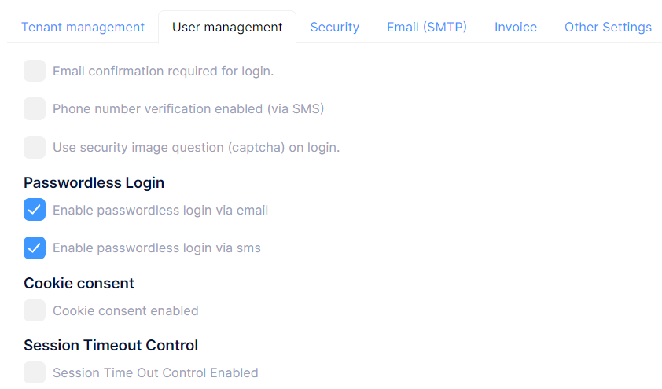
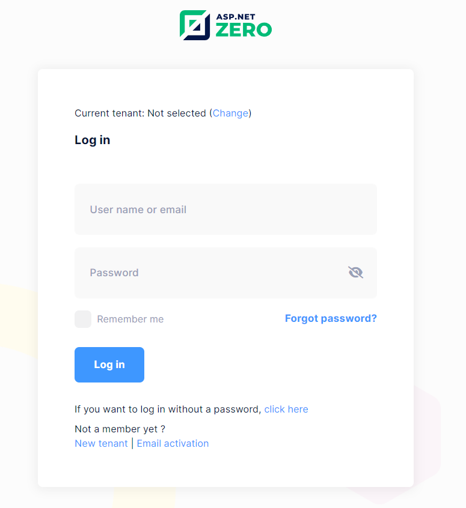
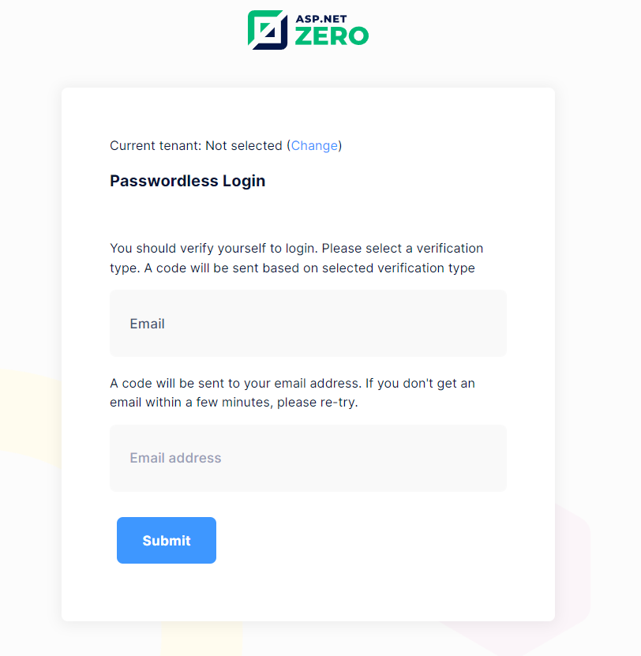
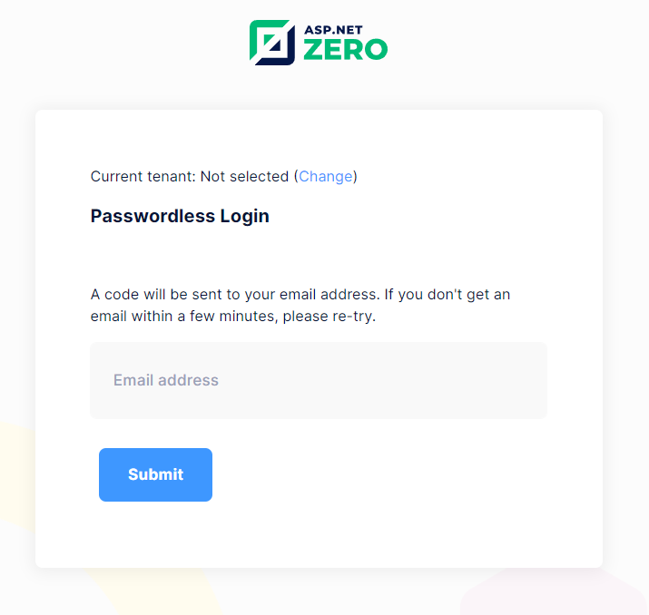
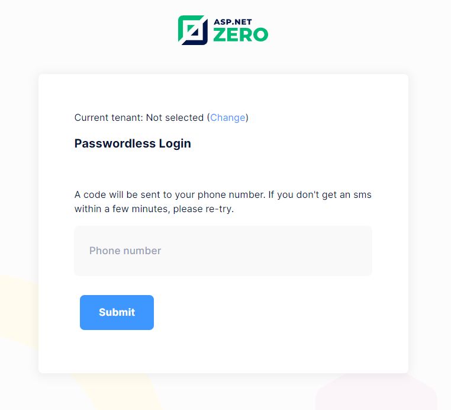
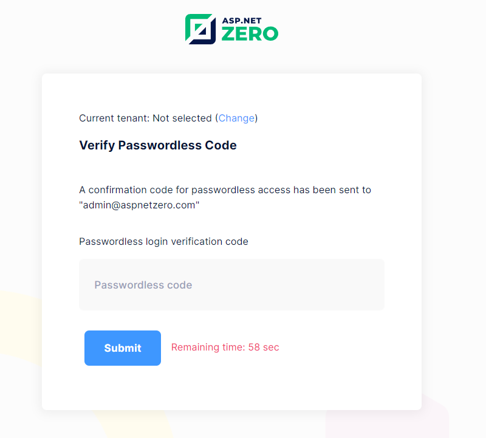

# Passwordless Login

ASP.NET Zero provides passwordless login feature out of the box, but it is disabled by default. It can be enabled in the `User Management` tab, on the host settings page. 

When a user requests to login using passwordless login feature, a 6-digit unique code will be sent to users email address or phone number depending on users selection on passwordless login page. 

- A Passwordless login code can be used only once.
- When a passwordless login code is verified, it can't be used anymore.

In a multi-tenant application, passwordless login is available to tenants if it's enabled in the host settings. Additionally, depending on which type of passwordless login verification is active, tenants also have the option to enable or disable the active type on the settings page.

If any of the passwordless login options are turned on, a section for passwordless login will be displayed on the login screen as shown in the screenshot below.

If a user wants to log in using passwordless login, the user will be directed to the verification screen for authentication after clicking on the `click here` link.

## Verification Type

The current options for passwordless login verification include **Email** and **SMS** authentication methods.

If multiple verification types are active, the selection screen for verification types appears as shown below.

### Email Verification

If only the email verification type is active, the screen for entering the email address is displayed as shown below.

### SMS Verification

If only SMS verification is active, the screen for entering the phone number will appear as shown below.

## Verify Passwordless Code

After filling in the necessary fields according to the chosen verification type, a verification code will be sent to the selected method (Email or SMS) for authentication.

After entering the verification code correctly, user will be authenticated and redirected to the home page of the application.

## Next

- [QR Login](Features-Mvc-Core-Qr-Login)