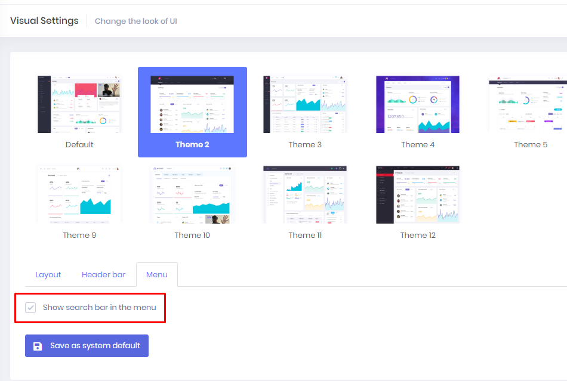
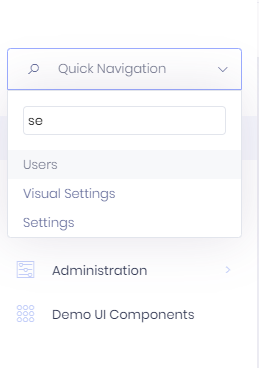
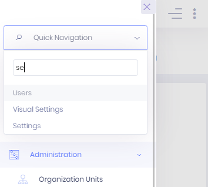

# Quick Navigation

If you have a lot of items in the navigation menu, you may use Quick Navigation. It allows you to navigate quickly.
To enable quick navigation go to "Visual Settings" page. Select your theme and then check the "Show search bar in the menu" option in the tab named "Menu".

After that, you will see a quick navigation bar on the menu. 

It places on the top menu or left menu depends on your theme menu location.

*Top Menu:*

*Left Menu:*

*And it is also available on mobile screens:*

