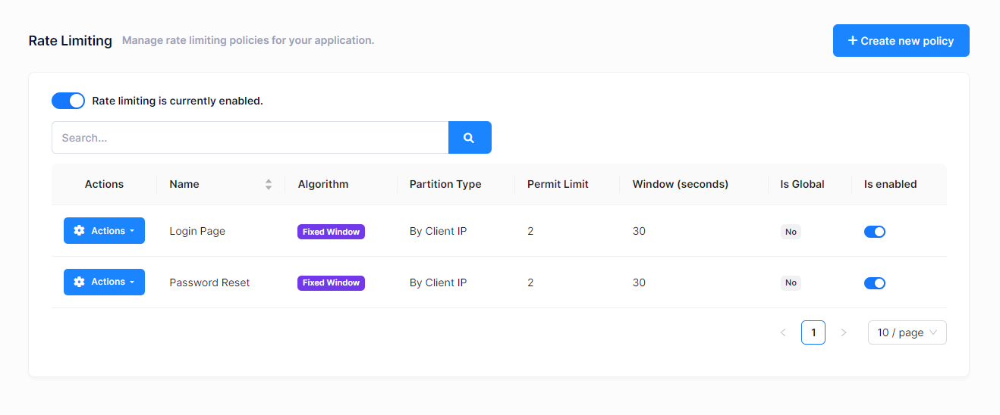
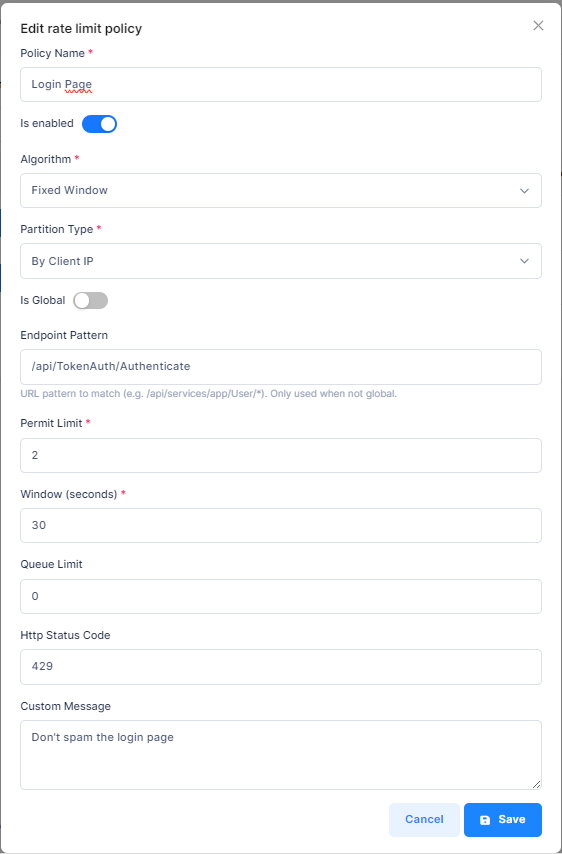

# Rate Limiting

ASP.NET Zero includes a built-in **dynamic rate limiting** system that allows you to protect your API endpoints from abuse by controlling the number of requests clients can make within a given time window. Rate limiting policies are fully manageable through the administration UI and are applied dynamically at runtime, no application restart is required when policies change.

## Enabling Rate Limiting

Rate limiting can be enabled or disabled globally using the master toggle at the top of the Rate Limiting management page. Navigate to **Administration > Rate Limiting** to access it.



When rate limiting is disabled, no policies are enforced and all requests pass through without any rate checks.

## Policy List

The policies page displays all configured rate limit policies in a table with the following columns:

- **Name** – A descriptive name for the policy
- **Algorithm** – The rate limiting algorithm used (Fixed Window, Sliding Window, Token Bucket, or Concurrency)
- **Partition Type** – How requests are grouped (By Client IP, By User, or By API Key)
- **Permit Limit** – Maximum number of requests allowed within the time window
- **Window (seconds)** – The time window duration in seconds
- **Is Global** – Whether the policy applies to all endpoints
- **Is Enabled** – Whether the policy is currently active

You can filter policies using the search box and use the **Actions** button on each row to edit, toggle, or delete a policy.

## Creating or Editing a Policy

Click the **Create New Policy** button or select **Edit** from the Actions menu of an existing policy. The following modal will appear:



### Policy Fields

| Field | Description |
|-------|-------------|
| **Policy Name** | A unique, descriptive name for the policy (e.g., "API Global Limit", "Login Endpoint Limit"). |
| **Is Enabled** | Toggle to enable or disable this specific policy. |
| **Algorithm** | The rate limiting algorithm to use. See [Algorithms](#algorithms) below. |
| **Partition Type** | How to partition (group) incoming requests. See [Partition Types](#partition-types) below. |
| **Is Global** | When enabled, the policy applies to all API endpoints. When disabled, you must specify an endpoint pattern. |
| **Endpoint Pattern** | A URL pattern to match specific endpoints (only visible when Is Global is off). Supports wildcard `*` matching. For example: `/api/services/app/User/*` |
| **Permit Limit** | The maximum number of requests allowed within the time window. |
| **Window (seconds)** | The duration of the time window in seconds (used by Fixed Window and Sliding Window algorithms). |
| **Queue Limit** | The number of requests that can be queued when the limit is reached. Set to `0` to reject immediately. |
| **HTTP Status Code** | The HTTP status code returned when a request is rate limited. Default is `429` (Too Many Requests). |
| **Custom Message** | An optional message returned in the response body when a request is rate limited. |

### Algorithm-Specific Fields

Depending on the selected algorithm, additional fields may be relevant:

| Field | Algorithm | Description |
|-------|-----------|-------------|
| **Segments Per Window** | Sliding Window | Number of segments the window is divided into. Higher values provide smoother rate limiting. |
| **Tokens Per Period** | Token Bucket | Number of tokens added to the bucket each replenishment period. |
| **Replenishment Period (seconds)** | Token Bucket | How often tokens are added to the bucket. |

## Algorithms

ASP.NET Zero supports four rate limiting algorithms built on .NET's `System.Threading.RateLimiting`:

### Fixed Window

Divides time into fixed windows (e.g., 60-second intervals). Each window allows a set number of requests. The counter resets at the start of each new window.

**Best for**: Simple, predictable rate limiting where occasional bursts at window boundaries are acceptable.

**Example**: 100 requests per 60 seconds.

### Sliding Window

Similar to Fixed Window, but the window slides continuously rather than resetting at fixed intervals. The window is divided into segments, and the allowed request count is calculated based on the weighted sum of the current and previous segments.

**Best for**: Smoother rate limiting that avoids burst issues at window boundaries.

**Example**: 100 requests per 60 seconds with 6 segments (each segment is 10 seconds).

### Token Bucket

Maintains a "bucket" of tokens that is replenished at a fixed rate. Each request consumes one token. When the bucket is empty, requests are rejected or queued. The bucket can accumulate tokens up to the permit limit, allowing controlled bursts.

**Best for**: APIs that need to allow short bursts of traffic while maintaining an average rate over time.

**Example**: Bucket size of 100 tokens, replenishing 10 tokens every second.

### Concurrency

Limits the number of concurrent (simultaneous) requests rather than requests over a time window. This is useful for protecting resources that have limited parallel processing capacity.

**Best for**: Endpoints that are resource-intensive and should limit how many requests are processed simultaneously.

**Example**: Maximum 10 concurrent requests.

## Partition Types

Partition types determine how incoming requests are grouped for rate limiting:

### By Client IP

Requests are grouped by the client's IP address. Each unique IP address gets its own rate limit counter. This is the default partition type.

### By User

Requests are grouped by the authenticated user's identity. Each logged-in user gets their own rate limit counter. Anonymous requests fall back to IP-based partitioning.

### By API Key

Requests are grouped by the `X-API-Key` HTTP header value. This is useful for API consumers that authenticate using API keys.

## Policy Matching

When a request arrives, the system finds the matching policy using this priority:

1. **Endpoint-specific policies** are checked first. The request path is matched against the `EndpointPattern` of non-global policies.
2. If no endpoint-specific policy matches, the first **global policy** is applied.
3. If no policy matches at all, the request passes through without rate limiting.

Endpoint patterns support wildcard matching with `*`. For example:

| Pattern | Matches |
|---------|---------|
| `/api/services/app/User/*` | All User service endpoints |
| `/api/services/app/*/GetAll` | GetAll method on any service |
| `/api/TokenAuth/*` | All authentication endpoints |

## Caching and Performance

Rate limiting policies are cached in memory for optimal performance. The cache is automatically invalidated whenever a policy is created, updated, deleted, or toggled, and when the global rate limiting setting is changed. This means policy changes take effect immediately without requiring an application restart.

## Permissions

Rate limiting management is controlled by the following permissions under **Administration > Rate Limiting**:

| Permission | Description |
|------------|-------------|
| Rate Limiting | View rate limiting policies |
| Create | Create new policies |
| Edit | Edit existing policies |
| Delete | Delete policies |

## Configuration

Rate limiting is built on top of .NET's `Microsoft.AspNetCore.RateLimiting` middleware. It is registered in the application's startup using the `AddDynamicRateLimiting()` extension method:

```csharp
services.AddDynamicRateLimiting();
```

And the middleware is applied in the request pipeline:

```csharp
app.UseRateLimiter();
```

The global enable/disable setting is stored in the application settings (`App.RateLimiting.IsEnabled`) and can be toggled from the UI without redeploying.

## Next

- [User Delegation](Features-Mvc-Core-User-Delegation)