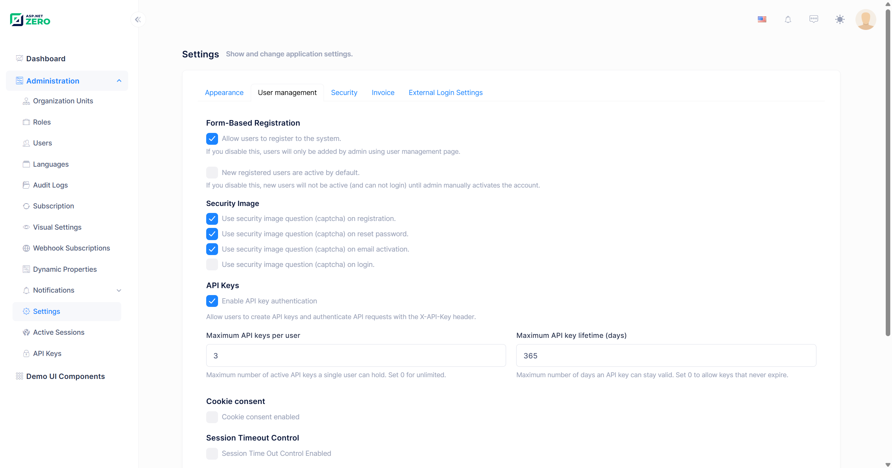
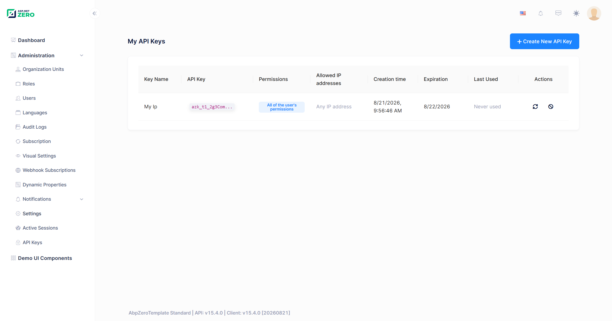
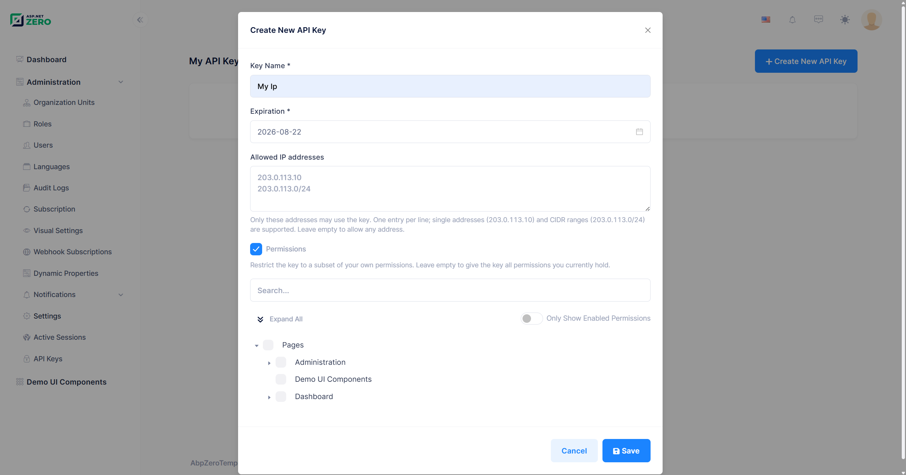
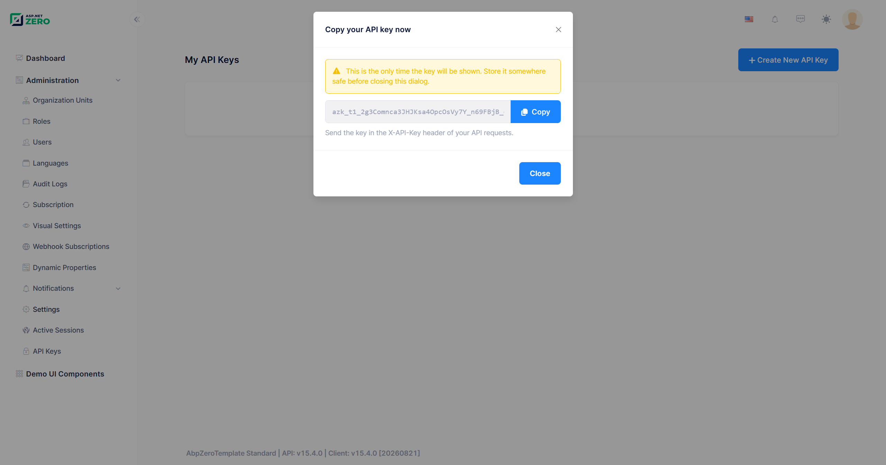
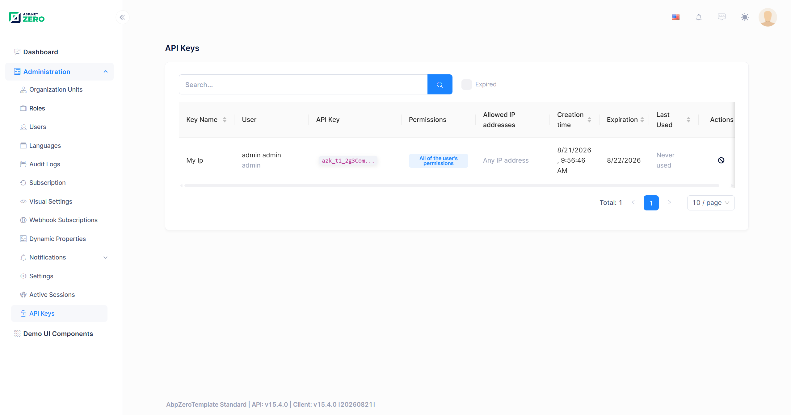
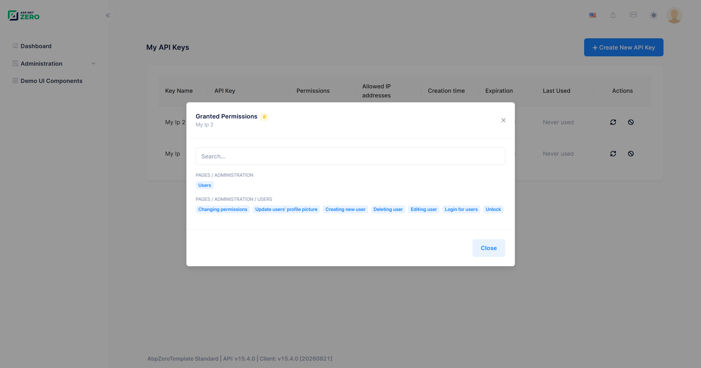

# API Keys

ASP.NET Zero includes a built-in **API key authentication** system that lets users create long-lived keys and use them to call the application's HTTP API without going through the interactive login flow. This is the recommended way to authenticate machine-to-machine integrations: scheduled jobs, CI/CD pipelines, server-to-server calls, scripts and third-party services that cannot maintain a browser session or refresh a JWT token.

An API key always belongs to a **user**. A request authenticated with an API key runs as that user, in that user's tenant, with that user's permissions, unless the key was explicitly restricted to a narrower set of permissions when it was created.

Every user can manage their own keys from the **My API Keys** page, while administrators can review and revoke every key in the tenant from the **Administration > API Keys** page.

## Enabling API Key Authentication

API key authentication is controlled by a setting, so it can be turned on or off per host and per tenant without redeploying the application.

Navigate to **Administration > Settings > User Management** and find the **API Keys** section.



| Setting | Setting name | Default | Description |
|---------|--------------|---------|-------------|
| **Enable API key authentication** | `App.UserManagement.ApiKey.IsEnabled` | `true` | Master switch. When it is off, the **API Keys** menu item and the **My API Keys** link are hidden, the application service rejects every call with *"API key authentication is currently disabled."*, and incoming `X-API-Key` headers are ignored. |
| **Maximum API keys per user** | `App.UserManagement.ApiKey.MaxKeyCountPerUser` | `5` | Maximum number of keys a single user can hold. Set `0` for unlimited. Expired keys still count until the cleanup worker removes them. |
| **Maximum API key lifetime (days)** | `App.UserManagement.ApiKey.MaxExpirationInDays` | `365` | Maximum number of days a key can stay valid. When it is greater than `0`, an expiration date becomes **required** and cannot be further in the future than this limit. Set `0` to allow keys that never expire. |

All three settings are defined with `SettingScopes.Application | SettingScopes.Tenant`, so a tenant can tighten (or relax) them for its own users independently from the host. Their initial values can also be changed in `appsettings.json` before the first run:

```json
{
  "App": {
    "App.UserManagement.ApiKey.IsEnabled": "true",
    "App.UserManagement.ApiKey.MaxKeyCountPerUser": "5",
    "App.UserManagement.ApiKey.MaxExpirationInDays": "365"
  }
}
```

> Values in `appsettings.json` are only the **initial defaults**. Once a value has been changed on the settings page, it is stored in the database and the configuration file no longer has any effect on it.

## My API Keys

Every authenticated user can manage their own keys; no permission is required. The page is reachable from the **user menu > My API Keys**, at `/app/admin/my-api-keys`.



The list shows the following columns:

- **Key Name** – The descriptive name given when the key was created.
- **API Key** – The masked key (for example `azk_t3_9fK2Lp...`). The full key is never stored and never shown again after creation.
- **Permissions** – Either *All of the user's permissions* or *Restricted to N permission(s)*. Clicking the restricted badge opens a modal that lists every granted permission with its full path.
- **Allowed IP addresses** – The IP allow list, or *Any IP address* when it is empty. Only the first two entries are displayed; the rest are shown in a tooltip on the `+N` badge.
- **Creation Time** – When the key was created.
- **Expiration** – The expiration date, *Never expires*, or an *Expired* badge.
- **Last Used** – When the key was last used to authenticate a request, or *Never used*.
- **Actions** – **Rotate** and **Revoke**.

The **Create New API Key** button is disabled once the user reaches the *Maximum API keys per user* limit.

### Creating an API Key

Click **Create New API Key** to open the creation modal.




| Field | Required | Description |
|-------|----------|-------------|
| **Key Name** | Yes | A descriptive name, up to 128 characters. Use it to identify the integration the key belongs to (for example *Nightly Import Job*). |
| **Expiration** | Depends | Required when *Maximum API key lifetime (days)* is greater than `0`, and then the date picker only offers dates between today and the configured limit. When the limit is `0`, the field is optional and any future date is accepted; leaving it empty creates a key that never expires. The **end** of the selected day is submitted, so a key created for "today" stays valid until midnight. |
| **Allowed IP addresses** | No | An optional allow list. One entry per line (or comma separated). Leave it empty to allow requests from any address. See [IP Allow List](#ip-allow-list). |
| **Permissions** | No | A switch that reveals a permission tree. Leave it off to give the key every permission its owner currently holds. Turn it on to restrict the key to a subset. See [Permission Scope](#permission-scope). |

Once the key is created, it is displayed **exactly once**:




Only a SHA-256 hash of the key is stored in the database, so **the plain key cannot be recovered afterwards**. If it is lost, the key has to be rotated or revoked and re-created.

### Rotating an API Key

**Rotate** replaces a key with a brand new one while keeping everything else about it identical: the name, the IP allow list and the permission scope are carried over, and the expiration date is preserved unless a new one is supplied. The old key stops working immediately and the new key is shown in the same one-time dialog used at creation.

Rotation is the recommended response to a leaked or soon-to-expire key, because the integration only needs the new secret value; nothing else about its configuration changes.

A few things are worth knowing:

- The UI rotates a key with its **current** expiration date, so a key that has **already expired** cannot be rotated from the page: the new expiration date has to be in the future. Revoke it and create a new one instead, or call `RotateApiKey` directly with a new `ExpirationDate`.
- A key that **never expires** cannot be rotated from the page either, once *Maximum API key lifetime (days)* has been raised above `0`. Such a key was created while the limit was `0`, so it carries no expiration date, and rotation now fails with a validation error saying that an expiration date is required. Call `RotateApiKey` with an `ExpirationDate` that fits the new limit, or revoke the key and create a new one.
- A key can only be rotated by the user it belongs to. Administrators can revoke another user's key, but they can never mint a new key in someone else's name.

### Revoking an API Key

**Revoke** deletes the key and drops it from the cache. Any request using it fails from that moment on. A user can always revoke their own keys; revoking someone else's key requires the *Revoking API keys* permission.

`UserApiKey` is a `FullAuditedEntity`, so revocation is a **soft delete**: the row stays in the database with `IsDeleted = 1` along with the deleting user and the deletion time, but it is filtered out of every query and no longer authenticates anything.

## API Keys Administration Page

Users with the *API Keys* permission can see every API key in the tenant (or, on the host side, every host key) from **Administration > API Keys**, at `/app/admin/api-keys`.




The page adds a **User** column (full name and username) to the columns of the *My API Keys* page and provides:

- A **search box** that filters on the key name, the username, the name and the surname of the owner.
- An **Expired** checkbox that lists only keys whose expiration date has already passed.
- Sortable **Key Name**, **Creation Time**, **Expiration** and **Last Used** columns, with server-side paging.
- A **Revoke** action, visible only to users who also hold the *Revoking API keys* permission.

Clicking the *Restricted to N permission(s)* badge opens the granted permissions modal:



## Using an API Key

Send the key in the `X-API-Key` HTTP header of your request:

```bash
curl -X POST "https://localhost:44301/api/services/app/User/GetUsers" \
     -H "X-API-Key: azk_t3_9fK2LpQ4rT8vX1zB6nM0sD3gH7jW5yC2eA4uI9oK1lP" \
     -H "Content-Type: application/json" \
     -d "{ \"maxResultCount\": 10, \"skipCount\": 0 }"
```

With `HttpClient`:

```csharp
var client = new HttpClient
{
    BaseAddress = new Uri("https://localhost:44301/")
};

client.DefaultRequestHeaders.Add("X-API-Key", apiKey);

var response = await client.PostAsJsonAsync(
    "api/services/app/User/GetUsers",
    new { MaxResultCount = 10, SkipCount = 0 });
```

Notes:

- The tenant does **not** have to be specified. The tenant id is embedded in the key itself, so no `Abp.TenantId` header is needed.
- The header takes effect only when the request is not already authenticated. If a request carries both a valid bearer token and an `X-API-Key` header, the bearer token wins.
- An API key **cannot be used to manage API keys**. Creating, rotating and revoking keys are rejected with a user-friendly error when the request itself is authenticated with an API key. Listing keys is still allowed.

## Key Format

A generated key looks like this:

```text
azk_t3_9fK2LpQ4rT8vX1zB6nM0sD3gH7jW5yC2eA4uI9oK1lP
│   │  └── secret: 32 cryptographically random bytes, base64url encoded
│   └───── tenant segment
└───────── fixed prefix
```

| Segment | Value | Description |
|---------|-------|-------------|
| Prefix | `azk` | Constant prefix (`ApiKeyConsts.KeyPrefix`) that makes ASP.NET Zero keys easy to recognize in logs and secret scanners. |
| Tenant segment | `h` or `t{TenantId}` | `h` for a host user, `t3` for a user of the tenant with id `3`. It allows the tenant to be resolved before touching the database. |
| Secret | 43 characters | 32 bytes produced by `RandomNumberGenerator`, base64url encoded (`+` → `-`, `/` → `_`, padding removed). |

The three segments are joined with `_`. A key can be at most 128 characters long.

### What is Stored

| Column | Content |
|--------|---------|
| `KeyHash` | The lowercase hexadecimal SHA-256 hash of the full key (64 characters), with a unique index on it. This is what lookups run against. |
| `DisplayKey` | The visible part plus the first 6 characters of the secret and an ellipsis, for example `azk_t3_9fK2Lp...`. This is what the UI shows. |

The plain key value is never written to the database, to a log or to an audit record; the validation method is marked with `[DisableAuditing]`.

## Permission Scope

By default an API key inherits **all permissions of its owner, dynamically**. If the owner is later granted a new permission, the key can use it too; if a permission is taken away, the key loses it as well.

A key can also be **restricted** to a subset of permissions at creation time. In that case:

- The permission tree in the create modal only offers permissions **the creating user actually holds**. Attempting to grant a permission the user does not have is rejected with a validation error.
- A key can be scoped to at most 200 permissions.
- The scope is an *upper bound only*. It never grants anything: an operation is allowed only when it is both inside the key's scope **and** still granted to the owner.

The scope is enforced in two places:

1. **`PermissionChecker`** narrows every permission check made for the key's owner to the permissions in the scope.
2. **`ApiKeyScopeAuthorizationHelper`** (registered by replacing ABP's `IAuthorizationHelper`) blocks a scoped key from reaching any operation that is protected by a bare `[AbpAuthorize]` without a permission name. Without this, a narrowly scoped key would still be able to call every method that only requires "be logged in".

> This means a **scoped key can only call operations that explicitly require a permission**. Operations that are merely `[AbpAuthorize]` authenticated, but without a permission name are not available to scoped keys. Keys created without a scope are not affected by this rule, and endpoints that require no authorization at all are unaffected either way.

## IP Allow List

An API key can be limited to a set of source addresses. When the allow list is empty, any address is accepted.

- Entries can be single IP addresses (`203.0.113.10`, `2001:db8::1`) or CIDR ranges (`203.0.113.0/24`, `2001:db8::/32`).
- IPv4 and IPv6 are both supported, and IPv4-mapped IPv6 addresses are normalized before matching, so `::ffff:203.0.113.10` matches the `203.0.113.10` entry.
- A key can hold at most **20** entries, stored as a comma separated string of at most 1024 characters.
- Invalid entries are rejected at creation time with a user-friendly message.

The client address is read from `HttpContext.Connection.RemoteIpAddress`. Behind a reverse proxy, a load balancer or a container ingress, this is the address of the proxy rather than that of the real client, so the allow list would compare the wrong address. The forwarded headers middleware runs before authentication in both `Web.Host` and `Web.Mvc`, so configure your proxies in `appsettings.json` to make the real client address visible:

```json
{
  "App": {
    "ForwardedHeaders": {
      "KnownProxies": [ "10.0.0.5" ],
      "KnownNetworks": [ "10.0.0.0/8" ],
      "TrustAllProxies": false
    }
  }
}
```

## Expiration and Cleanup

- When *Maximum API key lifetime (days)* is greater than `0`, an expiration date is mandatory and may be at most that many days in the future. Setting the value to `0` allows keys that never expire.
- An expiration date in the past is rejected.
- An expired key immediately stops authenticating requests. It stays in the list with an **Expired** badge so its owner can see what happened, and it keeps counting toward the *Maximum API keys per user* limit until it is cleaned up.
- `ExpiredApiKeyCleanupWorker` is a background worker that runs **every 24 hours** and deletes keys that expired more than **30 days** ago (a soft delete, like revocation). It walks the host database and every tenant that has its own connection string, and logs (instead of throwing) if one of those databases is unreachable.
- **Last Used** is not written on every request. It is only updated when the previous value is older than 5 minutes, which keeps a busy integration from producing a database write per call.

## Caching

Validated keys are cached in the `AppUserApiKeys` cache, keyed by the key hash, for **5 minutes**. The cache entry holds everything needed to authenticate a request: owner, tenant, expiration, IP allow list and permission scope. A repeated call therefore does not hit the database for the key itself.

Revoking or rotating a key removes its entry from the cache immediately.

> In a clustered deployment, use a distributed cache so that a revocation on one instance is visible to all of them. With the default in-process cache, other instances keep serving a revoked key from their own copy until the entry expires (up to 5 minutes). See [Deploying to a Clustered Environment](Clustered-Environment).

## Permissions

API key administration is controlled by the following permissions under **Administration > API Keys**:

| Permission | Name | Description |
|------------|------|-------------|
| API Keys | `Pages.Administration.ApiKeys` | Access to the **Administration > API Keys** page, which lists the keys of all users. |
| Revoking API keys | `Pages.Administration.ApiKeys.Revoke` | Revoke a key that belongs to another user. Shown as a child permission of *API Keys*. |

Managing one's own keys (**My API Keys**: create, rotate, revoke, list) requires **no permission**; an authenticated session is enough.

## Application Service

All operations go through `IUserApiKeyAppService`, which is exposed as a dynamic Web API under `/api/services/app/UserApiKey/`. The service is `[AbpAuthorize]` at class level, and every method first verifies that API key authentication is enabled.

| Method | Endpoint | Authorization |
|--------|----------|---------------|
| `GetMyApiKeys()` | `GET /api/services/app/UserApiKey/GetMyApiKeys` | Authenticated user. Also returns the grantable permissions, the configured limits and the header name, so the UI needs no second call. |
| `CreateApiKey(CreateApiKeyInput)` | `POST /api/services/app/UserApiKey/CreateApiKey` | Authenticated user; rejected when the request itself uses an API key. |
| `RotateApiKey(RotateApiKeyInput)` | `POST /api/services/app/UserApiKey/RotateApiKey` | Owner of the key only; rejected when the request itself uses an API key. |
| `RevokeApiKey(EntityDto<long>)` | `POST /api/services/app/UserApiKey/RevokeApiKey` | Owner of the key, or `Pages.Administration.ApiKeys.Revoke` for someone else's key; rejected when the request itself uses an API key. |
| `GetApiKeys(GetApiKeysInput)` | `POST /api/services/app/UserApiKey/GetApiKeys` | `Pages.Administration.ApiKeys`. Paged, sorted and filtered list of every key. |

Validation failures (limit reached, invalid IP entry, unknown or ungranted permission, expiration out of range, feature disabled) are thrown as `UserFriendlyBadRequestException`, which returns HTTP `400` with a localized message instead of the default `500`.

## How Authentication Works

The scheme is registered in `AuthConfigurer` of both `Web.Host` and `Web.Mvc`:

```csharp
authenticationBuilder.AddApiKeyAuthentication();
```

and plugged into the pipeline right after the other authentication middlewares:

```csharp
app.UseAuthentication();
app.UseJwtTokenMiddleware();
app.UseApiKeyAuthentication();
```

`ApiKeyAuthenticationMiddleware` only steps in when the request is **not already authenticated** and carries an `X-API-Key` header. It then runs the `ApiKey` scheme and, on success, assigns the resulting principal to `HttpContext.User`.

`ApiKeyAuthenticationHandler` and `UserApiKeyManager` validate the key in this order:

1. **Parse the key.** The prefix and the tenant segment must be well formed and the key must not exceed 128 characters. A malformed key fails immediately, without a database query.
2. **Check the setting for the key's tenant.** Because the setting is tenant scoped and the session tenant is not resolved yet, it is read for the tenant that owns the key. When API key authentication is disabled there, the header is ignored.
3. **Check the tenant.** The tenant must exist and be active.
4. **Look up the key by its SHA-256 hash**, first in the cache, then in the database.
5. **Check expiration and the IP allow list.**
6. **Check the user.** The owner must exist, be active and not be locked out.
7. **Update the last used time** (at most once every 5 minutes). If the key row has disappeared in the meantime, authentication fails and the cache entry is dropped.
8. **Build the principal** with `AbpUserClaimsPrincipalFactory`, exactly as a normal login would, then add an `api_key_id` claim and one `api_key_permission` claim per permission in the scope.

Every failure returns the same generic *"Invalid API key."* result, so a caller cannot tell an unknown key apart from an expired one, a disabled user or a blocked IP address.

### Accessing the Current API Key

Inject `ICurrentApiKey` anywhere in your application code to find out whether the current request was authenticated with an API key:

```csharp
public class MyAppService : AbpZeroTemplateAppServiceBase
{
    private readonly ICurrentApiKey _currentApiKey;

    public MyAppService(ICurrentApiKey currentApiKey)
    {
        _currentApiKey = currentApiKey;
    }

    public async Task DoSomething()
    {
        if (_currentApiKey.IsAvailable)
        {
            //The request is authenticated with the API key _currentApiKey.Id
        }

        if (_currentApiKey.HasPermissionScope)
        {
            //The key was restricted to a subset of its owner's permissions
        }
    }
}
```

Use this, for example, to keep a sensitive operation out of reach of API keys, or to write the key id into your own audit records.

## Database Tables

### AppUserApiKeys

| Column | Type | Description |
|--------|------|-------------|
| `Id` | `bigint` | Primary key. |
| `TenantId` | `int?` | `null` for host users. |
| `UserId` | `bigint` | Owner of the key. Cascade deleted with the user. |
| `Name` | `nvarchar(128)` | Descriptive name. |
| `KeyHash` | `nvarchar(64)` | SHA-256 hash of the key. Unique index. |
| `DisplayKey` | `nvarchar(32)` | Masked key shown in the UI. |
| `ExpirationDate` | `datetime2?` | `null` when the key never expires. |
| `LastUsedTime` | `datetime2?` | Throttled to one update per 5 minutes. |
| `AllowedIpAddresses` | `nvarchar(1024)?` | Comma separated IP addresses and CIDR ranges. |

The entity is a `FullAuditedEntity<long>` and implements `IMayHaveTenant`, so it carries the usual creation, modification and deletion audit columns and is filtered by tenant automatically. Indexes: `KeyHash` (unique), `UserId`, and `TenantId, UserId`.

### AppUserApiKeyPermissions

| Column | Type | Description |
|--------|------|-------------|
| `Id` | `bigint` | Primary key. |
| `TenantId` | `int?` | Tenant of the owning key. |
| `UserApiKeyId` | `bigint` | Owning key. Cascade deleted with the key. |
| `Name` | `nvarchar(128)` | Permission name, for example `Pages.Administration.Users`. |

`UserApiKeyId, Name` is a unique index. A key with no rows in this table is an unscoped key.

Both tables are created by the `Added_UserApiKeys` and `Added_UserApiKey_IpAllowList_And_PermissionScope` migrations.

## Customization

**Change the header name.** The header is `X-API-Key` by default and can be overridden when the scheme is registered:

```csharp
authenticationBuilder.AddApiKeyAuthentication(options =>
{
    options.HeaderName = "X-My-Api-Key";
});
```

Note that `ApiKeyAuthenticationMiddleware` looks for `ApiKeyConsts.HeaderName` when deciding whether to run the scheme, so change the constant as well if you want the middleware to pick up the new header.

**Resolve the client address differently.** Override `GetClientIpAddress()` in a class derived from `ApiKeyAuthenticationHandler` if your infrastructure exposes the caller's address in a custom header instead of via forwarded headers.

**Change the cleanup behaviour.** `CleanupPeriodHours` (24) and `RetentionDays` (30) in `ExpiredApiKeyCleanupWorker` control how often expired keys are purged and how long they are kept.

**Change the cache duration.** `ApiKeyConsts.CacheDurationInMinutes` (5) controls how long a validated key stays cached, and `ApiKeyConsts.LastUsedTimeUpdateThresholdMinutes` (5) how often *Last Used* is written.

**Change the limits.** `ApiKeyConsts.MaxAllowedIpAddressCount` (20) and `ApiKeyConsts.MaxPermissionCount` (200) cap the size of the IP allow list and the permission scope.

## Security Considerations

- **Treat a key like a password.** Anyone holding it can act as its owner. Store it in a secret manager, never in source control.
- **Prefer scoped keys.** Grant an integration only the permissions it actually needs, instead of handing it everything its owner can do.
- **Prefer short lifetimes and rotate regularly.** Keep *Maximum API key lifetime (days)* at a value that forces periodic rotation.
- **Use the IP allow list** whenever the integration calls from a known, stable address.
- **Always use HTTPS.** The key travels in a plain header.
- **Combine it with rate limiting.** Rate limit policies can partition requests *By API Key*, so a single key cannot exhaust your API. See [Rate Limiting](Features-Rate-Limiting).
- **Watch the Last Used column.** A key that has never been used, or has not been used in a long time, is a good candidate for revocation.

## Next

- [Email Templates](Features-React-Email-Templates)
