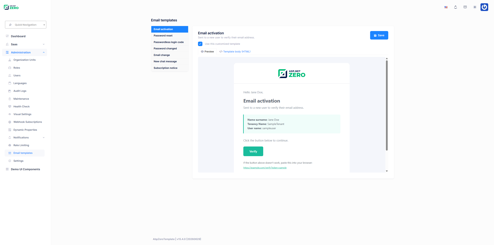

# Email Templates

ASP.NET Zero sends transactional emails to users in several situations: account activation, password reset, passwordless login codes, offline chat messages and subscription notices. Each of these emails is rendered from an **HTML template**.

The templates ship with the solution as **embedded resources** in the `.Core` project, under `Net/Emailing/EmailTemplates`. You can edit those `.html` files directly in your own source code, but you then need to rebuild and redeploy the application to see the change.

The **Email Templates** page removes that round trip: a host administrator can open a template in the browser, edit its HTML, preview the result and save it. The customized body is stored in the database and used from that moment on, without a rebuild or a restart.

## Built-in Templates

| Template | Resource file | Sent when |
|----------|---------------|-----------|
| Email activation | `email-activation.html` | A new user has to verify their email address. |
| Password reset | `password-reset.html` | A user requests a password reset. |
| Passwordless login code | `passwordless-code.html` | A user requests a one-time login code. See [Passwordless Login](Features-React-Passwordless-Login). |
| Password changed | `password-changed.html` | A user's password has been changed. |
| Email change | `email-change.html` | A user's new email address has to be verified. |
| New chat message | `chat-message.html` | A user receives a chat message while being offline. See [Chat](Features-React-Chat). |
| Subscription notice | `subscription-notice.html` | Subscription expiration, payment and edition change events. See [Subscription](Features-React-Subscription). |

The template names used by the application are constants on `UserEmailer` (`UserEmailer.TemplateEmailActivation`, `UserEmailer.TemplatePasswordReset` and so on) and they match the file names without the extension.

## The Email Templates Page

Open **Administration > Email Templates** (`/app/admin/email-templates`) to manage the templates.

The page is split in two: the list of templates on the left and the editor on the right.

The list shows, for every template, its display name and whether it is a **Factory default** (the embedded resource is being used) or **Customized** (a body is stored in the database), together with the time it was last modified.

Selecting a template opens the editor, which offers:

- **Preview** - Renders the template server side with sample data and shows the result in a sandboxed frame, the way a recipient would see it. The preview always reflects what is currently in the editor, so you can check a change before saving it.
- **Template body (HTML)** - A [Monaco](https://microsoft.github.io/monaco-editor/) editor with HTML syntax highlighting, holding the full body of the template.
- **Use this customized template** - A checkbox that switches between the stored body and the factory default *without deleting* your customization. When it is unchecked, the application falls back to the embedded resource, but your HTML is kept and can be re-activated at any time.
- **Save** - Stores the body and the active flag. Requires the *Editing email template* permission.
- **Reset to default** - Permanently deletes the stored body (a hard delete) and returns the template to the embedded resource. It is only shown for a customized template and requires the *Resetting email template* permission.

## Template Variables

A template is plain HTML with `{TOKEN}` placeholders. When an email is sent, the placeholders are replaced with the actual values. **Keep the placeholders you need in the HTML**; a placeholder that is removed is simply not rendered, and a placeholder that the application does not fill for that template stays in the output as literal text.

### Base variables

These are replaced for every template, and also in the preview. The first four are substituted by `EmailTemplateProvider` while the template is resolved and cached; the last three are filled in per email by `UserEmailer` (and by `EmailTemplateAppService` for the preview), because their values differ from one email to the next:

| Variable | Value |
|----------|-------|
| `{PRODUCT_NAME}` | The product name (`AbpZeroTemplate` by default, renamed with your project). |
| `{THIS_YEAR}` | The current year, for the footer. |
| `{EMAIL_LOGO_URL}` | URL of the tenant's light-skin logo. Resolved per tenant, so a single customized template still shows each tenant's own logo. |
| `{EMAIL_LOGO_URL_DARK}` | URL of the tenant's dark-skin logo. |
| `{EMAIL_TITLE}` | Title of the email. |
| `{EMAIL_SUB_TITLE}` | Subtitle of the email. |
| `{EMAIL_PREHEADER}` | The preheader text most mail clients show next to the subject. |

### Per-template variables

| Template | Variables |
|----------|-----------|
| `email-activation` | `{GREETING}` `{NAME_LABEL}` `{NAME_VALUE}` `{TENANCY_NAME_ROW}` `{USERNAME_LABEL}` `{USERNAME_VALUE}` `{PASSWORD_ROW}` `{CTA_INSTRUCTION}` `{CTA_URL}` `{CTA_LABEL}` `{FALLBACK_INSTRUCTION}` |
| `password-reset` | `{GREETING}` `{RESET_CODE_LABEL}` `{RESET_CODE_VALUE}` `{CTA_INSTRUCTION}` `{CTA_URL}` `{CTA_LABEL}` `{FALLBACK_INSTRUCTION}` `{SECURITY_NOTE}` |
| `passwordless-code` | `{CODE_DESCRIPTION}` `{CODE_VALUE}` `{CODE_EXPIRATION_TEXT}` |
| `password-changed` | `{GREETING}` `{NAME_LABEL}` `{NAME_VALUE}` `{TENANCY_NAME_ROW}` `{USERNAME_LABEL}` `{USERNAME_VALUE}` `{BODY_TEXT}` `{SECURITY_NOTE}` |
| `email-change` | `{GREETING}` `{NAME_LABEL}` `{NAME_VALUE}` `{TENANCY_NAME_ROW}` `{USERNAME_LABEL}` `{USERNAME_VALUE}` `{NEW_EMAIL_LABEL}` `{NEW_EMAIL_VALUE}` `{CTA_INSTRUCTION}` `{CTA_URL}` `{CTA_LABEL}` `{FALLBACK_INSTRUCTION}` |
| `chat-message` | `{SENDER_LABEL}` `{SENDER_VALUE}` `{TIME_LABEL}` `{TIME_VALUE}` `{MESSAGE_LABEL}` `{MESSAGE_VALUE}` |
| `subscription-notice` | `{BODY_TEXT}` |

All values are HTML encoded by `UserEmailer` before they are substituted.

> `{TENANCY_NAME_ROW}` and `{PASSWORD_ROW}` are conditional: they are replaced with a complete table row when there is something to show (the tenancy name of a tenant user, the initial password of a user created by an administrator) and with an empty string otherwise.

## How a Template is Resolved

`EmailTemplateProvider.GetTemplate(templateName, tenantId)` is what `UserEmailer` calls, and it resolves a template in this order:

1. **Cache.** The `AppEmailTemplateCache` cache is checked first, keyed by `templateName:tenantId` (or `templateName:host`). The cached value already has the provider's base variables substituted, so a repeated send does no work at all.
2. **Database.** The `AppEmailTemplates` table is queried for a row with that name and `IsActive = 1`. The query always runs with the tenant filter disabled, because templates are host level.
3. **Embedded resource.** When there is no active row, the `.html` resource of the `.Core` assembly is read.
4. `{PRODUCT_NAME}`, `{THIS_YEAR}` and the two logo URLs are substituted and the result is written to the cache. The remaining tokens are replaced by `UserEmailer` afterwards, per email.

If the database cannot be reached (for example while the application is being installed and the schema does not exist yet), the provider logs a warning and falls back to the embedded resource instead of failing. Emails therefore keep working even before the email templates table is available.

Saving or resetting a template clears the cache immediately, so the next email uses the new body.

> Email templates are stored at **host level** and there is no tenant column on the table: a customization applies to every tenant. Only the logo URLs are resolved per tenant.

## Permissions

Email template administration is a **host-only** feature. The permissions live under **Administration > Email templates**:

| Permission | Name | Description |
|------------|------|-------------|
| Email templates | `Pages.Administration.EmailTemplates` | Access to the **Email Templates** page and read access to every template. |
| Editing email template | `Pages.Administration.EmailTemplates.Edit` | Save a customized body. |
| Resetting email template | `Pages.Administration.EmailTemplates.Reset` | Delete a customized body and go back to the factory default. |

All three are defined with `MultiTenancySides.Host`, so they are not offered to tenant roles.

## Application Service

`IEmailTemplateAppService` is exposed as a dynamic Web API under `/api/services/app/EmailTemplate/`. The class is authorized with `Pages.Administration.EmailTemplates`.

| Method | Authorization | Description |
|--------|---------------|-------------|
| `GetTemplates()` | `Pages.Administration.EmailTemplates` | Returns the known templates with their display name, description, customization state and last modification time. |
| `GetForEdit(GetEmailTemplateForEditInput)` | `Pages.Administration.EmailTemplates` | Returns the current body, the factory default body and the active flag of one template. |
| `Update(UpdateEmailTemplateInput)` | `Pages.Administration.EmailTemplates.Edit` | Inserts or updates the stored body, then invalidates the cache. |
| `ResetToDefault(ResetEmailTemplateInput)` | `Pages.Administration.EmailTemplates.Reset` | Hard deletes the stored row, then invalidates the cache. |
| `RenderPreview(EmailTemplatePreviewInput)` | `Pages.Administration.EmailTemplates` | Renders the given body with sample values and returns the resulting HTML. |

The set of templates that can be edited is a fixed list (`KnownTemplates`) inside `EmailTemplateAppService`. An unknown template name is rejected with a `UserFriendlyException`.

## Database Table

### AppEmailTemplates

| Column | Type | Description |
|--------|------|-------------|
| `Id` | `int` | Primary key. |
| `Name` | `nvarchar(100)` | Template name, for example `password-reset`. Unique index. |
| `Body` | `nvarchar(max)` | The customized HTML body. |
| `IsActive` | `bit` | When `0`, the embedded resource is used and the stored body is kept aside. |

`EmailTemplate` is a `FullAuditedEntity`, so the usual creation, modification and deletion audit columns are present as well. The table is created by the `Added_EmailTemplates` migration.

## Adding Your Own Template

To render one of your own emails from a manageable template:

1. Add an `.html` file to `Net/Emailing/EmailTemplates` in the `.Core` project. The folder is already declared as an `EmbeddedResource` in the `.csproj`, so no project change is needed.
2. Add a constant for its name next to the existing ones in `UserEmailer`.
3. Inject `IEmailTemplateProvider`, call `GetTemplate(name, tenantId)` and replace your own tokens, the way `UserEmailer.BuildEmail` does.
4. To make it editable from the UI, add a `TemplateMetadata` entry to `KnownTemplates` in `EmailTemplateAppService` along with the display name and description localization keys, and add sample values for your tokens to `BuildSampleTokens` so that the preview renders correctly.

## Notes

- **Email sending is disabled in DEBUG mode** (`IEmailSender` is replaced with `NullEmailSender` in `*YourProjectName*CoreModule`), so you will not receive a real email while debugging. The preview on the Email Templates page works regardless.
- SMTP settings are configured on the [Host Settings](Features-React-Host-Settings) page.
- The preview is rendered in a sandboxed frame, and the body you save is stored as it is written. Only host administrators can reach the page, but it is still worth remembering that whatever HTML is saved is what gets sent to your users.
- See [Sending Emails](Infrastructure-Core-Mvc-Sending-Emails) for how emails are sent.

## Next

- [User Delegation](Features-React-User-Delegation)
