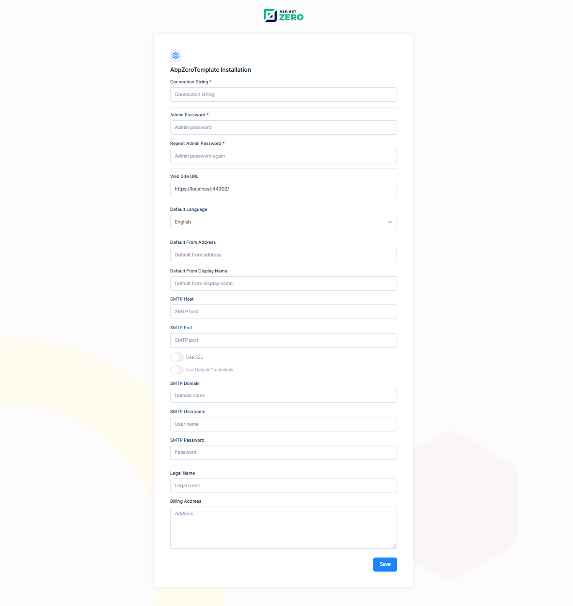

# Setup Page

ASP.NET Zero application can be set-up using install page. This page is developed to create initial database, apply migrations and configure the application according to user's input on this page. Setup page can be accessed on **http://yourwebsite.com/account/install**.

Just note that, this page is only visible when the database is not created. If the database is created, you will be redirected to login page.

Since the server application and the database server often start together (for example after a machine reboot), the server application waits for the database server for a short while before it starts, so that a database that is simply slow to start is not mistaken for a missing one. See [Waiting for the Database on Startup](Infrastructure-Core-Mvc-Configuration#waiting-for-the-database-on-startup) if you need to change how long it waits.

## Next

- [Migrator Console App](Migrator-Console-Application)

