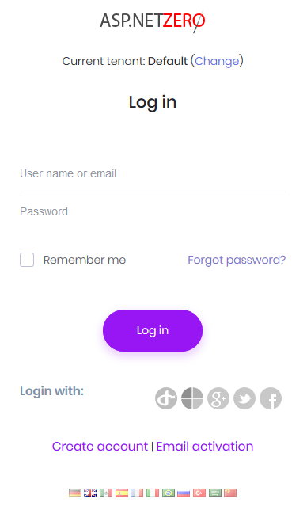

# Social and External Logins

ASP.NET Zero supports social media logins and external logins as well. To enable one of them, we should change the following settings in **appsettings.json** file.

```json
  "Authentication": {
    "Facebook": {
        "IsEnabled": "false",
        "AppId": "",
        "AppSecret": ""
    },
    "Google": {
        "IsEnabled": "false",
        "ClientId": "",
        "ClientSecret": "",
        "UserInfoEndpoint": "https://www.googleapis.com/oauth2/v2/userinfo"
    },
    "Microsoft": {
        "IsEnabled": "false",
        "ConsumerKey": "",
        "ConsumerSecret": ""
    },
    "OpenId": {
        "IsEnabled": "false",
        "ClientId": "",
        "ClientSecret": "",
        "Authority": "",
        "LoginUrl": "",
        "ValidateIssuer": "true",
        "ResponseType": "code",
        "ClaimsMapping": []
    },
    "WsFederation": {
        "IsEnabled": "false",
        "Authority": "",
        "ClientId": "",
        "Tenant": "",
        "MetaDataAddress": ""
    },
    "JwtBearer": {
        "IsEnabled": "true",
        "SecurityKey": "PhoneBook_XXXXXXXXXXXXXXXX",
        "Issuer": "PhoneBook",
        "Audience": "PhoneBook"
    }
}
```

ASP.NET Zero enables and configures social and external login providers in the PostInitialize method of **{YourProjectName}WebHostModule.cs** class. Some parts of social and external login code are closed source for licensing purposes in [Abp.AspNetZeroCore](https://www.nuget.org/packages/Abp.AspNetZeroCore) and [Abp.AspNetZeroCore.Web](https://www.nuget.org/packages/Abp.AspNetZeroCore.Web) nuget packages.

You can find many documents on the web to learn how to obtain authentication keys for social platforms. So, we will not go to details of creating apps on social media platforms. Once you get your keys, you can write
them into `appsettings.json`. When you enable it, social media logos are automatically shown on the login page as shown below:



Just note that, social media logins and external logins are only available on Tenant scope. So, a tenant must be selected on the login page to see those logos, otherwise there will be no logos on the login page.

## OpenId Connect Login

In addition to social logins, ASP.NET Zero includes OpenId Connect Login integrated. It's configuration can be changed in `appsettings.json`

```json
"OpenId": {
  "IsEnabled": "false",
  "ClientId": "",
  "ClientSecret": "",
  "Authority": "",
  "LoginUrl": "",
  "ValidateIssuer": "true",
  "ResponseType": "code",
  "ClaimsMapping": []
}
```

`ResponseType` defines which OpenID Connect flow ASP.NET Zero will use. You can configure it in `appsettings.json` or from the host/tenant settings page when social login settings per tenant are enabled.

- Use `code` (recommended/default) for Authorization Code Flow with PKCE. The provider must allow authorization code flow, the React login callback URL (for example, `[ReactAppUrl]/account/login`) must be added to the provider's redirect URIs, and the token endpoint must return an `id_token`. Set `ClientSecret` if your provider requires it.
- Use `id_token` only if your provider supports implicit ID token flow. In this mode, the provider returns the `id_token` directly to the browser, so the provider must be configured to issue ID tokens with the user claims required by ASP.NET Zero.

If your provider does not expose an authorization endpoint from the discovery document, set `LoginUrl` manually.

In some cases, OpenId Connect provider doesn't return claims we want to use. For example, Azure AD doesn't return "nameidentifier" claim but ASP.NET Core Identity uses it to find id of the user. So, in such cases, we can use **ClaimsMapping** to map claims of provider to custom claims. AspNet Zero will find the claim with **key** and will map it to internal claim with **claim** value in the mapping. For the following configuration, external **objectidentifier** will be mapped to internal **nameidentifier** claim.

````json
"ClaimsMapping": [
  {
    "claim": "http://schemas.xmlsoap.org/ws/2005/05/identity/claims/nameidentifier",
    "key": "id"
  },
  {
    "claim": "http://schemas.xmlsoap.org/ws/2005/05/identity/claims/name",
    "key": "name"
  },
  {
    "claim": "http://schemas.xmlsoap.org/ws/2005/05/identity/claims/givenname",
    "key": "given_name"
  },
  {
    "claim": "http://schemas.xmlsoap.org/ws/2005/05/identity/claims/surname",
    "key": "family_name"
  },
  {
    "claim": "http://schemas.xmlsoap.org/ws/2005/05/identity/claims/emailaddress",
    "key": "email"
  }
]
````

If you are using Azure AD for OpenID Connect and your app is multi-tenant on Azure side, then you need to disable issuer validation, so all Azure AD users can use your app. Note that, multi-tenant app here is the one you have created on Azure, not the multi-tenancy concept of ASP.NET Zero.

## WsFederation (ADFS)

ASP.NET Zero also includes ADFS login integrated. t's configuration can be changed in `appsettings.json`

```json
"WsFederation": {
  "IsEnabled": "false",
  "Authority": "",
  "ClientId": "",
  "Tenant": "",
  "MetaDataAddress": ""
}
```

## JwtBearer

ASP.NET Zero uses JwtBearer authentication by defult. It is recommended to change SecurityKey configured in appsettings.json for your production environment

## IExternalLoginInfoManager interface

ASP.NET Zero allows to customize getting user's username, name and surname from claims when logging in via external login. By default there are two implementations of IExternalLoginInfoManager which are **DefaultExternalLoginInfoManager** and **WsFederationExternalLoginInfoManager**.

You can implement this class for any external login manager you want and return it the external login provider you want in **ExternalLoginInfoManagerFactory.cs**. After that, ASP.NET Zero will use your implementation to get username, name and surname when creating a local user record for the externally logged in user.

## React part

All the above sections are related to the server side part of ASP.NET Zero. On the React side, social and external logins are handled in the account pages under `src/pages/account/`. Note that currently **Facebook**, **Google**, **OpenID Connect** and **ADFS** authentications are implemented for the React application.

When you click a social login or external login icon on the login page, Facebook, Google and ADFS options open a popup window and ask the user to login. In that case, the callback function for the selected provider will be called right away.

For OpenID Connect, clicking the icon redirects the browser to the external provider. After login, the user is redirected back to the React login page. If `ResponseType` is `code`, ASP.NET Zero exchanges the returned authorization code on the server. If `ResponseType` is `id_token`, the returned ID token is sent to the server for validation.

All callback functions make a request to server-side app to validate the information gathered from external or social login provider. If the information is validated, a local user record will be created (only for the first time) and user will be logged in to ASP.NET Zero website.

## Next

- [Two Factor Authentication](Features-React-Two-Factor-Authentication)


