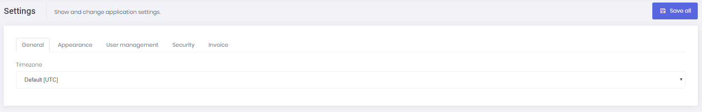
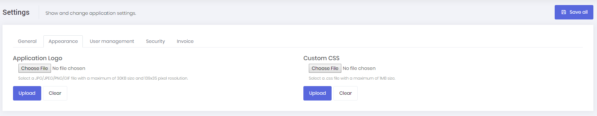
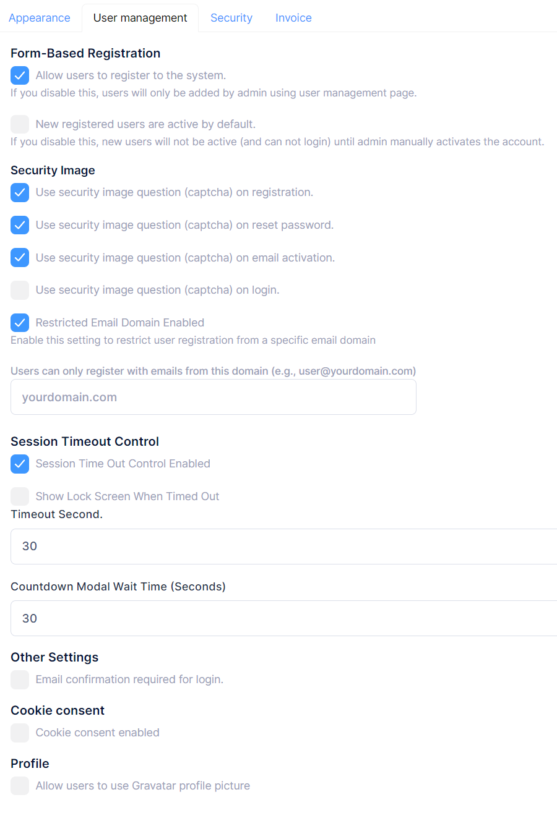
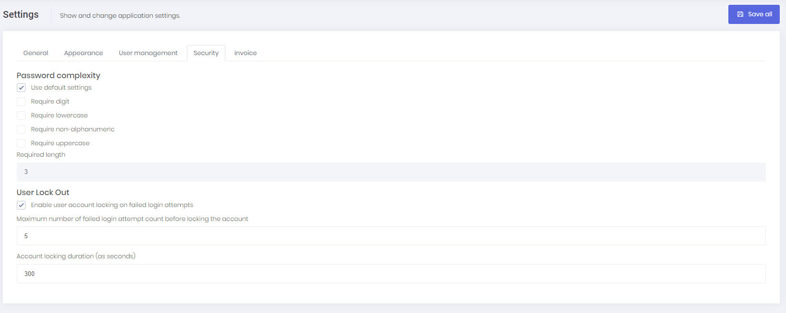
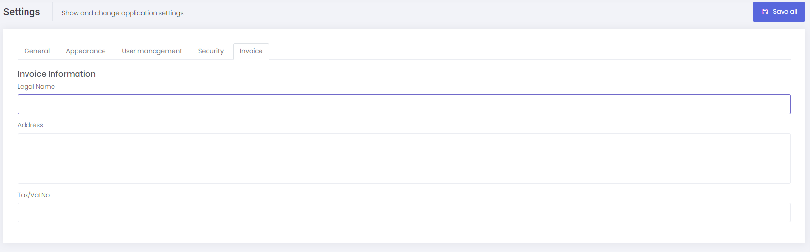

# Tenant Settings

Tenant settings page is used to configure tenant based settings.

## General

Under the general tab, each tenant can configure default time zone setting for users of that tenant. Each user of the tenant can also change this setting for their own account. 

If tenant doesn't make any change, time zone setting of host will be used.

## Appearance

Under the appearance tab, each tenant can upload a logo file and upload a custom css file. In this way, each tenant can change the look of the application only for their account. Uploaded logo and css files can be easily removed by using the clear button.

## User Management

Under the user management tab, each tenant can configure some user management settings related to their account. Each tenant can enable/disable user registration for their account. Tenants can also make newly registered users for their account active or passive by default.

Each tenant can also enable/disable captcha on user registration, reset password, email activation and login page for their account.

> Note: **Token Based Authentication** has `ReCaptchaIgnoreWhiteList` located in `WebConsts`. If you want a client app to be ignored for reCaptcha control during login, add a value to `ReCaptchaIgnoreWhiteList` and send the same value in the `User-Agent` request header for your login request from the client app. You can check the Xamarin mobile app in AspNet Zero to see how `ReCaptchaIgnoreWhiteList` works.

Each tenant can also enable or disable email restriction for their own account. When enabled, it can specify the email domain allowed for email restriction.

Each tenant can also enable/disable session timeout control for tenant users. If it is enable and the user does not provide any input to the site during the timeout period, a countdown modal will be displayed to user. If the user still does not provide any input to the site during the modal countdown period, user will be log out.

Also, each tenant can enable/disable cookie consent so ASP.NET Zero shows a cookie consent bar for the users of that tenant to accept cookie policy of the application.

Each tenant can force email confirmation for login.

Each tenant can allow tenant users to use Gravatar profile picture or not.

## Security

Security tab contains password complexity settings. Each tenant can define password complexity settings in this tab for their account. Each tenant can also configure user lock out settings.

##### Password

If MultiTenancyEnabled is set to false, the password expiration settings will apply globally to all active users across the application, rather than being configurable for each tenant.

You can enable/disable password expiration on the settings page. If you enable it, users will have to change their password after defined days passed.

You can also prevent user's new password from being same as any of last x passwords. If you enable it, you will need to define how many previous password you want to prevent. Users will not be able to use some of the previously used password as a new password.

## Invoice

Under this tab, each tenant can configure their legal name, tax number and address which will be displayed on the generated invoices. Note that, tenants can only generate invoice if they made a payment for a subscription.

If we disable multi-tenancy, some host settings are also shown in this page (since there is no host setting page).

## Next

* [Active Directory](Features-React-Active-Directory)
