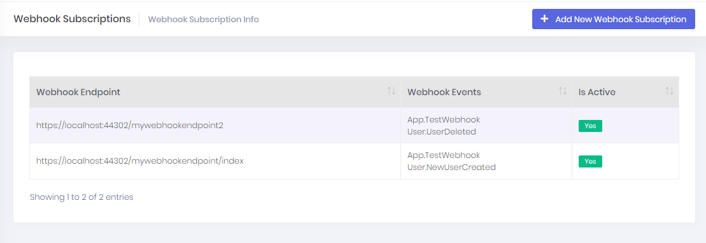
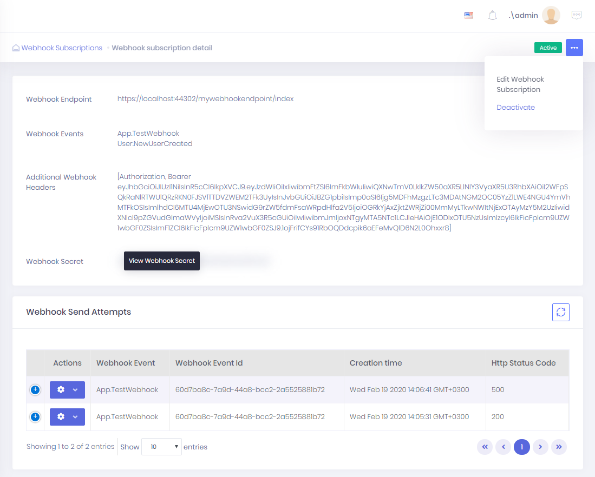
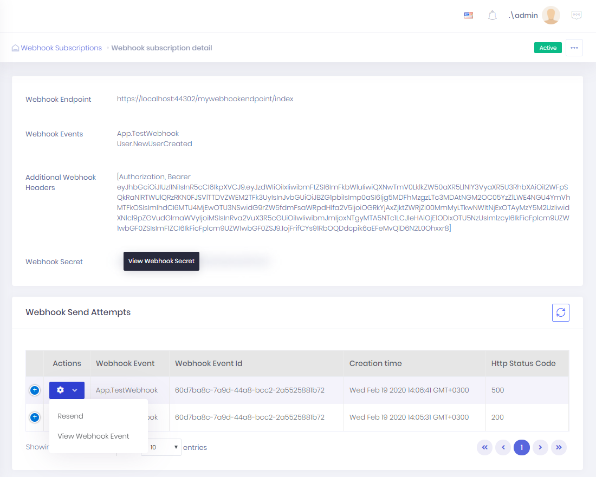
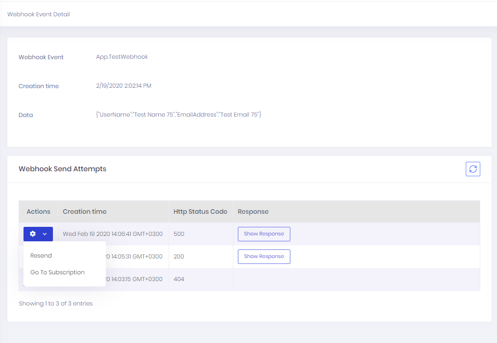

# Webhooks

ASP.NET ZERO has built-in webhook system designed with pub/sub pattern. 

In `WebhookSubscription` page, we can see all of your webhook subscriptions:

You can click a row to see detail of subscription.

In `Webhook Subscription Detail` page, you can edit, activate/deactivate subscription. And see all web hook send attempts that your subscription received. 

You can resend a webhook with same parameter or view webhook event.

In ` Webhook Event Detail` page, you can see the detail of created webhook. And you can see all send attempts for all of your subscriptions.

For more information. You can check [ASP.NET Boilerplate webhook documentation](https://aspnetboilerplate.com/Pages/Documents/Webhook-System).