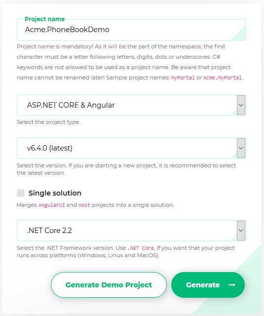
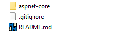
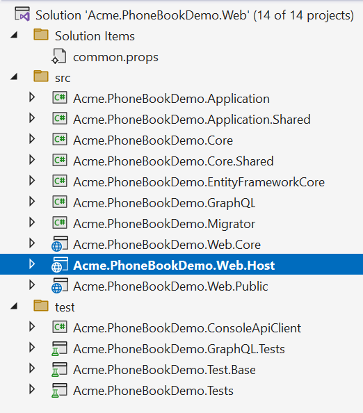
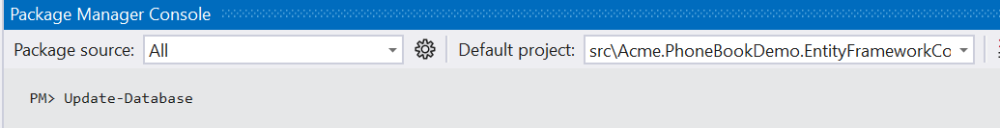
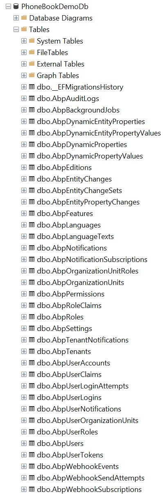
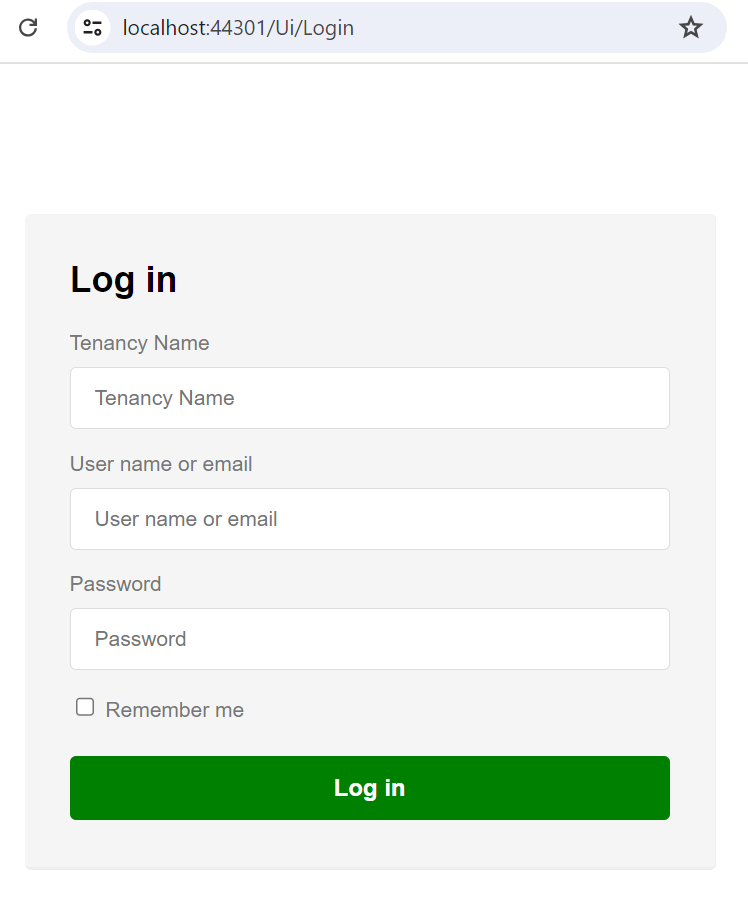
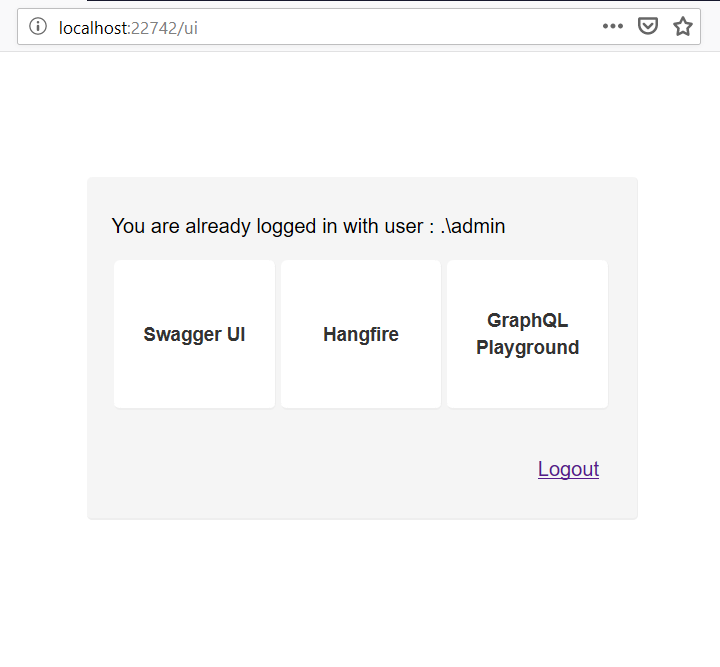
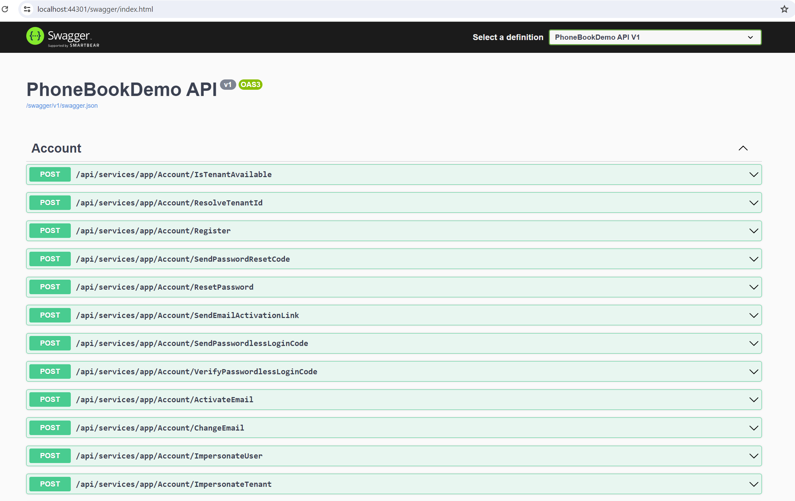
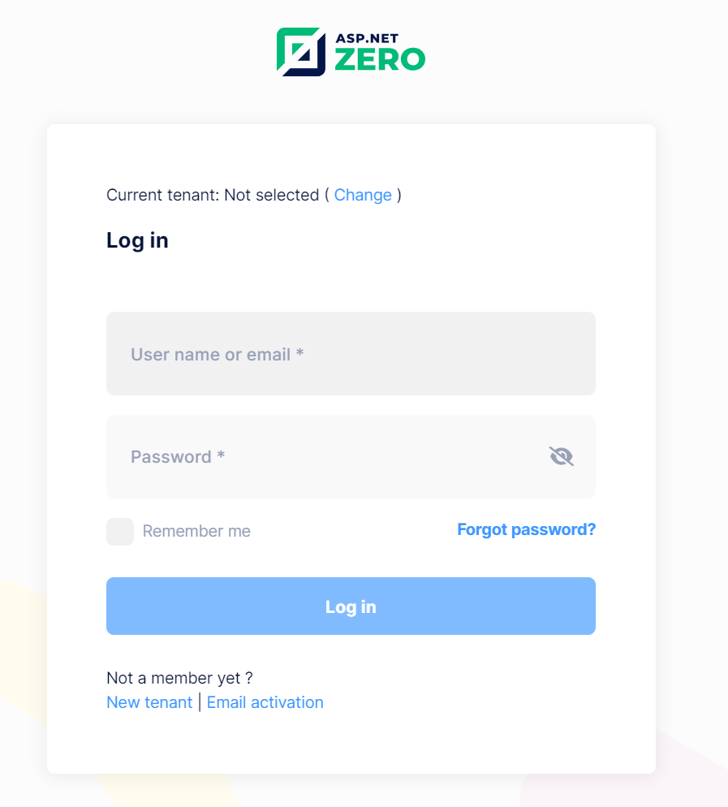
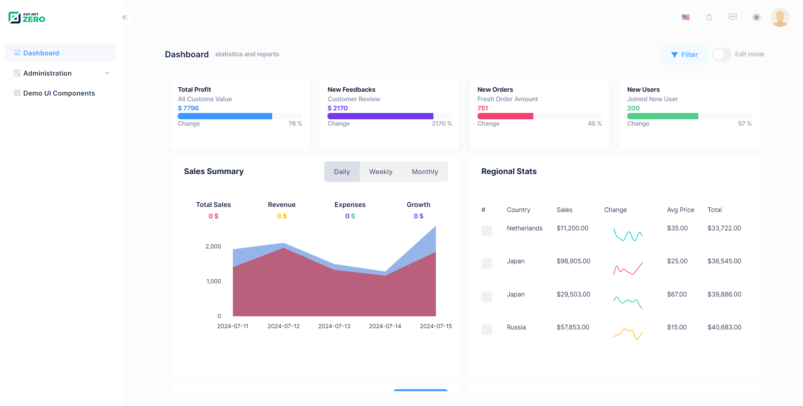

# Getting Started

This document is aimed to create and run an ASP.NET Zero based project in just 5 minutes. It's assumed that you already [purchased](https://aspnetzero.com/Pricing) and created your ASP.NET Zero account.

## Create Your Project

[Login to aspnetzero.com](https://aspnetzero.com/Account/Login) with your username and password. Go to the [download](https://aspnetzero.com/Download) page. You will see a form as shown below:



Select **ASP.NET Core & Angular** as Project Type and fill other required fields. Your project will be ready in one minute. When you open the downloaded zip file, you will see two folders:



-   **aspnet-core** folder contains the entire app. Angular UI application is placed under **aspnet-core/src/*.Web.Host** folder which is configured to work with the [angular-cli](https://cli.angular.io/). Server side API app (*.Web.Host) is an ASP.NET Core solution and configured to work with [Visual Studio](https://www.visualstudio.com/vs/community/).

## Pre Requirements

- [Visual Studio 2017 (v15.9.0+)](https://www.visualstudio.com) (for backend ASP.NET Core application)
- [Typescript 2.0+](https://www.microsoft.com/en-us/download/details.aspx?id=48593)
- [Node.js 6.9+ with NPM 3.10+](https://nodejs.org/en/download/)
- [Yarn](https://yarnpkg.com/)

## ASP.NET Core Application

When you open the server side solution (**\*.Web.sln**) using **Visual Studio 2017+**, you will see the solution structure as below:



> If you want to work on only Xamarin project, open **\*.Mobile.sln** solution. If you want to work on both of Xamarin and Web projects, open **\*.All.sln** solution.

Right click the **.Web.Host** project and select "**Set as StartUp project**". Then **build** the solution. It may take a longer time during the first build since all **nuget** packages will be restored.

### Database

#### Connection String

Open **appsettings.json** in **.Web.Host** project and change the **Default** connection string if you want:

```json
"ConnectionStrings": {
    "Default": "Server=localhost; Database=PhoneBookDemoDb; Trusted_Connection=True;"
}
```

#### Migrations

We have two options to create and migrate database to the latest version.

##### ASP.NET Zero Migrator Application

ASP.NET Zero solution includes a **.Migrator** (like Acme.PhoneBookDemo.Migrator) project in the server side solution. You can run this tool for database migrations on development and production  (see [migrator docs](Migrator-Console-Application) for more information).

##### Entity Framework Migration Command

You can also use Entity Framework Core's built-in tools for migrations. Open **Package Manager Console** in Visual Studio, set *.**EntityFrameworkCore** as the **Default Project** and run the **Update-Database** command as shown below: 



This command will create your database. Initial data will be inserted when you run the *.Web.Host project. You can open SQL Server Management Studio to check if database is created:



You can use EF console commands for development and Migrator.exe for production. But notice that; Migrator.exe supports running migrations in multiple databases at once, which can be useful in development/production for multi tenant applications.

### Configure Multi-Tenancy

ASP.NET Zero supports multi-tenant and single-tenant applications. Multi-tenancy is **enabled by default**. If you don't have an idea about multi-tenancy, you can read it on [wikipedia.org/wiki/Multitenancy](https://en.wikipedia.org/wiki/Multitenancy). If you don't want to create a multi-tenant application, you can **disable** it by setting **PhoneBookDemoConsts.MultiTenancyEnabled** to false in the ***.Core.Shared** project (name of the PhoneBookDemoConsts will be like *YourProjectName*Consts for your project).

### Run API Host

Once you've done the configuration, you can run the application. Server side application only contains APIs. When you start the application you will see a login page like below:



If you log in to host application, then you will see a page like below:



You can navigate to **Swagger UI**, **Hangfire Dashboard** or **GraphQL Playground** from this page. Note that, by default only Swagger UI is enabled, you can enable Hangfire by following [Hangfire documentation](Hangfire-Angular) and GraphQL by following [GraphQL documentation](GraphQL).

For example when you navigate **Swagger UI**, you will see following page:



## Angular Application

### Restore Packages

Navigate to the root folder of ***.Web.Host** project, open a command line and run the following command to restore the packages:

    yarn

We use [yarn](https://yarnpkg.com/) because NPM has some problems; It is slow and can not consistently resolve dependencies. Yarn solves those problems and it is compatible to NPM as well.

### Running The Application

Open the command line and run the following command:

    npm start

Once the application compiled, you can browse <http://localhost:4200> in your browser. ASP.NET Zero also has also **HMR** (Hot Module Replacement)  enabled. You can use the following command (instead of NPM start) to enable HMR on development time:

    npm run hmr

In development time, since we use **angular-cli** and it is a separate process, we need to run *.Web.Host project and Angular UI separately. However, merged Angular solution can be published to a single website or two separate websites.

### Login

All ready! Just run your solution to enter to the login page:



If multi-tenancy is enabled, you will see the current tenant and a change link. If so, click to **Change** and enter **default** as tenant name. If you leave it empty, you login as the host admin user. Then enter **admin** as user name and **123qwe** as password (remember to change it to a more secure password on production!).

### Application UI

After login to the application, you will see the sample dashboard screen:



## ASP.NET Zero Power Tools

ASP.NET Zero Power Tools lets you to create a new page from the database to the UI layer by just typing your entity properties. It creates the entity, related permissions, application services, DTOs, client-side code, a menu element and so on... It also creates & applies database migrations.

Finally you will have a CRUD page with insert, update, delete, list and excel export functions. To minimize the effort of creating a new page, install the Power Tools from the following link:

[https://marketplace.visualstudio.com/items?itemName=Volosoft.AspNetZeroPowerTools](https://marketplace.visualstudio.com/items?itemName=Volosoft.AspNetZeroPowerTools)

## Next

* [Solution Overview](Overview-Angular.md)
