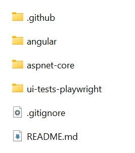

# Getting Started

This document is aimed to create and run an ASP.NET Zero based project in just 10 minutes. It's assumed that you already [purchased](https://aspnetzero.com/Prices) and created your ASP.NET Zero account.

## Login

[Login](https://aspnetzero.com/Account/Login) to this web site with your user name and password. Then you will see [Download](https://aspnetzero.com/Download) link on the main menu.

## Create Your Project

Go to the [download](https://aspnetzero.com/Download) page. You will see a form as shown below:

Select **ASP.NET Core & Angular** as Project Type and fill other required fields. Your project will be ready in one minute. When you open the downloaded zip file, you will see two folders:

-   **angular** folder contains the [Angular
    application](Development-Guide-Angular.md) which is configured to work with [angular-cli](https://cli.angular.io/).
-   **aspnet-core** folder contains the [server side](Development-Guide-Core.md) ASP.NET Core solution and configured to work with [Visual Studio](https://www.visualstudio.com/vs/community/).

### Merging Client and Server Solutions

Client and Server solutions are designed to work separately by default but if you want to work on a single Visual Studio solution, you can select "One Solution" checkbox while downloading your project.

## ASP.NET Core Application

When you open the server side solution **\*.Web.sln** in **Visual Studio 2017+**, you will see the solution structure as below:

If you want to work on only Xamarin project, open **\*.Mobile.sln** solution. If you want to work on both Xamarin and Web projects, open **\*.All.sln** solution.

Right click the **.Web.Host** project and select "**Set as StartUp project**": Then **build** the solution. It may take a longer time during the first build since all **nuget** packages will be restored.

### Database

#### Connection String

Open **appsettings.json** in **.Web.Host** project and change the **Default** connection string if you want:

    "ConnectionStrings": {
        "Default": "Server=localhost; Database=PhoneBookDemoDb; Trusted_Connection=True;"
    }

#### Migrations

We have two options to create and migrate database to the latest version.

##### ASP.NET Zero Migrator Application

ASP.NET Zero solution includes a **.Migrator** (like Acme.PhoneBookDemo.Migrator) project in the solution. You can run this tool for database migrations on development and production (see [development guide](Development-Guide-Angular.md) for more information).

##### Entity Framework Migration Command

You can also use Entity Framework's built-in tools for migrations. Open **Package Manager Console** in Visual Studio, set *.**EntityFrameworkCore** as the **Default Project** and run the **Update-Database** command as shown below: 

This command will create your database and fill initial data. You can open SQL Server Management Studio to check if database is created:

You can use EF console commands for development and Migrator.exe for production. But notice that; Migrator.exe supports running migrations in multiple databases at once, which can be useful in development/production for multi tenant applications.

### Multi-Tenancy

ASP.NET Zero supports multi-tenant and single-tenant applications. Multi-tenancy is **enabled by default**. If you don't have an idea about multi-tenancy, you can read it on [wikipedia.org/wiki/Multitenancy](https://en.wikipedia.org/wiki/Multitenancy). If you don't want to create a multi-tenant application, you can **disable** it by setting **AbpZeroTemplateConsts.MultiTenancyEnabled** to false in the ***.Core.Shared** project.

### Run API Host

Once you've done the configuration, you can run the application. Server
side application only contains APIs. When you start the application you will see a login page:

**NOTE:** If your project is a merged project, you will not see the login page when you start the host project. Basically you need to manually navigate to http://localhost:22742/ui/login.

If you log in to host application, then you will see host main page:

You can navigate **Swagger UI**, **Hangfire Dashboard** or **GraphQL Playground** from this page. For example when you navigate **Swagger UI**, you will see following page:

## Angular Application

### Prerequirements

Angular application needs the following tools to be installed:

-   [nodejs](https://nodejs.org/en/download/) 6.9+ with npm 3.10+
-   [Typescript 2.0+](https://www.typescriptlang.org/)
-   [yarn](https://yarnpkg.com/)

### Restore Packages

Navigate to the Angular folder, open a command line and run the following command to restore packages:

    yarn

**Note:** If you downloaded merged project then you should run commands on Host folder not Angular.

We suggest to use [yarn](https://yarnpkg.com/) because npm has some
problems. It is slow and can not consistently resolve dependencies, yarn
solves those problems and it is compatible to npm as well.

### Running The Application

Open the command line and run the following command:

    npm start

Once the application compiled, you can browse <http://localhost:4200> in
your browser. ASP.NET Zero also has also **HMR** (Hot Module Replacement)
enabled. You can use the following command (instead of npm start) to
enable HMR on development time:

    npm run hmr

### Login

All ready.. just run your solution to enter to the login page:

If multi-tenancy is enabled, you will see the current tenant and a change link. If so, click to **Change** like and enter **default** as tenant name. If you leave it empty, you login as the host admin user. Then enter **admin** as user name and **123qwe** as password. You should change your password at first login.

### Application UI

After you login to the application, you will see the sample dashboard screen:

## ASP.NET Zero Power Tools

ASP.NET Zero Power Tools lets you to create a new page from the backend to the UI layer by just typing your entity properties. It creates the entity, related permissions, application services, client-side code, applies DB migrations and adds to the main menu. Finally you will have a CRUD page that is capable of insert, update, delete, list, excel export functions. To minimize the effort of creating a new page, install the Power Tools from the following link:

[https://marketplace.visualstudio.com/items?itemName=Volosoft.AspNetZeroPowerTools](https://marketplace.visualstudio.com/items?itemName=Volosoft.AspNetZeroPowerTools)

## Next

Your solution is up and working. See the [Xamarin Development Guide](Development-Guide-Xamarin) or [Angular Overview](Overview-Angular) document for more information.
