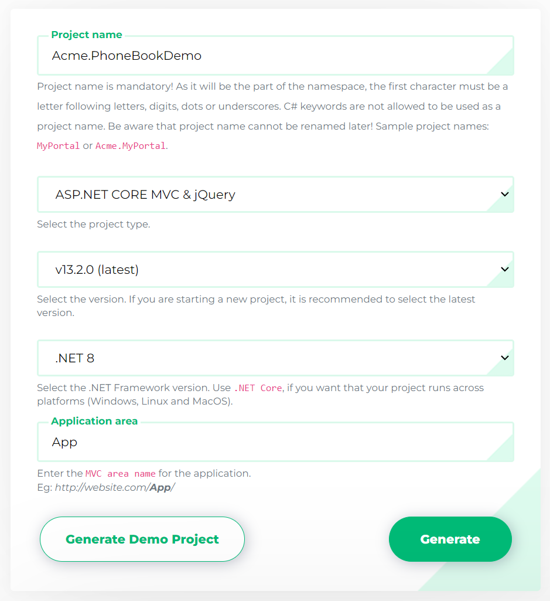

# Getting Started

This document is aimed to create and run an ASP.NET Zero based project in just 5 minutes. It's assumed that you already [purchased](https://aspnetzero.com/Pricing) and created your ASP.NET Zero account.

## Create Your Project

[Login to aspnetzero.com](https://aspnetzero.com/Account/Login) with your user name and password. Go to the [download](https://aspnetzero.com/Download) page. You will see a form as shown below:



Select **ASP.NET Core & jQuery** as Project Type and fill other required fields. Click to the Download button, your project will be ready in one minute.

## Pre Requirements

- [Visual Studio 2017 (v15.9.0+)](https://www.visualstudio.com)
- [Node.js](https://nodejs.org/en/download/) 6.9+ with NPM 3.10+
- [Yarn](https://yarnpkg.com/)

## Configure The Project

Before opening the solution, open a command prompt, navigate to root directory of **\*.Web.Mvc** project and run "**yarn**" command to install client side dependencies.

````
yarn
````

**Important Notice:** Installing client side npm dependencies using **yarn** before opening the solution will decrease project opening & building time dramatically.

Open the **\*.Web.sln** solution in **Visual Studio**. If you want to work on only Xamarin project, open **\*.Mobile.sln** solution. If you want to work on both Xamarin and Web projects, open **\*.All.sln** solution.

*.Web solution structure is shown below:


Right click the **.Web.Mvc** project, select "**Set as StartUp project**" and **build** the solution. It may take longer time in first build since all **nuget** packages will be restored.

### Database

#### Connection String

Open **appsettings.json** in **.Web.Mvc** project and change the **Default** connection string if you want:

```json
"ConnectionStrings": {
    "Default": "Server=localhost; Database=PhoneBookDemoDb; Trusted_Connection=True;"
}
```

#### Migrations

We have two options to create and migrate database to the latest version.

##### ASP.NET Zero Migrator Application

ASP.NET Zero solution includes a **.Migrator** (like Acme.PhoneBookDemo.Migrator) project in the solution. You can run this tool for database migrations on development and production platforms (see [migrator docs](Migrator-Console-Application) for more information).

##### Entity Framework Migration Command

You can also use Entity Framework's built-in tools for migrations. Open **Package Manager Console** in Visual Studio, set **EntityFrameworkCore** as the **Default Project** and run the **Update-Database** command as shown below: 


This command will create your database and fill initial data. You can open SQL Server Management Studio to check if database is created:


You can use EF console commands for development and Migrator.exe for production. But notice that; Migrator.exe supports running migrations in multiple databases at once, which is very useful in development/production for multi tenant applications.

### Configure Multi-Tenancy

ASP.NET Zero supports multi-tenant and single-tenant applications. Multi-tenancy is **enabled by default**. If you don't have idea about multi-tenancy or don't want to create a multi-tenant application, you can **disable** it by setting **PhoneBookDemoConsts.MultiTenancyEnabled** to false in the *.Core.Shared project (name of the PhoneBookDemoConsts will be like *YourProjectName*Consts for your project).

## Running The Application

Before running the project, we need to run a npm task to bundle and minify the CSS and JavaScript files. In order to do that, we can open a command prompt, navigate to root directory of ***.Web.Mvc** project and run **npm run create-bundles** command. This command should be run when a new npm package is being added to the solution. 

Now we are ready.. just run your solution. It will open the login page of the web application:


If multi-tenancy is enabled, you will see the current tenant and a change link. If so, click to Change and enter **default** as tenant name. If you leave it empty, you login as the host admin user. Then enter **admin** as user name and **123qwe** as password. You should change password at first login. You will see the following dashboard page after logging in to the application.


## ASP.NET Zero Power Tools

ASP.NET Zero Power Tools lets you to create a new page from the database to the UI layer by just typing your entity properties. It creates the entity, related permissions, application services, DTOs, client-side code, a menu element and so on... It also creates & applies database migrations.

Finally you will have a CRUD page with insert, update, delete, list and excel export functions. To minimize the effort of creating a new page, install the Power Tools from the following link:

[https://marketplace.visualstudio.com/items?itemName=Volosoft.AspNetZeroPowerTools](https://marketplace.visualstudio.com/items?itemName=Volosoft.AspNetZeroPowerTools)

## Next

* [Solution Overview](Overview-Core.md)
