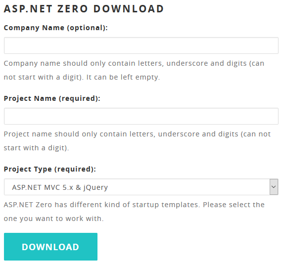
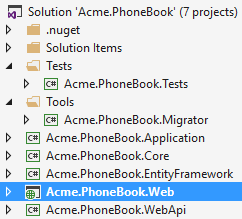
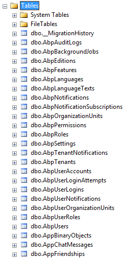

# Getting Started

This document is aimed to create and run an ASP.NET Zero based project
in just 5 minutes. It's assumed that you already [purchased](/Prices)
and created your ASP.NET Zero account.

## Login

[Login](https://aspnetzero.com/Account/Login) to this web site with your user name and
password. Then you will see [Download](https://aspnetzero.com/Download) link on the main menu.

## Create a Project

Go to the [download](https://aspnetzero.com/Download) page. You will see a form as shown
below:

Select "**ASP.NET MVC 5.x & jQuery**" or "**ASP.NET MVC 5.x & AngularJS 1.x**" based on your preference. Your project will be ready in one
minute. After extacting the downloaded zip file and opening solution in
**Visual Studio**, you will see solution structure as shown below:

## Configure The Project

Right click the **.Web** project and select "**Set as StartUp
project**": Then **build** the solution. It make take longer time in
first build since all **nuget** packages will be restored.

### Database Connection

Open web.config file in the .Web project and change the **Default**
connection string if you want:

    <add name="Default" connectionString="Server=localhost; Database=PhoneBook; Trusted_Connection=True;" providerName="System.Data.SqlClient" />

### Database Migrations

You have two options to create and migrate database to the latest
version.

#### ASP.NET Zero Migrator Application

ASP.NET Zero solution includes a **.Migrator** (like
Acme.PhoneBook.Migrator) project in the solution. You can run this tool
for database migrations on development and production (see [development
guide](Development-Guide-Mvc-Angularjs.md) for more information).

#### Entity Framework Migration Command

You can also use Entity Framework's built-in command line tools for
migrations.

Open **Package Manager Console** (Under Tools\\Nuget Package Manager in
the main menu), select **.EntityFramework** project as **Default
project** and run **Update-Database** command.

This command will create your database and fill initial data. You can
open SQL Server Management Studio to check if database is created:

You can use EF console commands for development and Migrator.exe for
production. But notice that; Migrator.exe supports running migrations in
multiple databases at once, which can be useful in
development/production for multi tenant applications.

### Multi-Tenancy

ASP.NET Zero supports multi-tenant and single-tenant applications.
Multi-tenancy is **enabled by default**. If you don't have idea about
multi-tenancy or don't want to create a multi-tenant application, you
can **disable** it by setting
**AbpZeroTemplateConsts.MultiTenancyEnabled** to false in the .Core
project.

## Run The Project

All ready.. just run your solution. It will open home page of your web
site. You can click login link at top right corner to **login** to the
application:

Enter **default** as tenancy name (this field is shown if multi-tenancy
is enabled), **admin** as user name and **123qwe** as password. You
should change password at first login. After login to the application,
you will see sample dashboard screen:

If your application is multi-tenant, then you can leave tenancy name as
**empty** in login screen and use **admin** as user name and **123qwe**
as password to login as **host admin**.

## More

Your solution is up and working. See [development
guide](Development-Guide-Mvc-Angularjs.md) document for more
information.
