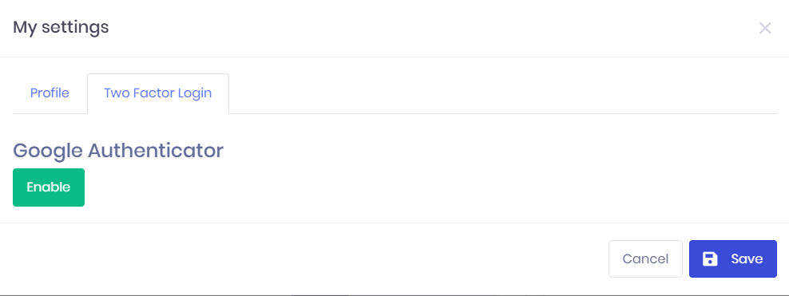
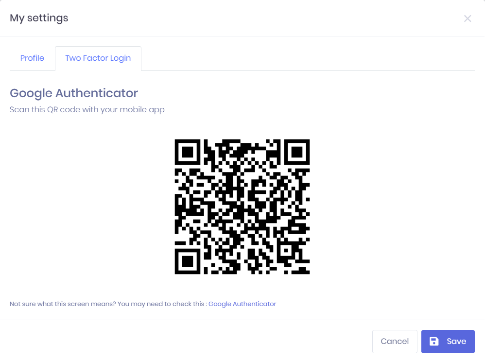
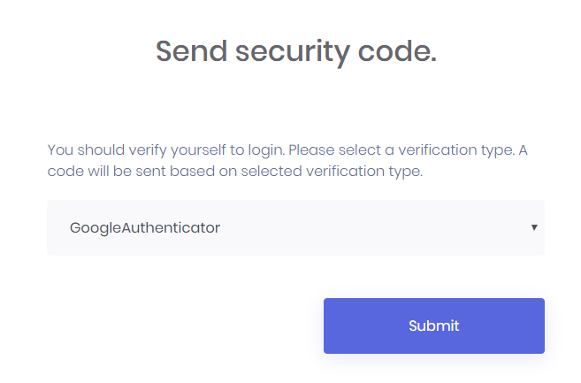
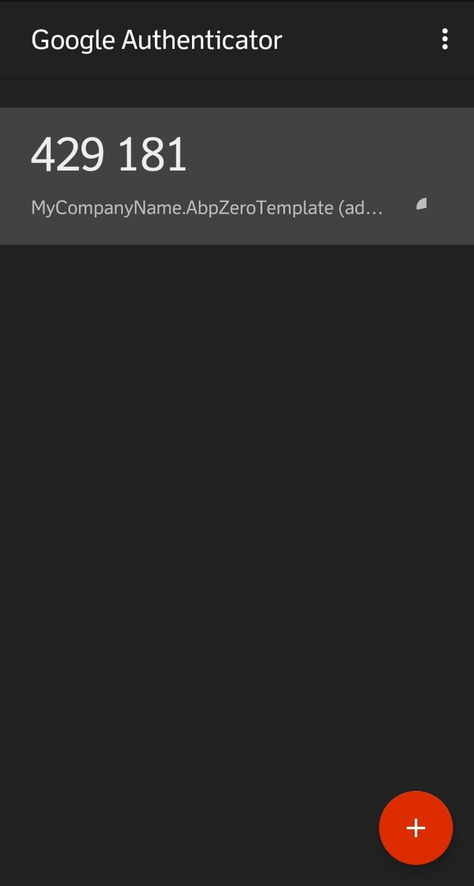

# Google Authenticator

To use Google Authenticator, enable **two factor user login** then enable **Google Authenticator** in host settings Security tab.

## Usage

* Install Google Authenticator mobile app to your mobile phone (Search for "Google Authenticator" to install).
* In AspNet Zero, go to **My settings** -> **Two Factor Login** tab and enable Google Authenticator.

* After enabling Google Authenticator, you will see a QR Code like below. Open your app and scan QR code.

  

After that you will be able to use **Google Authenticator** during two-factor login. 

* When you try to login, you will see Google Authenticator option:

  

* Select **GoogleAuthenticator** and then open Google Authenticator mobile app on your mobile phone. 

  

* Enter the code you see on the Google Authenticator app as the verification code:

  

