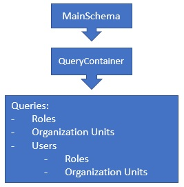
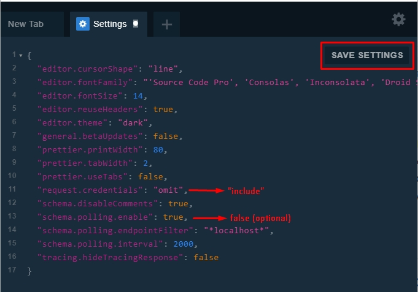
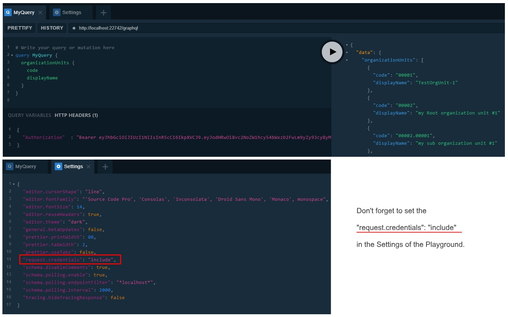

# GraphQL

GraphQL is a query language for APIs and a runtime for fulfilling those queries with your existing data. GraphQL provides a complete and understandable description of the data in your API, gives clients the power to ask for exactly what they need and nothing more, makes it easier to evolve APIs over time, and enables powerful developer tools. It is a single API face for different clients like mobile, desktop apps, tablets. ASP.NET Zero includes an implementation of GraphQL API. In the solution the ***.GraphQL** project exposes some built-in queries like Organization Units, Roles and Users . There is also a unit test project ***.GraphQL.Tests** in the `test` folder. You can add your own GraphQL unit tests to this project.

For more information about GraphQL visit [https://graphql.org/](https://graphql.org/)


## GraphQL Structure

The ***.GraphQL** project consists of a `MainSchema`. In the `MainSchema` there is `QueryContainer` that hosts all queries. Out of the box, there are queries for `Roles`, `Organization Units` and `Users`. 




The **.GraphQL** project depends on `AbpZeroTemplateCoreModule`. It is used in the ***.Web.Host** and  ***.Web.Mvc** projects. So both `ASP.NET Core Angular` and `ASP.NET Core MVC` templates contain GraphQL project.

The GraphQL is being added in the `Configure` method of ***.Web.Host.Startup** for `Angular` project and  ***.Web.Mvc.Startup** for `MVC` project.

There is also GraphQL Playground included in the project. GraphQL Playground  is an IDE like Swagger,  helps you to write your queries directly from your website. The default endpoint of the playground is *http://your-domain.com/ui/playground* 

```csharp
app.UseGraphQL<MainSchema>();
app.UseGraphQLPlayground(new GraphQLPlaygroundOptions()); 
```

The GraphQL middleware is being added in `ConfigureService` method of  ***.Web.Host.Startup** for `Angular` project and ***.Web.Mvc.Startup** for `MVC` project.

```csharp
services.AddAndConfigureGraphQL();
```

`AddAndConfigureGraphQL()` is an extension method to add the GraphQL middleware and makes necessary configurations. In debug mode, all GraphQL exceptions are being sent to the client but in release mode exceptions are not being sent to the client.

## Enabling GraphQL 

By default, GraphQL is **disabled**. To enable the GraphQL, open `WebConsts.cs` in the ***.Web.Core** project  and set `GraphQL.Enabled = true`. 

**Web.Core/Common/WebConsts.cs**

```csharp
public static class WebConsts
{
    //ignored...
    
    public static class GraphQL
    {
        //ignored...
        public static bool Enabled = true;
    }
}
```

## GraphQL Endpoint

The default GraphQL endpoints are;

* [https://localhost:44302/graphql](https://localhost:44302/graphql) `MVC`
* [https://localhost:44301/graphql](https://localhost:44301/graphql) `Angular`

### Changing The Default GraphQL Endpoint

You can change the default endpoint of the GraphQL. To do this, open the `Startup.cs` in the ***.Web.Host** project for `Angular` or in the ***.Web.Mvc** project for `MVC`. In the `Configure` method, find the line `app.UseGraphQL<MainSchema>()`. And set the `path` parameter like below;

```csharp
app.UseGraphQL<MainSchema>(path: "/mygraphql");
```

This will change your endpoint to ` yourdomain.com/mygraphql`.

## GraphQL Playground

GraphQL Playground is an extension tool that helps you write your GraphQL queries easily. It supports  autocompletion & error highlighting. It is included AspNet Zero but disabled by default.
The default GraphQL Playground endpoints are;

- [https://localhost:44302/ui/playground](https://localhost:44302/ui/playground)  `MVC`
- [https://localhost:44301/ui/playground](https://localhost:44301/ui/playground)  `Angular`

There is also a desktop version of the GraphQL Playground. The desktop app is the same as the web version but includes these additional features:

- Partial support for [graphql-config](https://github.com/prismagraphql/graphql-config) enabling features like multi-environment setups (no support for sending HTTP headers).
- Double click `*.graphql` files to open.

To download GraphQL Desktop version click on the following link;

[https://github.com/prisma/graphql-playground/releases](https://github.com/prisma/graphql-playground/releases)

## Enabling GraphQL Playground

By default, GraphQL Playground is **disabled**. To enable it, open `WebConsts.cs` in the ***.Web.Core** project and set `GraphQL.PlaygroundEnabled=true` in the `WebConsts.GraphQL` class. 

**Web.Core/Common/WebConsts.cs**

```csharp
public static class WebConsts
{
    //ignored...
    
    public static class GraphQL
    {
        //ignored...
        public static bool PlaygroundEnabled = true;
    }
}
```


### Changing GraphQL Playground Default Endpoint

You can change the default endpoint of the GraphQL Playground. To do this, open `Startup.cs` of the ***.Web.Host** for `Angular` or  the ***.Web.Mvc** for `MVC`. In the `Configure` method, find the  line`app.UseGraphQLPlayground()` and set the `Path` property of `GraphQLPlaygroundOptions` ;

````csharp
app.UseGraphQLPlayground(new GraphQLPlaygroundOptions
{
    Path = new PathString("/myplayground")
});
````

This will change your playground endpoint to ` yourdomain.com/myplayground`.

### GraphQL Playground Settings

To be able to run the queries that requires authentication, you need to open Playground on your browser, open settings tab and change the `request.credentials` from `omit` to `include` . This is needed for cookie authentication.

On the other hand, Playground uses polling to update the schema and refreshes the schema every 2 seconds. You can also safely disable this option to not see flooding XHR requests on your browser's network tab. 

The necessary changes are;

```json
{
   "request.credentials": "include",
   "schema.polling.enable": false   
}
```

After these settings, you need to save it by pressing `SAVE SETTINGS` button.




## Running Queries on GraphQL Playground

Playground gives you the advantage of writing the queries with intellisense and see the results on your browser. There are two types of queries; **Queries require authentication** and **Queries don't require authentication**. For the queries that don't require authentication, you can directly write the query on the Playground and see the results. But for the authentication required queries you have to authenticate first. To authenticate, read the next section of the project that is relevant to you..

### Authenticating Playground Requests in MVC Project

#### Authenticating With Cookie

MVC project uses cookie authentication. Before running any queries that need authentication, you need to login to your website to retrieve the authentication cookie. 
Start your ***.Web.Mvc** project, open your browser and navigate to [https://localhost:44302/Account/Login](https://localhost:44302/Account/Login).
After successful login, you will have a valid authentication cookie in your browser's storage.
Now you can go to [https://localhost:44302/ui/playground](https://localhost:44302/ui/playground) and run your query as authenticated.

### Authenticating Playground Requests in Angular Project

Angular project uses both token (Bearer) authentication and cookie authentication. The simplest way is authenticating with cookie.

#### Authenticating With Cookie

Start your ***.Web.Host** project and go to [https://localhost:44301/ui/login](https://localhost:44301/ui/login).
After the successful login, you will see the GraphQL Playground box in the redirected page.
Click the link that goes to [https://localhost:44301/ui/playground](https://localhost:44301/ui/playground) and run your query as authenticated.

#### Authenticating With Token

Alternatively you can use token authentication in `Angular ` project.
Make a post request to [https://localhost:44301/api/TokenAuth/Authenticate](https://localhost:44301/api/TokenAuth/Authenticate) to get the token.
See the below request to get the token:

```json
POST /api/TokenAuth/Authenticate HTTP/1.1
Host: localhost:22742
Content-Type: application/json
cache-control: no-cache

{
	TenancyName: "",
	UserNameOrEmailAddress: "admin",
	Password: "123qwe"
}
```

You will get a similar response like below. You will use `accessToken` value.

```json
{
    "result": {
        "accessToken": "eyJhbGciOiJIUzI1NiIsInR5cCI6IkpXVCJ9.eyJodHRwOi8vc2NoZW1hcy54bWxzb2FwLm9yZy93cy8yMDA1LzA1L2lkZW50aXR5L2NsYWltcy9uYW1laWRlbnRpZmllciI6IjEiLCJodHRwOi8vc2NoZW1hcy54bWxzb2FwLm9yZy93cy8yMDA1LzA1L2lkZW50aXR5L2NsYWltcy9uYW1lIjoiYWRtaW4iLCJBc3BOZXQuSWRlbnRpdHkuU2VjdXJpdHlTdGFtcCI6IktGWDUzQldLWlNZNUE1TjNQM0xYRFM2S1NUNUIyRDdPIiwiaHR0cDovL3NjaGVtYXMubWljcm9zb2Z0LmNvbS93cy8yMDA4LzA2L2lkZW50aXR5L2NsYWltcy9yb2xlIjpbIkFkbWluIiwiMjU2ZTc4NmVmZmFmNDJmZDk5N2MyNTk5MTNjNjEyNDciXSwic3ViIjoiMSIsImp0aSI6ImZkMmY3NWFhLWNiMWItNDlmMi1iYjg2LWZjNTNiMmZhYTI3NyIsImlhdCI6MTU1MjYzOTM5NiwidG9rZW5fdmFsaWRpdHlfa2V5IjoiNjFhOGVkNjYtMTMwYS00ODhhLWEwMTAtYThkMDI2M2RiNTUxIiwidXNlcl9pZGVudGlmaWVyIjoiMSIsIm5iZiI6MTU1MjYzOTM5NiwiZXhwIjoxNTUyNzI1Nzk2LCJpc3MiOiJBYnBaZXJvVGVtcGxhdGUiLCJhdWQiOiJBYnBaZXJvVGVtcGxhdGUifQ.nGcwto1Ih8z15FIZ_4lAXc_Q7Lf1ccJwKDAnGh8AzY8",
        "encryptedAccessToken": "wNYmO41/48SHNstaLVXxHCCre29BZQl1NhC6NM3R3rzpXtPQxVzH6jEzA/QhXFN5tu6Fk7pO53uppm1mVXMZgxbyRVz26dnepi/FyB6axBY+6gq1GL+uRQgoiFUCjRN2p8w6LevViwKlHyWZZJZO1DGVSjAi1m2U+og9pkHw9/QR4Nl/DPnoP9JYDMpZ1zxx09u6s0GZ9/Q5Sjk+L0UfcSCbl38X8he5w9UIn/Hvxh7ysM1CiPLsoOwtbiieSRVmrmt0JjnipAn4/K283F8GrGwzwgehWsqefmUnM0ckMwP9ZAdwQxWDhxv0IqNw4tDhwUYs/1SYdYozdNzgByhgNOBPzQDObNLlWc4vV5VMOiajyrvabgoLnMvpYCP0YrrR2Trkgw9U1crOz6qWkGpdxJs8t6le2nIPkkMDOuzJL+9gOpxxPd6pOXWTmPN73/ioJF5xcwxX3KnKQX7IbIlv7MRIHQf0EjGdpCk+TMkVcAAYSOGMv/0AMZSS0LZQYDrDCEy1wQMDhH8FT4VaJDnugINdL8TWD7ZX3lYu3HLvTpyDX59wqSqUuT/M0XaTW+J/7lGWOyz8zzPUXPsID4wDAXGe6vfLrzn0Tz9zyeRbXApmmP0aFJN7xfh96O3H4H7L9QWNefIZjq0UMPGmDkCW7FubMRuLNdJNLs6ItfUDCJcDVppn0hNRJB7mpocPeII4fd06Q7YGdbB3sruMYXx/CQxvZCiohK4q0hQxFXqG7Xb2Ig1xYJOA5qT9JikvS2vVcvDGh/+Shn6FQISBwDGwOBjlJ4EupqQ1XalfAqa4IPUjskHsN1spypNb4WMZvu5gooxES4mFdTiJoPPR7WgpauAdu2CHKr7CLla6fBeHfVbNXgVYPEM/mJFnd++RZj5SYul+6FhwZwNfTixawjknoGX9+vJfeYID5V1F4mjN86FAP4caVp5nAOuycdYjgnc6vdvEXjuZ+KU5nVFFO8U5i+Xd9Hc0qMNllF6aM3TilIHVWQKdESuHdBLfCT7MYyeWu1YNh7LsXuadb7eTctUUzxJ3roUh6tg/hyRh9TE7hGvmvucz+2ZJwfnYfLNeXXnTJjsDKIWwHC9v999e5B2LeA==",
        "expireInSeconds": 86400,
        "shouldResetPassword": false,
        "passwordResetCode": null,
        "userId": 1,
        "requiresTwoFactorVerification": false,
        "twoFactorAuthProviders": null,
        "twoFactorRememberClientToken": null,
        "returnUrl": null,
        "refreshToken": "eyJhbGciOiJIUzI1NiIsInR5cCI6IkpXVCJ9.eyJodHRwOi8vc2NoZW1hcy54bWxzb2FwLm9yZy93cy8yMDA1LzA1L2lkZW50aXR5L2NsYWltcy9uYW1laWRlbnRpZmllciI6IjEiLCJodHRwOi8vc2NoZW1hcy54bWxzb2FwLm9yZy93cy8yMDA1LzA1L2lkZW50aXR5L2NsYWltcy9uYW1lIjoiYWRtaW4iLCJBc3BOZXQuSWRlbnRpdHkuU2VjdXJpdHlTdGFtcCI6IktGWDUzQldLWlNZNUE1TjNQM0xYRFM2S1NUNUIyRDdPIiwiaHR0cDovL3NjaGVtYXMubWljcm9zb2Z0LmNvbS93cy8yMDA4LzA2L2lkZW50aXR5L2NsYWltcy9yb2xlIjpbIkFkbWluIiwiMjU2ZTc4NmVmZmFmNDJmZDk5N2MyNTk5MTNjNjEyNDciXSwic3ViIjoiMSIsImp0aSI6ImU1NTY3MTkxLWY0YTktNDZjOC04Mjc3LTgyMjdlYjRiZjNmMCIsImlhdCI6MTU1MjYzOTM5NiwidG9rZW5fdmFsaWRpdHlfa2V5IjoiNjJmYWMzNDMtNDhiOS00MTgzLTkyMWItNGM4Njk5YWQ1YzdhIiwidXNlcl9pZGVudGlmaWVyIjoiMSIsIm5iZiI6MTU1MjYzOTM5NiwiZXhwIjoxNTg0MTc1Mzk2LCJpc3MiOiJBYnBaZXJvVGVtcGxhdGUiLCJhdWQiOiJBYnBaZXJvVGVtcGxhdGUifQ.u6cnxzB6Hnd4VpPYt-hOi23f6YlEkNZdw3cnyzi-0go"
    },
    "targetUrl": null,
    "success": true,
    "error": null,
    "unAuthorizedRequest": false,
    "__abp": true
}
```

Write the `accessToken` value to the HTTP headers as seen below. 

### Sample GraphQL Query

Here's a sample query that retrieves built-in entities like `role`, `organizationUnit` and `user`. You can use this query to test if your GraphQL API is working properly.

```json
query MyQuery {
  users(id: 1) {
    totalCount
    items {
      name
      surname

      roles {
        id
        name
        displayName
      }

      organizationUnits {
        id
        code
        displayName
      }
    }
  }

  roles {
    displayName
    id
    name
    tenantId
  }

  organizationUnits {
    id
    code
    displayName
    tenantId
  }
}
```

**Be aware** that if your authentication is not valid or if you didn't set  `"request.credentials": "include"` in your Playground settings, you will see the below error response for the authentication required queries.

```json
errors": [
    {
      "message": "GraphQL.ExecutionError: Error trying to resolve users. ---> Abp.Authorization.AbpAuthorizationException: Current user did not login to the application!\r\n   at Abp.Authorization.AuthorizationHelper.AuthorizeAsync(IEnumerable`1 authorizeAttributes) in D:\\Github\\aspnetboilerplate\\src\\Abp\\Authorization\\AuthorizationHelper.cs:line 42\r\n   at Abp.Authorization.AuthorizationHelper.CheckPermissions(MethodInfo methodInfo, Type type) in D:\\Github\\aspnetboilerplate\\src\\Abp\\Authorization\\AuthorizationHelper.cs:line 107\r\n   at Abp.Authorization.AuthorizationHelper.AuthorizeAsync(MethodInfo methodInfo, Type type) in D:\\Github\\aspnetboilerplate\\src\\Abp\\Authorization\\AuthorizationHelper.cs:line 56\r\n   at Nito.AsyncEx.Synchronous.TaskExtensions.WaitAndUnwrapException(Task task)\r\n   at System.Threading.ExecutionContext.RunInternal(ExecutionContext executionContext, ContextCallback callback, Object state)\r\n--- End of stack trace from previous location where exception was thrown ---\r\n   at System.Threading.Tasks.Task.ExecuteWithThreadLocal(Task& currentTaskSlot)\r\n--- End of stack trace from previous location where exception was thrown ---\r\n   at Nito.AsyncEx.Synchronous.TaskExtensions.WaitAndUnwrapException(Task task)\r\n   at Nito.AsyncEx.AsyncContext.Run(Func`1 action)\r\n   at Abp.Authorization.AuthorizationInterceptor.Intercept(IInvocation invocation) in D:\\Github\\aspnetboilerplate\\src\\Abp\\Authorization\\AuthorizationInterceptor.cs:line 20\r\n   at Castle.DynamicProxy.AbstractInvocation.Proceed()\r\n   at Castle.DynamicProxy.AbstractInvocation.Proceed()\r\n   at Castle.Proxies.UserQueryProxy.Resolve(ResolveFieldContext`1 context)\r\n   at MyCompanyName.AbpZeroTemplate.Core.Base.AbpZeroTemplateQueryBase`2.InternalResolve(ResolveFieldContext`1 context) in D:\\Github\\aspnet-zero-core\\aspnet-core\\src\\MyCompanyName.AbpZeroTemplate.GraphQL\\Core\\Base\\AbpZeroTemplateQueryBase.cs:line 47\r\n   at Abp.Threading.InternalAsyncHelper.AwaitTaskWithPostActionAndFinallyAndGetResult[T](Task`1 actualReturnValue, Func`1 postAction, Action`1 finalAction)\r\n   at GraphQL.Instrumentation.MiddlewareResolver.Resolve(ResolveFieldContext context)\r\n   at GraphQL.Execution.ExecutionStrategy.ExecuteNodeAsync(ExecutionContext context, ExecutionNode node)\r\n   --- End of inner exception stack trace ---",
	   "locations": [
        {
          "line": 2,
          "column": 3
        }
      ],
      "path": [
        "users"
      ],
      "extensions": {
        "code": "ABP_AUTHORIZATION"
      }
    }
]
```


## GraphQL Query Execution Flow

When a new query is initiated, the GraphQL middleware parses the query then routes it to the corresponding query handler which is registered in `QueryContainer` class of the ***.GraphQL** project. Out of the box there are 3 query handlers registered in `QueryContainer`: `RoleQuery, ` `UserQuery` and  `OrganizationUnitQuery`. The next step is the `Resolve` method of the query with the query context. The query context has all the information about a query like  `UserContext`, `Arguments`, `Selections` and `Variables`. If there is an `[AbpAuthorize]`  attribute on the `Resolve` method, AspNet Boilerplate framework checks the related permission of the logged on user and throws `ABP_AUTHORIZATION` exception when the related permission is not granted. If there is no `[AbpAuthorize]` attribute, then it can be run by anonymous users. In the `Resolve` method, the necessary query runs and returns a `DTO` object. Then the `DTO` object is being converted to the relevant `IGraphType`. This conversation is made by the GraphQL middleware and the middleware knows which `IGraphType` to be converted, as it is registered it in the `QueryContainer`.


## Writing a New GraphQL Query

Let's create a new GraphQL query.  For this example we will use `AbpAuditLogs` that stores all logs in the database. Below is a simplified version of the `AuditLog` entity.

**AuditLog Entity:**

```csharp
public class AuditLog : Entity<long>, IMayHaveTenant
{
    //...ignored other properties
	public virtual int? TenantId { get; set; }
	public virtual long? UserId { get; set; }
	public virtual string ServiceName { get; set; }
	public virtual DateTime ExecutionTime { get; set; }
}
```

1. Create a new `DTO ` class. Name it `AuditLogDto.cs`, locate it in the `DTO` folder of the ***.GraphQL** project.   Add the `[AutoMapFrom(typeof(AuditLog))]` attribute to register the `AuditLogDto` for mapping. This will be used to map from the `AuditLog` entity to `AuditLogDto`.

   **AuditLogDto.cs**

   ```csharp
   [AutoMapFrom(typeof(AuditLog))]
   public class AuditLogDto : EntityDto<long>
   {    
   	public int? TenantId { get; set; }
   	public long? UserId { get; set; }
   	public string ServiceName { get; set; }
   	public DateTime ExecutionTime { get; set; }
   }
   ```

2. Create a new class in the `Types` folder of the ***.GraphQL** project and name it `AuditLogType.cs`. Derive this class from `ObjectGraphType<AuditLogDto>`. `AuditLogType` will be used to map from the `AuditLogDto` class.

   Be careful with the `nullable` types. You must explicitly define the `nullable` field.

   **AuditLogType.cs**

   ```csharp
   public class AuditLogType : ObjectGraphType<AuditLogDto>
   {
   	public AuditLogType()
   	{
   		Field(x => x.Id);
   		Field(x => x.UserId, nullable: true);
   		Field(x => x.TenantId, nullable: true);
   		Field(x => x.ExecutionTime);
   		Field(x => x.ServiceName);
   	}
   }
   ```

3. Create a new class and name it `AuditLogQuery.cs` in the `Queries` folder of the  ***.GraphQL** project. This is the query resolver for `AuditLogs`. It should be derived from the base `AbpZeroTemplateQueryBase<TField,TResult>`. This abstract base class has two generic types. `TField`  which is the type to return to the client. In this example, it is a list of `AuditLogType`. Other field is `TResult`, this is the return type of the `Resolve()` method. Basically `TResult` will be mapped to `TField` by the GraphQL middleware. 

   To get the list of audit logs, `IRepository<AuditLog, long>` is injected into the query. Note that the base class `AbpZeroTemplateQueryBase` is registered to the dependency injection container with `ITransient` lifecycle. So all the GraphQL queries derived from `AbpZeroTemplateQueryBase` are meant to be `ITransientDependency`.

   The base constructor of the query requires a field name. In our sample, the field name is `auditLogs`. This name will be used in the query text. The second parameter is the list of `Arguments`. It is a `Dictionary<string, Type>` to allow clients to filter the query with these arguments. In this example, `userId` and `serviceName` are arguments and can be sent by clients to filter the records.

   **AuditLogQuery.cs**

   ```csharp
   public class AuditLogQuery : AbpZeroTemplateQueryBase<ListGraphType<AuditLogType>, List<AuditLogDto>>
   {
   	private readonly IRepository<AuditLog, long> _auditLogRepository;
   
   	public static class Args
   	{
   		public const string UserId = "userId";
   		public const string ServiceName = "serviceName";
   	}
   
   	public AuditLogQuery(IRepository<AuditLog, long> auditLogRepository)
   	:base("auditLogs",new Dictionary<string, Type>
   	{
   		{Args.UserId, typeof(IdGraphType)},
   		{Args.ServiceName, typeof(StringGraphType)}
   	})
   	{
   		_auditLogRepository = auditLogRepository;
   	}
   
   	protected override Task<List<AuditLogDto>> Resolve(ResolveFieldContext<object> context)
   	{
   		throw new NotImplementedException();
   	}
   }
   ```

   Let's write the content of `Resolve()` method. Basically we need to return a list of `AuditLogDto` filtered with the given arguments.  To keep it simple, we will return only the 10 records. In the below code, `ContainsArgument` is an extension method that helps us to add a condition to the query if there is an argument. If the client sends `UserId` or `ServiceName` arguments, they will be filtered in the query. On the last row, `ProjectToListAsync` is a base method and maps the queryable list to the list of `AuditLogDto`. 

   ```csharp
   protected override async Task<List<AuditLogDto>> Resolve(ResolveFieldContext<object> context)
   {
   	var query = _auditLogRepository.GetAll().Take(10).AsNoTracking();
   
   	context
   		.ContainsArgument<int>(Args.UserId, userId => query = query.Where(a => a.UserId == userId))
   		.ContainsArgument<string>(Args.ServiceName, serviceName => query = query.Where(a => a.ServiceName == serviceName));
   
   	return await ProjectToListAsync<AuditLogDto>(query);
   }
   ```

4. Add the `AuditLogQuery` to the `QueryContainer`. This is needed for exposing schema.

   ```csharp
   public sealed class QueryContainer : ObjectGraphType, ITransientDependency
   {
      public QueryContainer(
          //other queries... ,
          
          AuditLogQuery auditLogQuery)
      {
            //other queries...
            
            AddField(auditLogQuery.GetFieldType());
      }
   }
   ```

5. It is completed. We have added a new query to get audit logs. You can now run the query on the  GraphQL Playground and see the results. Below is the sample query to get the audit logs from GraphQL API.

   ```json
   query MyAuditLogQuery {
     auditLogs {
       id
       serviceName
       tenantId
       userId
       executionTime
     }
   }
   ```

   The result is a JSON data and similar to the below:

   Note that, to see some data in the response, there should be data in your `AbpAuditLogs` table.

   ```json
    "data": {
       "auditLogs": [
         {
           "id": 1,
           "serviceName": "MyProject.Web.Controllers.AccountController",
           "tenantId": null,
           "userId": 1,
           "executionTime": "2019-03-14"
         },
         {
           "id": 2,
           "serviceName": "MyProject.Web.Controllers.AccountController",
           "tenantId": null,
           "userId": 1,
           "executionTime": "2019-03-14"
         }
   	]
   }
   ```

6. The new query is ready but accessible by anonymous users. If you would like to add a permission check for your query, it is the same as we use in [Application Services](https://aspnetboilerplate.com/Pages/Documents/Authorization#checking-permissions). Add the `[AbpAuthorize]` attribute with the required permission to the `Resolve()` method.

   ```csharp
   [AbpAuthorize(AppPermissions.Pages_Administration_AuditLogs)]
   ```

   The final look of the `Resolve()` method:

   ```csharp
   [AbpAuthorize(AppPermissions.Pages_Administration_AuditLogs)]
   protected override async Task<List<AuditLogDto>> Resolve(ResolveFieldContext<object> context)
   {
   	var query = _auditLogRepository.GetAll().Take(10).AsNoTracking();
   
   	context
   		.ContainsArgument<int>(Args.UserId, userId => query = query.Where(a => a.UserId == userId))
   		.ContainsArgument<string>(Args.ServiceName, serviceName => query = query.Where(a => a.ServiceName == serviceName));
   
   	return await ProjectToListAsync<AuditLogDto>(query);
   }
   ```

   To run the final query with `[AbpAuthorize]` attribute, you need to get an authentication cookie. Go to your login page:

   * https://localhost:44302/Account/Login  `MVC `.
   * https://localhost:44301/ui/login `Angular`

   After successful login, you will have your authentication cookie and you can run the query.

## Writing a New Unit Test For Your Query

When you write a new GraphQL query, it is suggested to write a new unit test for the query. ASP.NET Zero provides a unit test project for your GraphQL queries. There is a `test` folder in your ASP.NET Zero solution. In the `test` folder, open the ***.GraphQL.Tests** project.  Create a new folder for your new query. 

In our previous sample, we have written a query for `AuditLog` entity. Let's write a unit test for the `AuditLogQuery`.

Before writing a new unit test for a new entity. You need to add sample data to the in-memory test database. For the `AuditLog ` tests, let's add some test data;

1. Open ***.Test.Base** project and create a new class, name it `TestAuditLogsBuilder.cs`.
   In the below class two test audit log entries are being added.

   ```csharp
   public class TestAuditLogsBuilder
   {
   	private readonly AbpZeroTemplateDbContext _context;
   
   	public TestAuditLogsBuilder(AbpZeroTemplateDbContext context)
   	{
   		_context = context;
   	}
   
   	public void Create()
   	{
   		_context.AuditLogs.Add(new AuditLog
   		{
   			ServiceName = "MyProject.Web.Controllers.AccountController",
   			ExecutionTime = DateTime.Parse("2019-12-30"),
   			UserId = 1
   		});
   
   		_context.AuditLogs.Add(new AuditLog
   		{
   			ServiceName = "MyProject.MultiTenancy.TenantAppService",
   			ExecutionTime = DateTime.Parse("2019-12-28"),
   			UserId = 2
   		});
   	}
   }
   ```

   Open ***.Test.Base\TestData\TestDataBuilder.cs** class and add the `TestAuditLogsBuilder` into the `Create()` method.

   ```csharp
   public class TestDataBuilder
   {
       //ignored...
   	
   	public void Create()
   	{
   		//ignored...
   		
   		new TestAuditLogsBuilder(_context).Create();
   
   		_context.SaveChanges();
   	}
   }
   ```

2. Create a new folder in the root directory of ***.GraphQL.Tests** project, name it `AuditLogs`. 

3. Create a new class in the `AuditLogs` folder and name it `AuditLogQuery_Tests.cs.`

4. Derive the `AuditLogQuery_Tests` class from `GraphQLTestBase<MainSchema>`. This will help us to use some handy base functionality.

   Note that `MainSchema` is the schema for all our queries and it was registered in the `Startup` of the ***.Web.Mvc** or  ***.Web.Host** project.

5. Below is the full content of the `AuditLogQuery_Tests` class. `AssertQuerySuccessAsync()` method comes from the base class. It gets a GraphQL query and an expected value. It performs a string comparison with the actual value and the expected value when it's not equal, it fails the test.

   ```csharp
   public class AuditLogQuery_Tests : GraphQLTestBase<MainSchema>
   {
   	[Fact]
   	public async Task Should_Get_AuditLogs()
   	{
   		LoginAsHostAdmin();
   
   		const string query = @"
   		   query MyAuditLogQuery {
   			  auditLogs {
   				id
   				serviceName
   				tenantId
   				userId
   				executionTime
   			  }
   			}";
   
   		const string expectedResult = @"
   		   {
   			""auditLogs"": 
   			  [
   				  {
   					""id"": 1,
   					""serviceName"": ""MyProject.Web.Controllers.AccountController"",
   					""tenantId"": null,
   					""userId"": 1,
   					""executionTime"": ""2019-12-30""
   				  },
   				  {
   					""id"": 2,
   					""serviceName"": ""MyProject.MultiTenancy.TenantAppService"",
   					""tenantId"": null,
   					""userId"": 2,
   					""executionTime"": ""2019-12-28""
   				  }
   			  ]
   		   }";
   
   		await AssertQuerySuccessAsync(query, expectedResult);
   	}
   }
   ```

   ## Conclusion

   GraphQL helps us providing our clients a very flexible Web API. In this document, we have seen the structure of the ASP.NET Zero GraphQL implementation. We understood how we can enable GraphQL and GraphQL Playground. We added a new sample GraphQL query to understand it better. We also added a new unit test for the query. 
