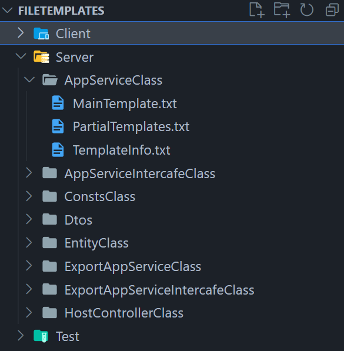
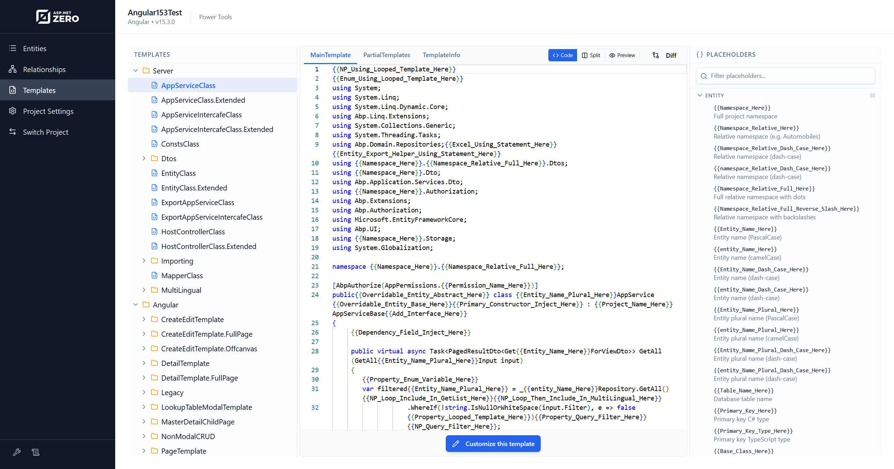

# How to Create & Edit Power Tools Templates

Power Tools uses text templates for code generation. Templates are stored in the project's `AspNetZeroRadTool/FileTemplates` directory.

Default templates are bundled with the global tool and synchronized into the project when Power Tools opens a project or starts generation. User customizations are stored as `.custom.txt` files and are preserved when default templates are refreshed.

For day-to-day customization, use the **Templates** page in the Power Tools web UI. You can select an existing template, customize it in the browser, compare it with the default template, and insert placeholders without manually creating `.custom.txt` files.

## Template Files

Each template folder can contain these files:

**MainTemplate.txt:** Main code generation template.

**PartialTemplates.txt:** Conditional and looped template fragments used by `MainTemplate.txt`.

**TemplateInfo.txt:** Output path and generation condition for the template.

*Folder structure*

## Edit Pre-defined Templates

Do not edit the default `.txt` files directly. They can be refreshed by newer Power Tools versions.

Open the Power Tools web UI and go to the **Templates** page. The template tree shows server templates, the client templates for the current project type, test templates, and MAUI templates when they are available.

Select the template you want to change, then choose one of the editor tabs: **MainTemplate**, **PartialTemplates**, or **TemplateInfo**. Default templates are read-only. Click **Customize this template** to make the selected tab editable.

After editing, click **Save**. Power Tools writes your change to the matching `.custom.txt` file, such as `MainTemplate.custom.txt`, `PartialTemplates.custom.txt`, or `TemplateInfo.custom.txt`, and keeps the original `.txt` file unchanged.

Use **Diff** to compare your customization with the default template. For **MainTemplate**, you can also use **Code**, **Split**, and **Preview** modes. Preview uses sample placeholder values for visual review; it is not a replacement for running generation.

Use the placeholders panel on the right side to search placeholders and insert them into the editor.

## Revert a Custom Template

To revert a customized template file, select its tab in the template editor and click **Revert**. Power Tools deletes the related `.custom.txt` file and starts using the default `.txt` file again.

You can also revert manually by deleting the related `.custom.txt` file from the template folder.

## Create New Templates

Choose a folder under `FileTemplates` based on where the generated file belongs:

* `Server`
* `Client/Angular`
* `Client/Mvc`
* `Client/React`
* `Test`
* `Maui`

Then create a new template folder and add `MainTemplate.txt`, `PartialTemplates.txt`, and `TemplateInfo.txt`. New template folders are created in the file system, not from the Templates page.

You can use existing templates as a reference. For guidance on placeholders and template behavior, see [Understanding Power Tools Templates](Power-Tools-Understanding-Power-Tools-Templates.md).

Power Tools discovers templates in the `FileTemplates` directory each time generation runs. If the web UI is open while you add new template folders manually, refresh the page if you do not see them immediately.
