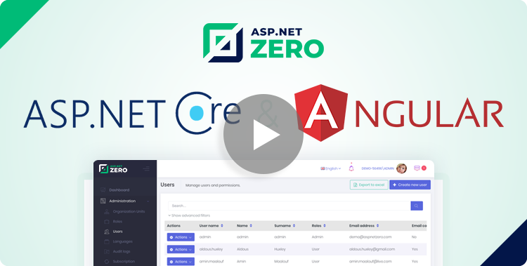

# ASP.NET CORE & Angular Project Documentation

This document is for "ASP.NET Core Backend & Angular UI" project type. See [other project types](https://aspnetzero.com/Documents).

## Getting Started

[Getting Started](Getting-Started-Angular.md) helps you to create your project and run in just 5 minutes.

## Video Course

See the [free Udemy video course](https://www.udemy.com/aspnet-zero-aspnet-core-angular/) to easily understand ASP.NET Zero and start your development in a short time. The course covers the following topics;

* Getting started with ASP.NET Zero
* Exploring ASP.NET Zero
* Building your first ASP.NET Zero application

## External Links

ASP.NET Zero is developed based on the **ASP.NET Boilerplate** web application framework and the **Metronic** UI Theme. You can refer to their web sites to learn details of them:

- [ASP.NET Boilerplate](https://aspnetboilerplate.com/Pages/Documents)
- [Metronic](https://keenthemes.com/metronic/)

## Old Documents

[Click here](Old-Documents.md) for documents older than v6.2.