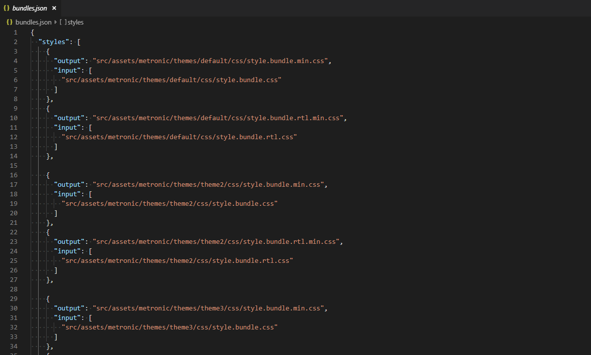

# Dynamic Asset Bundling and Minifying

AspNet Zero uses [Angular CLI](https://cli.angular.io/) to build the Angular application and it creates style and script bundles. But for some cases, an Angular app might decide which style/script file to use at runtime and loads this style/script file dynamically. For such cases, AspNet Zero provides a bundling and minification system.

AspNet Zero uses [Gulp](https://gulpjs.com/) for bundling & minifying such dynamic script and style files. 

Bundle definitions are store in **bundles.json** file. Here is a sample screenshot of **bundles.json** file:

**bundles.json** file contains two sections, scripts and styles.

* **scripts:** This section contains script bundle definitions. Each bundle definition contains two properties **output** and **input**. **output** property contains the file which the bundled script content will be written. **input** property contains the list of scripts which will be bundled. Script files are not minified in development time.
* **styles:** This section contains style bundle definitions.  Each bundle definition contains two properties **output** and **input**. **output** property contains the file which the bundled style content will be written. **input** property contains the list of styles which will be bundled. Style files are always minified. You can also use **less** files in the input section of your style bundles. ASP.NET Zero converts the less file into css and adds it to bundle. 

All input sections in **bundles.json **supports wildcard syntax. So, you can include all files under a folder (ex: *.js) or all files under a folder and its subfolders (ex: /**/*.css) or you can exclude some files (ex: !wwwroot/**/*.min.css) using wildcard syntax.

ASP.NET Zero has command for bundling style and script files "**npm run create-dynamic-bundles**".

* **npm run create-dynamic-bundles**: This command is introduced for development time usage. It automatically updates bundle(s). If you modify **bundles.json** file, you need to re-run this command. It also writes output to console about the bundling progress. Script and style bundles are not minified when using this command. 

For production usage, you can run "**npm run publish**" and it will minify dynamic assets for you and then it will publish your Angular app.

If you need to make any change about ASP.NET Zero's bundling and minification process, you can modify **gulpfile.js** . 

> Note: Don't use the bundle.json unless you have a dynamic css/js file. Normally, Angular CLI manages your css and js file.