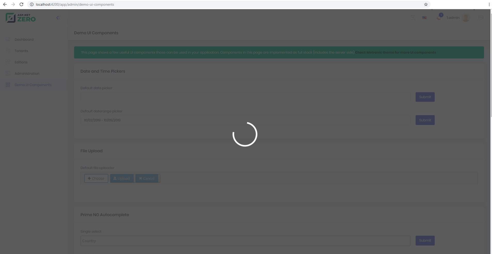

# Spinner

AspNet Zero uses [ngx-spinner](https://github.com/Napster2210/ngx-spinner) for blocking the UI elements and showing loading effect.

#### Enable/Disable Full Screen Spinner

To block entire screen, you can use spinner service.

```typescript
export class DemoUiComponentsComponent extends AppComponentBase implements OnInit {
    constructor(
        injector: Injector
    ) {
        super(injector);
    }
    ngOnInit(): void {
        //show default spinner which cover all page
        this.spinnerService.show();

        setTimeout(() => {
            this.spinnerService.hide();
        }, 1000);
    }
}
```




#### Enable/Disable Spinner on Html Elements

To use spinner on specific html elements you can use `busyIf` directive.  

The element which has `busyIf` directive will be blocked until input is false.

```html
 <div class="kt-portlet kt-portlet--height-fluid">   
     ...
     <div class="kt-portlet__body">
		<div [busyIf]="loading">
            
         </div>
     </div>
     ...
</div>
```

```typescript
export class MyComponent extends AppComponentBase implements OnInit {
    constructor(
        injector: Injector
    ) {
        super(injector);
    }
    loading = true;
    ngOnInit(): void {
        setTimeout(() => {
            loading = false;
        }, 3000);
    }
}
```


#### Customize Spinner

Since AspNet Zero uses [ngx-spinner](https://github.com/Napster2210/ngx-spinner), you can customize your spinner.

Implementations are located in `busy-if.directive.ts` and `root.component.ts`.

Check  [ngx-spinner](https://github.com/Napster2210/ngx-spinner) documentation for more details.