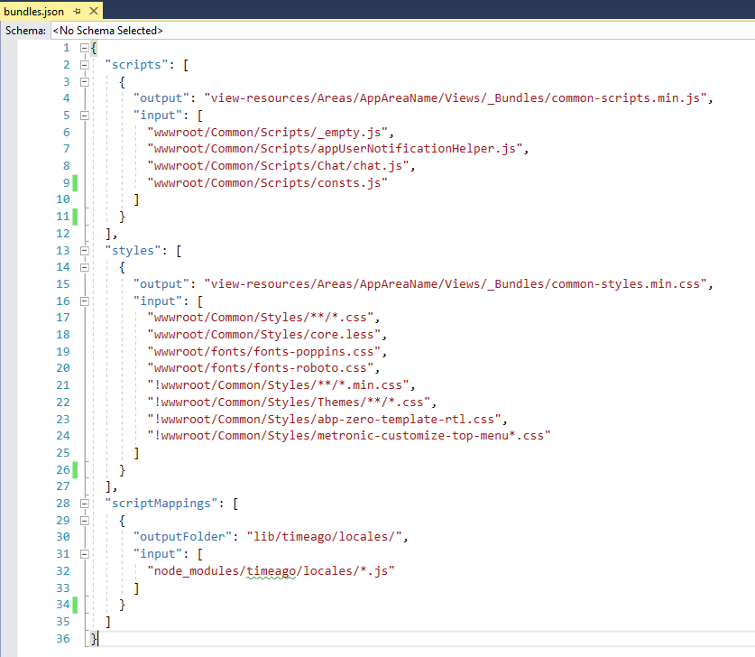

# Bundling, Minifying and Compiling

ASP.NET Zero uses [Gulp](https://gulpjs.com/) for bundling & minifying script and style files. ASP.NET Zero also watches style and script files used for bundling and automatically updates only the related bundle when one of the style or script file is changed in development time.

Bundle definitions are store in **bundles.json** file. Here is a sample screenshot of bundles.json file:

**bundles.json** file contains three sections scripts, styles and scriptMappings.

* **scripts:** This section contains script bundle definitions. Each bundle definition contains two properties **output** and **input**. **output** property contains the file which the bundled script content will be written. **input** property contains the list of scripts which will be bundled. Script files are not minified in development time.
* **styles:** This section contains style bundle definitions.  Each bundle definition contains two properties **output** and **input**. **output** property contains the file which the bundled style content will be written. **input** property contains the list of styles which will be bundled. Style files are always minified. You can also use **less** files in the input section of your style bundles. ASP.NET Zero converts the less file into css and adds it to bundle. When processing your style files (css & less), ASP.NET Zero also copies assets referenced in your style files to a separate folder. Font files are copied to **wwwroot/dist/fonts** and image files are copied to **wwwroot/dist/img** and bundled style files are updated accordingly. 
* **scirptMappings**: This section allows you to copy file(s) from a specific directory to a target directory. In ASP.NET Zero, it is used to copy localization files for some JavaScript libraries. ASP.NET Zero loads localization script files according to selected language. For example for timeago JavaScript library, we need to load **jquery.timeago.en.js** file by default and we can't bundle all localization files of timeago because it will increase the bundle size.

All input sections in **bundles.json **supports wildcard syntax. So, you can include all files under a folder (ex: *.js) or all files under a folder and its subfolders (ex: /**/*.css) or you can exclude some files (ex: !wwwroot/**/*.min.css) using wildcard syntax.

By default, ASP.NET Zero has two commands for bundling style and script files "**npm run create-bundles**" and "**npm run build**".

* **npm run create-bundles**: This command is introduced for development time usage. It watches your style and script files for changes and automatically updates bundle(s). If you modify **bundles.json** file, you need to re-run this command. It also writes output to console about the bundling progress. Script and style bundles are not minified when using this command. 
* **npm run build**: This command is introduced for publishing your app. It doesn't write any output to console and it doesn't watch files for any change. It also minifies script and style bundles unlike "create-bundles"  command.

If you need to make any change about ASP.NET Zero's bundling and minification process, you can modify **gulpfile.js** in the root directory of the ***.Web.Mvc** project. 

Same approach is used for ***.Web.Public** website project.