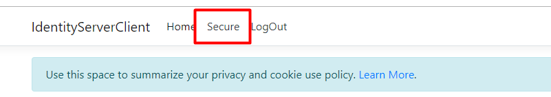
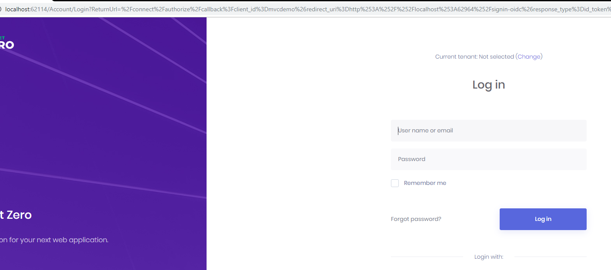
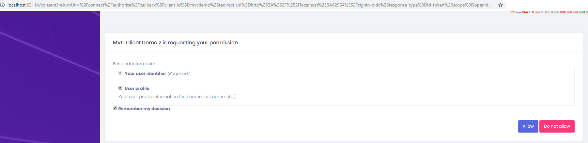
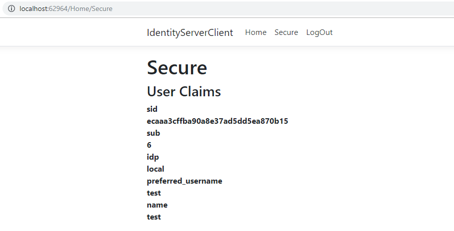

# Identity Server 4 Integration

[IdentityServer4](http://identityserver.io/) is an OpenID Connect and OAuth 2.0 framework for ASP.NET Core. ASP.NET Zero is integrated to IdentityServer4. It's **enabled by default**.

## Configuration

You can enable/disable or configure it from **appsettings.json** file

```json
"IdentityServer": {
  "IsEnabled": "true",
  "Clients": [
    {
      "ClientId": "client",
      "AllowedGrantTypes": [ "password" ],
      "ClientSecrets": [
        {
          "Value": "def2edf7-5d42-4edc-a84a-30136c340e13"
        }
      ],
      "AllowedScopes": [ "default-api" ]
    },
    {
      "ClientId": "demo",
      "ClientName": "MVC Client Demo",
      "AllowedGrantTypes": [ "hybrid", "client_credentials" ],
      "RequireConsent": "true",
      "ClientSecrets": [
        {
          "Value": "def2edf7-5d42-4edc-a84a-30136c340e13"
        }
      ],
      "RedirectUris": [ "http://openidclientdemo.com:8001/signin-oidc" ],
      "PostLogoutRedirectUris": [ "http://openidclientdemo.com:8001/signout-callback-oidc" ],
      "AllowedScopes": [ "openid", "profile", "email", "phone", "default-api" ],
      "AllowOfflineAccess": "true"
    }
  ]
}
```

## Testing with Client

ASP.NET Zero solution has a sample console application (ConsoleApiClient) that can connects to the application, authenticates through IdentityServer4 and calls an API.


## Testing with MVC Client

You can use [aspnet-zero-samples](https://github.com/aspnetzero/aspnet-zero-samples)  -> `IdentityServerClient` project to test identity server with mvc client. 

Add a new client to `*.Web.Mvc` appsettings.json

```json
...
    {
      "ClientId": "mvcdemo",
      "ClientName": "MVC Client Demo 2",
      "AllowedGrantTypes": [ "implicit", "client_credentials" ],
      "RequireConsent": "true",
      "ClientSecrets": [
        {
          "Value": "mysecret"
        }
      ],
      "RedirectUris": [ "http://localhost:62964/signin-oidc" ],
      "PostLogoutRedirectUris": [ "http://localhost:62964/signout-callback-oidc" ],
      "AllowedScopes": [ "openid", "profile", "email", "phone", "default-api" ],
      "AllowOfflineAccess": "true"
    }
...
```

Download the `IdentityServerClient` project and open it's `Startup.cs` and modify `AddOpenIdConnect` area as seen below

```csharp
...
.AddOpenIdConnect("oidc", options =>
{
    options.SignInScheme = "Cookies";

    options.Authority = "https://localhost:44302";//change with your project url
    options.RequireHttpsMetadata = false;

    options.ClientId = "mvcdemo";
    options.ClientSecret = "mysecret";

    options.SaveTokens = true;
});
...
```


That is all. Now you can test it.

Run both projects. Go to `IdentityServerClient `project's  secure .



It will redirect you to the login page.



After you successfully, login you will see the consent page.



After you allow consents, you will redirect to secure page and get user claims.



## OpenId Connect Integration

Once IdentityServer4 integration is enabled Web.Mvc application becomes an OpenId Connect server. That means another web application can use standard OpenId Connect protocol to authenticate users with your
application and get permission to share their information (a.k.a. consent screen).

## More

See [IdentityServer4's own documentation](http://docs.identityserver.io/en/latest/) to understand and configure IdentityServer4.
