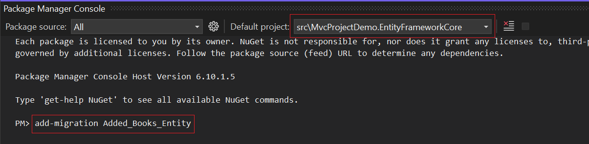
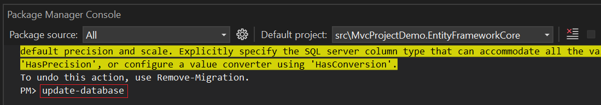

# Migration Guide: Transitioning from ASP.NET Boilerplate to ASP.NET Zero

A concise step-by-step guide to seamlessly migrate your MVC application from ASP.NET Boilerplate to ASP.NET Zero by leveraging the advanced features and capabilities of ASP.NET Zero.

## Introduction

The purpose of this migration guide is to provide a comprehensive, step-by-step process for migrating from ASP.NET Boilerplate to ASP.NET Zero in the context of an MVC application. This guide aims to help developers understand the differences between the two applications, ensure a smooth migration, and leverage the advanced features of ASP.NET Zero to improve application performance and maintainability.

## Creating and Migrating Entities

Let's consider an entity called `Book` that was previously created in an ASP.NET Boilerplate application. Its features are as follows:

```c#
public class Book : Entity<long>, IHasCreationTime
{
    public string Name { get; set; }  
    public string Description { get; set; }
    public DateTime CreationTime { get; set; }

    public Book()
    {
        CreationTime = Clock.Now;
    }
}
```

### Transitioning to ASP.NET Zero

When migrating this entity to ASP.NET Zero, you can create a new class within the `*.Core` project, just like you did in your ASP.NET Boilerplate application. This ensures consistency and simplifies integration into your ASP.NET Zero solution.

## Configuring DbContext

To integrate the `*DbContext` added entity in ASP.NET Boilerplate into ASP.NET Zero, add it to the `*DbContext` class in the `*.EntityFrameworkCore` project as shown below:

```c#
public class MvcProjectDemoDbContext : AbpZeroDbContext<Tenant, Role, User, MvcProjectDemoDbContext>, IOpenIddictDbContext
{
    /* Define an DbSet for each entity of the application */

    public virtual DbSet<Book> Books { get; }

    ...

    public MvcProjectDemoDbContext(DbContextOptions<MvcProjectDemoDbContext> options)
        : base(options)
    {
    }

    ...
}
```

## Database Migrations

To add the entity added to the `*DbContext` to the database table, first, we need to create a migration. You can follow the exact same steps applied in ASP.NET Boilerplate using the **Package Manager Console**. After opening it, select the project to be applied in the Default Project section and create a migration with the specified command.



After applying this command, it is sufficient to apply the following command to reflect the created migration to the database.



## Implementing Application Services

This chapter covers the implementation of application services in ASP.NET Zero, focusing on creating service interfaces, DTOs (Data Transfer Objects), and their associated services class.

### Creating DTOs and Defining AppService Interfaces

In this section, creating application service classes requires defining necessary interfaces and DTOs. Similar to ASP.NET Boilerplate, however, interfaces and DTOs created here will be managed in the `*.Application.Shared` project instead of `*.Application` for easier organization and accessibility.

**IBookAppService** manages general CRUD operations for the **Book** entity, defined with the following method signatures:

```c#
public interface IBookAppService: IApplicationService
{
    Task<ListResultDto<BookListDto>> GetBooks(GetBooksInput input);

    Task<GetBookForEditOutput> GetBookForEdit(NullableIdDto input);

    Task CreateOrUpdateBook(CreateOrUpdateBookInput input);

    Task DeleteBook(EntityDto input);
}
```

In ASP.NET Zero, DTOs like `CreateOrUpdateBookInput`, `GetBooksInput`, `BookListDto`, and `GetBookForEditOutput` are typically organized under the `*.Application.Shared` project, specifically under a folder structure such as **Books/Dto**. 

You can also use the same dto structure that you created in ASP.NET Boilerplate in the ASP.NET Zero application.

Like ASP.NET Boilerplate, you can create interfaces in ASP.NET Zero in a similar way.

## Managing Permissions

In ASP.NET Zero applications, it is important to manage permissions, as in ASP.NET Boilerplate, to control access to various features and functions within the application. Permissions are typically defined as constants in a central static class called AppPermissions.

```c#
public static class AppPermissions
{
    ...

    public const string Pages_Administration_Books = "Pages.Administration.Books";
    public const string Pages_Administration_Books_Create = "Pages.Administration.Books.Create";
    public const string Pages_Administration_Books_Edit = "Pages.Administration.Books.Edit";
    public const string Pages_Administration_Books_Delete = "Pages.Administration.Books.Delete";

    ...
}
```

In ASP.NET Zero applications, one distinction from ASP.NET Boilerplate in app service classes lies in CRUD operations where permission control is managed. Here, to access general app service functionality, a permission named `Pages_Administration_Books` is created, encompassing permissions for **Create**, **Edit**, and **Delete** operations. For these methods, separate permission checks can optionally be applied in ASP.NET Boilerplate applications as well. This approach aims to facilitate easier management and controlled access, emphasizing structured handling of permissions.

### Implementing App Service Classes

Create an app service class created in an `*.Application` project, as created in ASP.NET Boilerplate, that will implement the **IBookAppService** interface.

```c#
 [AbpAuthorize(AppPermissions.Pages_Administration_Books)]
 public class BookAppService : MvcProjectDemoAppServiceBase, IBookAppService
 {
     private readonly IRepository<Book, long> _bookRepository;

     public BookAppService(IRepository<Book, long> bookRepository)
     {
         _bookRepository = bookRepository;
     }

     public async Task CreateOrUpdateBook(CreateOrUpdateBookInput input)
     {
         if (input.Book.Id.HasValue)
         {
             await UpdateBookAsync(input);
         }
         else
         {
             await CreateBookAsync(input);
         }
     }


     [AbpAuthorize(AppPermissions.Pages_Administration_Books_Delete)]
     public async Task DeleteBook(EntityDto input)
     {
         var book = await _bookRepository.GetAsync(input.Id);

         await _bookRepository.DeleteAsync(book);
     }


     [AbpAuthorize(AppPermissions.Pages_Administration_Books_Create, AppPermissions.Pages_Administration_Books_Edit)]
     public async Task<GetBookForEditOutput> GetBookForEdit(NullableIdDto input)
     {
         BookEditDto bookListDto;

         if (input.Id.HasValue)
         {
             var book = await _bookRepository.GetAsync(input.Id.Value);
             bookListDto = ObjectMapper.Map<BookEditDto>(book);
         }
         else
         {
             bookListDto = new BookEditDto();
         }

         return new GetBookForEditOutput
         {
             Book = bookListDto
         };
     }

     [HttpPost]
     public async Task<ListResultDto<BookListDto>> GetBooks(GetBooksInput input)
     {
         var query = _bookRepository.GetAll();

         query = query
             .WhereIf(!input.Filter.IsNullOrEmpty(),
                 b => b.Name.Contains(input.Filter)
             );

         var books = await query.ToListAsync();

         return new ListResultDto<BookListDto>(ObjectMapper.Map<List<BookListDto>>(books));
     }

     [AbpAuthorize(AppPermissions.Pages_Administration_Books_Edit)]
     protected virtual async Task UpdateBookAsync(CreateOrUpdateBookInput input)
     {
         var book = await _bookRepository.GetAsync(input.Book.Id.Value);
         book.Name = input.Book.Name;
         book.Description = input.Book.Description;
     }

     [AbpAuthorize(AppPermissions.Pages_Administration_Books_Create)]
     protected virtual async Task CreateBookAsync(CreateOrUpdateBookInput input)
     {
         var book = ObjectMapper.Map<Book>(input.Book);

         await _bookRepository.InsertAsync(book);
     } 
 }
```

This **BookAppService** class demonstrates how CRUD operations for books are implemented in an ASP.NET Zero application, following a straightforward approach similar to ASP.NET Boilerplate.

## Navigation and Page Management

In ASP.NET Zero applications, to ensure consistent access to created pages under a standardized name, a practice similar to ASP.NET Boilerplate's PageNames class is adopted. In ASP.NET Zero, this is achieved by defining constants under the AppPageNames class. For ease of management, the AppPageNames class is located differently in ASP.NET Zero applications, specifically under Areas/App/Startup. Page names in ASP.NET Zero are categorized as Common, Tenant, and Host, allowing flexibility based on usage scenarios.

```c#
public class AppPageNames
{
    public static class Common
    {
        ...

        public const string Books = "Administration.Books";
    }

    public static class Host
    {
        ...
    }

    public static class Tenant
    {
        ...
    }
}
```

After defining page names, to facilitate navigation to these pages via a control panel in ASP.NET Zero, similar to ASP.NET Boilerplate's NavigationProvider class, ASP.NET Zero employs a similar structure within the AppNavigationProvider class. You can add navigation items to specific locations within this class based on your usage scenario.

```c#
public class AppNavigationProvider : NavigationProvider
{
    public const string MenuName = "App";

    public override void SetNavigation(INavigationProviderContext context)
    {
        var menu = context.Manager.Menus[MenuName] = new MenuDefinition(MenuName, new FixedLocalizableString("Main Menu"));

        menu
            .AddItem(new MenuItemDefinition(
                    AppPageNames.Host.Dashboard,
                    L("Dashboard"),
                    url: "App/HostDashboard",
                    icon: "flaticon-line-graph",
                    permissionDependency: new SimplePermissionDependency(AppPermissions.Pages_Administration_Host_Dashboard)
                )
            ).AddItem(new MenuItemDefinition(
                    AppPageNames.Common.Books,
                    L("Books"),
                    url: "App/Books",
                    icon: "flaticon-books",
                    permissionDependency: new SimplePermissionDependency(AppPermissions.Pages_Administration_Books)
                )
            )
            ...
    }
}
```

## Building the User Interface

The pages and modals created here show similar features. Since it is the Metronic theme used in ASP.NET Zero, it is recommended that you review the link [Metronic Theme](https://preview.keenthemes.com/metronic8/demo1/index.html?mode=light) to adapt it.

### Creating Controllers, Views and ViewModels

In ASP.NET Zero, controllers, views, and view models created in ASP.NET Boilerplate are structured differently for ease of management. Controllers, views, and view models in ASP.NET Zero are located under the **Areas/App/Controllers**, **Areas/App/Views**, and **Areas/App/ViewModels** directories, respectively. After creating the **BooksController** class, as shown below, the **CreateOrEditModal** method is implemented to display the **CreateOrEditModal** page for the Books section:

```c#
[Area("App")]
[AbpMvcAuthorize(AppPermissions.Pages_Administration_Books)]
public class BooksController : MvcProjectDemoControllerBase
{
    private readonly IBookAppService _bookAppService;

    public BooksController(IBookAppService bookAppService)
    {
        _bookAppService = bookAppService;
    }

    public IActionResult Index()
    {
        return View();
    }

    [AbpMvcAuthorize(AppPermissions.Pages_Administration_Books_Create, AppPermissions.Pages_Administration_Books_Edit)]
    public async Task<PartialViewResult> CreateOrEditModal(int? id)
    {
        var output = await _bookAppService.GetBookForEdit(new NullableIdDto { Id = id });
        var viewModel = ObjectMapper.Map<CreateOrEditBookModalViewModel>(output);

        return PartialView("_CreateOrEditModal", viewModel);
    }
}
```

Additionally, the Area attribute is specified to ensure that the prefix for the URL structure of the created controller includes `App`. This attribute differs from ASP.NET Boilerplate where the Area attribute is not typically used.

In the **BooksController**, the **IBookAppService** interface, implemented for use, calls **GetBookForEdit** to perform create or edit operations for the **CreateOrEditModal**.

#### Creating ViewModels

In ASP.NET Zero, view models for creating and editing are consolidated into a single view model with an IsEditMode property to control the mode, allowing a single view model and a single view to be used. This approach aims to simplify management and minimize code duplication. While in ASP.NET Boilerplate, view models are placed under the **Models/Books** directory within the Web.Mvc project, in ASP.NET Zero, they are located in the **Areas/App/Models/Books** directory.

```c#
 [AutoMapFrom(typeof(GetBookForEditOutput))]
 public class CreateOrEditBookModalViewModel : GetBookForEditOutput
 {
     public bool IsEditMode => Book.Id.HasValue;
 }
```

#### Creating Index and CreateOrEditModal Views

Migrating an **Index** and **CreateOrEditModal** View  from ASP.NET Boilerplate to ASP.NET Zero involves several steps. The main differences are the project structure, the use of areas, and the integration with the Metronic theme in ASP.NET Zero. Below are the detailed steps for this migration process, along with explanations of each part of the code.

##### Index View

In ASP.NET Boilerplate, create and edit modals are often defined as partial views and included in the main Index view.

**Index.cshtml (ASP.NET Boilerplate)**

```html

@using AbpMvcProjectDemo.Web.Startup
@model AbpMvcProjectDemo.Web.Models.Books.BookListViewModel
@{
    ViewBag.Title = L("Books");
    ViewBag.CurrentPageName = PageNames.Books;
}
@section scripts
{
    <environment names="Development">
        <script src="~/view-resources/Views/Books/Index.js" asp-append-version="true"></script>
    </environment>

    <environment names="Staging,Production">
        <script src="~/view-resources/Views/Books/Index.min.js" asp-append-version="true"></script>
    </environment>
}
<section class="content-header">
    <div class="container-fluid">
        <div class="row">
            <div class="col-sm-6">
                <h1>@L("Books")</h1>
            </div>
            <div class="col-sm-6">
                <a href="javascript:;" data-toggle="modal" data-target="#BookCreateModal" class="btn bg-blue float-sm-right">
                    <i class="fa fa-plus-square"></i>
                    @L("Create")
                </a>
            </div>
        </div>
    </div>
</section>
<section class="content">
    <div class="container-fluid">
        <div class="row">
            <div class="col-12">
                <div class="card">
                    <div class="card-header">
                        <div class="row">
                            <div class="col-md-6">
                                <!--Use for bulk actions-->
                            </div>
                            <div class="col-md-6">
                                @await Html.PartialAsync("~/Views/Books/Index.AdvancedSearch.cshtml")
                            </div>
                        </div>
                    </div>
                    <div class="card-body">
                        <div class="table-responsive">
                            <table id="BooksTable" class="table table-striped table-bordered">
                                <thead>
                                    <tr>
                                        <th></th>
                                        <th>@L("Name")</th>
                                        <th>@L("Description")</th>
                                        <th style="width: 150px">@L("Actions")</th>
                                    </tr>
                                </thead>
                                <tbody>
                                </tbody>
                            </table>
                        </div>
                    </div>
                </div>
            </div>
        </div>
    </div>
</section>

@await Html.PartialAsync("~/Views/Books/_CreateModal.cshtml", Model)

<div class="modal fade" id="BookEditModal" tabindex="-1" role="dialog" aria-labelledby="BookEditModalLabel" data-backdrop="static">
    <div class="modal-dialog modal-lg" role="document">
        <div class="modal-content">
        </div>
    </div>
</div>


```

In ASP.NET Zero, modals for create and edit operations are often managed separately and styled with the Metronic theme. 

**Index.cshtml (ASP.NET Zero)**

```html
@using Abp.Application.Services.Dto
@using MvcProjectDemo.Authorization
@using MvcProjectDemo.Web.Areas.App.Startup
@{
    ViewBag.CurrentPageName = AppPageNames.Common.Books;
}

@section Scripts
{
    <script abp-src="/view-resources/Areas/App/Views/_Bundles/book-list.js" asp-append-version="true"></script>
}

<abp-page-subheader title="@L("Books")" description="@L("BooksHeaderInfo")">
    @if (IsGranted(AppPermissions.Pages_Administration_Books_Create))
    {
        <button id="CreateNewBookButton" class="btn btn-primary">
            <i class="la la-plus btn-md-icon"></i>
            <span class="d-none d-md-inline-block">
                @L("CreateNewBook")
            </span>
        </button>
    }
</abp-page-subheader>

<div id="kt_app_content_container" class=" @(await GetContainerClass())">
    <div class="card">
        <div class="card-body">
            <div class="form">
                <div class="row mb-4">
                    <div class="col-12 text-end">
                        <button id="RefreshBooksButton" class="btn btn-primary">
                            <i class="la la-refresh btn-md-icon"></i>
                            <span class="d-none d-md-inline-block">
                                @L("Refresh")
                            </span>
                        </button>
                    </div>
                </div>
            </div>
            <div class="align-items-center">
                <table id="BooksTable" class="table align-middle table-row-dashed fs-6 gy-5 dataTable dtr-inline no-footer" width="100%">
                    <thead>
                        <tr>
                            <th></th>
                            <th>@L("Actions")</th>
                            <th>@L("Name")</th>
                            <th>@L("Description")</th>
                            <th>@L("CreationTime")</th>
                        </tr>
                    </thead>
                </table>
            </div>
        </div>
    </div>
</div>
```

###### Main Differences

- **ASP.NET Boilerplate:**

    - The original Index view is placed directly under the **Views/Books** folder.
    - No explicit permission check in the view.
    - Scripts are included based on the environment (Development or Production).

- **ASP.NET Zero:**

    - The view is moved under **Areas/App/Views/Books** to support modular and multi-tenancy architecture.
    - Uses **IsGranted(AppPermissions.Pages_Administration_Books_Create)** to conditionally render the create button.
    - Scripts are included using **abp-src**, which is specific to ABP Framework for better resource management.

##### CreateOrEditModal View

When migrating create and edit modals from ASP.NET Boilerplate to ASP.NET Zero, several key differences must be addressed to ensure a smooth transition. Below are the steps and considerations for this process:

**ASP.NET Boilerplate:**

- Separate modals for create and edit operations.
- Each modal has its own partial view and form structure.

**ASP.NET Zero:**

- Unified modal for both create and edit operations.
- A single partial view with logic to handle both operations based on the IsEditMode property.

**_CreateModal.cshtml (ASP.NET Boilerplate)**

```html 
@using AbpMvcProjectDemo.Web.Models.Common.Modals
@model AbpMvcProjectDemo.Web.Models.Books.BookListViewModel
@{
    Layout = null;
}
<div class="modal fade" id="BookCreateModal" tabindex="-1" role="dialog" aria-labelledby="BookCreateModalLabel" data-backdrop="static">
    <div class="modal-dialog modal-lg" role="document">
        <div class="modal-content">
            @await Html.PartialAsync("~/Views/Shared/Modals/_ModalHeader.cshtml", new ModalHeaderViewModel(L("CreateNewBook")))
            <form name="bookCreateForm" role="form" class="form-horizontal">
                <div class="modal-body">
                    <div class="form-group row required">
                        <label class="col-md-3 col-form-label" for="bookname">@L("BookName")</label>
                        <div class="col-md-9">
                            <input id="bookname" type="text" name="Name" class="form-control" required>
                        </div>
                    </div>
                </div>
                @await Html.PartialAsync("~/Views/Shared/Modals/_ModalFooterWithSaveAndCancel.cshtml")
            </form>
        </div>
    </div>
</div>

```


**_EditModal.cshtml (ASP.NET Boilerplate)**

```html
@using AbpMvcProjectDemo.Web.Models.Books
@using AbpMvcProjectDemo.Web.Models.Common.Modals
@model EditBookModalViewModel
@{
    Layout = null;
}
@await Html.PartialAsync("~/Views/Shared/Modals/_ModalHeader.cshtml", new ModalHeaderViewModel(L("EditBook")))
<form name="BookEditForm" role="form" class="form-horizontal">
    <input type="hidden" name="Id" value="@Model.Book.Id" />
    <div class="modal-body">
        <div class="form-group row required">
            <label class="col-md-3 col-form-label" for="bookname">@L("BookName")</label>
            <div class="col-md-9">
                <input id="bookname" class="form-control" type="text" name="Name" value="@Model.Book.Name" required>
            </div>
        </div>     
    </div>
    @await Html.PartialAsync("~/Views/Shared/Modals/_ModalFooterWithSaveAndCancel.cshtml")
</form>

<script src="~/view-resources/Views/Books/_EditModal.js" asp-append-version="true"></script>

```

**_CreateOrEditModal.cshtml (ASP.NET Zero)**

```html
@using Abp.Extensions
@using MvcProjectDemo.Web.Areas.App.Models.Books
@using MvcProjectDemo.Web.Areas.App.Models.Common.Modals
@model CreateOrEditBookModalViewModel

@await Html.PartialAsync("~/Areas/App/Views/Common/Modals/_ModalHeader.cshtml", new ModalHeaderViewModel(Model.IsEditMode ? (L("EditBook") + ": " + Model.Book.Name) : L("CreateNewBook")))

<div class="modal-body">

    <ul class="nav nav-tabs" role="tablist">
        <li class="nav-item">
            <a href="#BookInformationsTab" class="nav-link active" data-bs-toggle="tab" role="tab">
                @L("BookProperties")
            </a>
        </li>
    </ul>

    <div class="tab-content">
        <div class="tab-pane pt-5 active" id="BookInformationsTab" role="tabpanel">
            <form name="BookInformationsForm" role="form" novalidate class="form-validation">

                @if (Model.IsEditMode)
                {
                    <input type="hidden" name="Id" value="@Model.Book.Id"/>
                }

                <div class="mb-5">
                    <label for="BookName" class="form-label required">@L("BookName")</label>
                    <input id="BookName" class="form-control@(Model.Book.Name.IsNullOrEmpty() ? "" : " edited")" type="text" name="Name" value="@Model.Book.Name" required>
                </div>

            </form>
        </div>
    </div>
</div>

@await Html.PartialAsync("~/Areas/App/Views/Common/Modals/_ModalFooterWithSaveAndCancel.cshtml")

```

**Steps for Migration**

- In ASP.NET Zero, you must create a single view model that handles both rendering and editing. Use the IsEditMode property to distinguish between the two modes.

- Combine partial view creation and editing into a single partial view in ASP.NET Zero. Use the IsEditMode property in the view model to set form fields and titles.

- Make sure the form structure is suitable for both creation and editing. Use conditional expressions to include or exclude specific input fields or hidden fields (Id).

- If there are separate JavaScript files for handling create and edit operations in ASP.NET Boilerplate, you might need to merge them into a single script file or handle both cases within a single script in ASP.NET Zero.

- Make sure you add the modal header and footer partial views correctly, and make sure it includes the logic to display the appropriate headers and buttons.

- Ensure the modal's styling aligns with the Metronic theme used in ASP.NET Zero. This might involve updating classes and including specific Metronic components.

- Use abp-src attribute in ASP.NET Zero for better resource management and ensure scripts are loaded correctly.

- Integrate permission checks directly in the view to conditionally render elements like buttons and form fields based on user permissions.


### Creating Index and EditModal JavaScript Files 

In ASP.NET Zero, creating and editing operations are typically handled by a single javascript file. ASP.NET Zero uses built-in permission checks that can be easily integrated. Instead of manually handling modals, leverage ASP.NET Zero's ModalManager for consistent modal behavior. Use ASP.NET Zero's event system to handle create or edit events and refresh the table.

**Index.js (ASP.NET Boilerplate)**

```javascript
(function ($) {
    var _bookService = abp.services.app.book,
        l = abp.localization.getSource('AbpMvcProjectDemo'),
        _$modal = $('#BookCreateModal'),
        _$form = _$modal.find('form'),
        _$table = $('#BooksTable');

    var _$booksTable = _$table.DataTable({
        paging: true,
        serverSide: true,
        listAction: {
            ajaxFunction: _bookService.getAll,
            inputFilter: function () {
                return $('#BooksSearchForm').serializeFormToObject(true);
            }
        },
        buttons: [
            {
                name: 'refresh',
                text: '<i class="fas fa-redo-alt"></i>',
                action: () => _$booksTable.draw(false)
            }
        ],
        responsive: {
            details: {
                type: 'column'
            }
        },
        columnDefs: [
            {
                targets: 0,
                className: 'control',
                defaultContent: '',
            },
            {
                targets: 1,
                data: 'name',
                sortable: false
            },
            {
              targets: 2,
              data: 'name',
              sortable: false
            },
            {
                targets: 3,
                data: null,
                sortable: false,
                autoWidth: false,
                defaultContent: '',
                render: (data, type, row, meta) => {
                    return [
                        `   <button type="button" class="btn btn-sm bg-secondary edit-book" data-book-id="${row.id}" data-toggle="modal" data-target="#BookEditModal">`,
                        `       <i class="fas fa-pencil-alt"></i> ${l('Edit')}`,
                        '   </button>',
                        `   <button type="button" class="btn btn-sm bg-danger delete-book" data-book-id="${row.id}" data-book-name="${row.name}">`,
                        `       <i class="fas fa-trash"></i> ${l('Delete')}`,
                        '   </button>',
                    ].join('');
                }
            }
        ]
    });

    _$form.find('.save-button').on('click', (e) => {
        e.preventDefault();

        if (!_$form.valid()) {
            return;
        }

        var book = _$form.serializeFormToObject();

        abp.ui.setBusy(_$modal);
        _bookService
            .create(book)
            .done(function () {
                _$modal.modal('hide');
                _$form[0].reset();
                abp.notify.info(l('SavedSuccessfully'));
                _$booksTable.ajax.reload();
            })
            .always(function () {
                abp.ui.clearBusy(_$modal);
            });
    });

    $(document).on('click', '.delete-book', function () {
        var bookId = $(this).attr("data-book-id");
        var bookName = $(this).attr('data-book-name');

        deleteBook(bookId, bookName);
    });

    $(document).on('click', '.edit-book', function (e) {
        var bookId = $(this).attr("data-book-id");

        e.preventDefault();
        abp.ajax({
            url: abp.appPath + 'Books/EditModal?bookId=' + bookId,
            type: 'POST',
            dataType: 'html',
            success: function (content) {
                $('#BookEditModal div.modal-content').html(content);
            },
            error: function (e) {
            }
        })
    });

    abp.event.on('book.edited', (data) => {
        _$booksTable.ajax.reload();
    });

    function deleteBook(bookId, bookName) {
        abp.message.confirm(
            abp.utils.formatString(
                l('AreYouSureWantToDelete'),
                bookName),
            null,
            (isConfirmed) => {
                if (isConfirmed) {
                    _bookService.delete({
                        id: bookId
                    }).done(() => {
                        abp.notify.info(l('SuccessfullyDeleted'));
                        _$booksTable.ajax.reload();
                    });
                }
            }
        );
    }

    _$modal.on('shown.bs.modal', () => {
        _$modal.find('input:not([type=hidden]):first').focus();
    }).on('hidden.bs.modal', () => {
        _$form.clearForm();
    });

    $('.btn-search').on('click', (e) => {
        _$booksTable.ajax.reload();
    });

    $('.txt-search').on('keypress', (e) => {
        if (e.which == 13) {
            _$booksTable.ajax.reload();
            return false;
        }
    });
})(jQuery);

```

**_EditModal_.js (ASP.NET Boilerplate)**

```javascript
(function ($) {
    var _bookService = abp.services.app.book,
        l = abp.localization.getSource('AbpMvcProjectDemo'),
        _$modal = $('#BookEditModal'),
        _$form = _$modal.find('form');

    function save() {
        if (!_$form.valid()) {
            return;
        }

        var book = _$form.serializeFormToObject();

        abp.ui.setBusy(_$form);
        _bookService.update(book).done(function () {
            _$modal.modal('hide');
            abp.notify.info(l('SavedSuccessfully'));
            abp.event.trigger('book.edited', book);
        }).always(function () {
            abp.ui.clearBusy(_$form);
        });
    }

    _$form.closest('div.modal-content').find(".save-button").click(function (e) {
        e.preventDefault();
        save();
    });

    _$form.find('input').on('keypress', function (e) {
        if (e.which === 13) {
            e.preventDefault();
            save();
        }
    });

    _$modal.on('shown.bs.modal', function () {
        _$form.find('input[type=text]:first').focus();
    });
})(jQuery);

```

**Index.js (ASP.NET Zero)**

```javascript
(function () {
  $(function () {
    var _$booksTable = $('#BooksTable');
    var _bookService = abp.services.app.book;

    var _permissions = {
      create: abp.auth.hasPermission('Pages.Administration.Books.Create'),
      edit: abp.auth.hasPermission('Pages.Administration.Books.Edit'),
      delete: abp.auth.hasPermission('Pages.Administration.Books.Delete'),
    };

    var _createOrEditModal = new app.ModalManager({
      viewUrl: abp.appPath + 'App/Books/CreateOrEditModal',
      scriptUrl: abp.appPath + 'view-resources/Areas/App/Views/Books/_CreateOrEditModal.js',
      modalClass: 'CreateOrEditBookModal',
      cssClass: 'scrollable-modal',
    });

    var dataTable = _$booksTable.DataTable({
      paging: false,
      serverSide: false,
      processing: false,
      drawCallback: function (settings) {
        $('[data-bs-toggle=tooltip]').tooltip();
      },
      listAction: {
        ajaxFunction: _bookService.getBooks,
      },
      columnDefs: [
        {
          className: 'dtr-control responsive',
          orderable: false,
          render: function () {
            return '';
          },
          targets: 0,
        },
        {
          targets: 1,
          data: null,
          orderable: false,
          autoWidth: false,
          defaultContent: '',
          type: 'html',
          rowAction: {
            text:
              '<i class="fa fa-cog"></i> <span class="d-none d-md-inline-block d-lg-inline-block d-xl-inline-block">' +
              app.localize('Actions') +
              '</span> <span class="caret"></span>',
            items: [
              {
                text: app.localize('Edit'),
                visible: function () {
                  return _permissions.edit;
                },
                action: function (data) {
                  _createOrEditModal.open({ id: data.record.id });
                },
              },
              {
                text: app.localize('Delete'),
                action: function (data) {
                  deleteBook(data.record);
                },
              },
            ],
          },
        },
        {
          targets: 2,
          data: 'name',
          render: function (name, type, row, meta) {
            var $span = $('<span/>');
            $span.append(name + ' &nbsp;');

            return $span[0].outerHTML;
          },
        },
        {
          targets: 3,
          data: 'description',
          render: function (description, type, row, meta) {
            var $span = $('<span/>');
            $span.append(description + ' &nbsp;');

            return $span[0].outerHTML;
          },
        },
        {
          targets: 4,
          data: 'creationTime',
          render: function (creationTime) {
            return moment(creationTime).format('L');
          },
        },
      ],
    });

    function deleteBook(book) {
      abp.message.confirm(
        app.localize('BookDeleteWarningMessage', book.name),
        app.localize('AreYouSure'),
        function (isConfirmed) {
          if (isConfirmed) {
            _bookService
              .deleteBook({
                id: book.id,
              })
              .done(function () {
                getBooks();
                abp.notify.success(app.localize('SuccessfullyDeleted'));
              });
          }
        }
      );
    }

    $('#CreateNewBookButton').click(function () {
      _createOrEditModal.open();
    });

    $('#RefreshBooksButton').click(function (e) {
      e.preventDefault();
      getBooks();
    });

    function getBooks() {
      dataTable.ajax.reload();
    }

    abp.event.on('app.createOrEditBookModalSaved', function () {
      getBooks();
    });
  });
})();

```

**_CreateOrEditModal_.js (ASP.NET Zero)**

```javascript
(function () {
  app.modals.CreateOrEditBookModal = function () {
    var _modalManager;
    var _bookService = abp.services.app.book;

    this.init = function (modalManager) {
      _modalManager = modalManager;

      _$bookInformationForm = _modalManager.getModal().find('form[name=BookInformationsForm]');
      _$bookInformationForm.validate({ ignore: '' });
    };

    this.save = function () {
        if (!_$bookInformationForm.valid()) {
        return;
      }

      var book = _$bookInformationForm.serializeFormToObject();

      _modalManager.setBusy(true);
        _bookService
        .createOrUpdateBook({
          book: book,
        })
        .done(function () {
          abp.notify.info(app.localize('SavedSuccessfully'));
          _modalManager.close();
          abp.event.trigger('app.createOrEditBookModalSaved');
        })
        .always(function () {
          _modalManager.setBusy(false);
        });
    };
  };
})();

```

### Adding JavaScript Files to Bundles

In ASP.NET Zero, you can add entries to the `bundles.json` file located in the `*Web.Mvc` project to bundle and minify the views including the **_CreateOrEditModal** and **Index** files as shown below:

```json
 ...

 {
   "output": "view-resources/Areas/App/Views/_Bundles/book-list.min.js",
   "input": [
     "wwwroot/view-resources/Areas/App/Views/Books/_CreateOrEditModal.js",
     "wwwroot/view-resources/Areas/App/Views/Books/Index.js"
   ]
 },

 ...
```

## Adding Localization

As in ASP.NET Boilerplate, localization resources in ASP.NET Zero are created under the *.Core project within the Localization folder. In ASP.NET Zero, the source files are located in a folder named after your project, such as MvcProjectDemo. You can add entries to the MvcProjectDemo.xml file or any other language file as shown below:

```xml
<localizationDictionary culture="en">
  <texts>
    ...
    <text name="Books">Books</text>
    <text name="BooksHeaderInfo">Books Header Info</text>
    <text name="CreateNewBook">Create New Book</text>
  </texts>
</localizationDictionary>
```


## Implementing Unit Tests

Unit tests implemented in ASP.NET Boilerplate show minor changes in ASP.NET Zero.

**Main Differences:**

**ASP.NET Boilerplate:** More manual setup with Effort and custom fixtures.
**ASP.NET Zero:** Uses ASP.NET Core’s DI and in-memory database providers for simpler and more consistent setup.

**ASP.NET Boilerplate:** Uses Effort for simulating an in-memory database.
**ASP.NET Zero:** Uses SQL Server or Entity Framework Core’s in-memory database for easier configuration.

**Transition Steps:**

- Transition from base class TestBase to AppTestBase provided by ASP.NET Zero.
- Replace Effort with Entity Framework Core’s in-memory database provider.
- Ensure dependencies are resolved using ASP.NET Core’s DI framework.
- Adapt test methods to utilize ASP.NET Zero’s testing utilities and patterns.


## Conclusion

The migration from ASP.NET Public Plate to ASP.NET Zero involves several important transitions in various aspects of application development. This process includes changes in the management of models, configuration of app services and unit tests. ASP.NET Zero offers advanced features that increase efficiency and scalability by providing a more integrated and streamlined approach to these elements.


