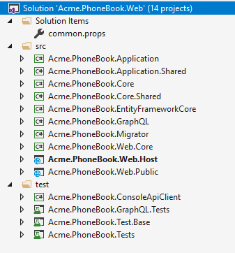

# Overview

## Introduction

Before reading this document, it's suggested to run the application and explore the user interface as described in the [Getting Started document](Getting-Started-Angular.md). This will help you to have a better understanding of the concepts defined here.

### IDE & Operating System

It's suggested to use an IDE to develop your project. We suggest [Visual Studio 2017+](https://www.visualstudio.com), but you can use Visual Studio Code or any other IDE/Editor you like. You can also use any OS (MacOS/Linux/Windows).

## Architecture

The diagram below shows the overall architecture of the solutions:


Angular project is designed so that it can be **deployed separately** from the backend ASP.NET Core solution, to a different port in the same server or to a different server. When it's deployed, it's actually a
plain HTML+JS+CSS application that can be served on any operating system and any web server.

Note that ASP.NET Core solution does not have any HTML, JS or CSS code. It simply provides end points for token based authentication and to use the application services (REST APIs).

### Server Side Solution Structure (Layers)

After you create and [download](https://aspnetzero.com/Download) your project, you have a solution structure as shown below for **\*.Web.sln**:



There are two more solutions:

- **\*.Mobile.sln** contains the Xamarin projects
- **\*.All.sln** contains both mobile and web development projects.

There are 12 projects in the solution:

- **Core.Shared** project contains `consts`, `enums` and helper classes used both in mobile & web projects.
- **Core** project contains domain layer classes (like [entities](https://aspnetboilerplate.com/Pages/Documents/Entities) and [domain services](https://aspnetboilerplate.com/Pages/Documents/Domain-Services)).
- **Application.Shared** project contains [application service interfaces](https://aspnetboilerplate.com/Pages/Documents/Application-Services#DocIApplicationServiceInterface) and [DTO](https://aspnetboilerplate.com/Pages/Documents/Data-Transfer-Objects)s.
- **Application** project contains application logic (like [application services](https://aspnetboilerplate.com/Pages/Documents/Application-Services)).
- **EntityFrameworkCore** project contains your DbContext, [repository](https://aspnetboilerplate.com/Pages/Documents/Repositories) implementations, database migrations and other Entity Framework Core specific concepts.
- **Web.Host** project does not contain any web related files like HTML, CSS or JS. Instead, it just serves the application as remote API. So, any device can consume your application as API. For more information see [Web.Host Project](Features-Mvc-Core-Web-Host-Project)
- **Web.Core** project contains common classes used by MVC and Host projects.
- **Web.Public** project is a separated web application that can be used to create a public web site or a landing page for your application. For more information see [Public Website](Public-Website).
- **Migrator** project is a console application that runs database migrations. For more information see [Migrator Console Application](Migrator-Console-Application)
- **ConsoleApiClient** project is a simple console application for performing API requests to the application  authenticated via IdentityServer4.
- **Tests** project contains unit and integration tests.

### Applications

ASP.NET Zero solution contains three applications:

- **Back End API** (`Web.Host`): An application to only serve the main application as REST API and does not provide any UI.

- **Public Web Site** (`Web.Public`): This can be used to create a public web site or a landing page for your application.

- **Migration Executer** (`Migrator`): Console application that runs database migrations.

#### Basic Configuration

`appsettings.json` in Web.Host project contains many settings but **ServerRootAddress**, **ClientRootAddress** and **CorsOrigins** are required to run the application:

```csharp
"ServerRootAddress": "http://localhost:22742/",
"ClientRootAddress ": "http://localhost:4200/",
"CorsOrigins": "http://localhost:4200/"
```

**ServerRootAddress** is the URL of the server side Web.Host application, **ClientRootAddress** is the URL of the client side Angular application. **CorsOrigins** contains the URLs allowed to make cross-origin requests to Web.Host application.

For more information about configuring Web.Host application, see [Features-Mvc-Core-Web-Host-Project](Features-Mvc-Core-Web-Host-Project.md).

#### Multi-Tenancy

Multi-tenancy is used to build **SaaS** (Software as a Service) applications easily. With this technique, we can deploy **single application** to serve to **multiple customers**. Each Tenant will have it's own roles, users, settings and other data. 

ASP.NET Zero's code-base is developed to be **multi-tenant**. But, it [**can be disabled**](Getting-Started-Angular#configure-multi-tenancy) with a single line of configuration if you are developing a **single-tenant** application. When you disable it, all multi-tenancy stuff will be hidden. If multi-tenancy is disabled, there will be a single tenant named **Default**.

There are two types of perspective in multi-tenant applications:

- **Host**: Manages tenants and the system.
- **Tenant**: Uses the actual application features and pays for it.

For multi-tenant applications, URLs can contain dynamic tenancy name. In that case, put {TENANCY\_NAME} as a placeholder for tenancy name like:

```csharp
"ServerRootAddress": "http://{TENANCY_NAME}.mydomain.com/",
"ClientRootAddress": "http://{TENANCY_NAME}.app.mydomain.com/"
```

For the CorsOrigins setting, you can use * character to allow all subdomains. For example:

```csharp
"CorsOrigins": "http://*.app.mydomain.com/"
```

If you want to use ```{TENANCY_NAME}``` placeholder in your URLs, you also need to use it when configuring URLs for client side Angular app.

Thus, ASP.NET Zero can automatically detect current tenant from URLs. If you configure it as above, you should also redirect all subdomains to your application. To do that;

1. You should configure DNS to redirect all subdomains to a static IP address. To declare 'all subdomains', you can use a wildcard e.g.
   **\*.mydomain.com**.
2. You should configure IIS to bind this static IP to your application.

There may be other ways of doing it but this is the simplest way.

> In the development time, you don't need to use subdomains for tenants for a simpler development experience. When you do like that, a 'tenant switch' dialog is used to manually switch between tenants.

Check out the [multi tenant documentation](https://aspnetboilerplate.com/Pages/Documents/Multi-Tenancy) if you are building multi-tenant applications.

### Angular Solution

Entry point of the Angular solution is src/**main.ts**. It simply bootstraps the root [Angular Module](https://angular.io/docs/ts/latest/guide/ngmodule.html):
**RootModule**. Fundamental modules of the solution are shown below:


-   **RootModule** is responsible to bootstrap the application.
-   **AccountModule** provides login, two factor authentication, register, password forget/reset, email activation, etc... It's [lazy loaded](https://angular.io/docs/ts/latest/guide/router.html).
-   **AppModule** is just to group application modules and provide a base layout. It contains two sub modules:
    -   **AdminModule** contains pages like user management, role management, tenant management, language management, settings and so on. It's lazy loaded.
    -   **MainModule** is the main module to develop your own application. It only contains a demo dashboard page which you can modify or delete. It's suggested to divide your application into smaller modules like we did in the startup project, instead of adding all functionality into the main module. This is also lazy loaded.

Fundamental modules have their own **routes**. For example; AccountModule views start with "**/account**" (like "/account/login"), AdminModule views starts with  **/app/admin**" (like "/app/admin/users").

Angular's router lazy loads modules based on their url. For instance, when you request a url starts with "app/admin", the AdminModule and all it's components are loaded. They are not loaded if you don't request those pages. That brings better startup time (and also better development time since they are independently splitted to chunks).

In addition to those fundamental modules, there are some shared modules:

-   app/shared/common/**app-common.module**: a common module used by main and admin modules as shared functionality.
-   shared/common/**common.module**: A common module used by account and app modules (and their sub modules).
-   shared/utils/**utils.module**: Another common module used by all modules (and their sub modules). We tried to collect general purpose code here those can be used even in different applications.
-   shared/service-proxies/**service-proxy.module**: Auto generated `nswag` code. It's used to communicate to backend ASP.NET Core API. We will see "how to generate automatic proxies" later.

#### Configuration

Angular solution contains src/assets/**appconfig.json** file which contains some fundamental settings for the client side:

- **remoteServiceBaseUrl**: Used to configure base address of the server side APIs. Default value: ```http://localhost:22742```
- **appBaseUrl**: Used to configure base address of the client application. Default value: ```http://localhost:4200```
- **localeMappings**: Used to configure localizations of third-party libraries those are incompatible with existing localizations.

**appBaseUrl** is configured since we use it to define format of our URL. If we want to use tenancy name as subdomain for a multi-tenant application then we can define **appBaseUrl** as

````
http://{TENANCY_NAME}.mydomain.com
````

*{TENANCY\_NAME}* is the place holder here for tenant names. Tenancy name can also be configured for **remoteServiceBaseUrl** as similar. To make tenancy name subdomains properly work, we should also make two configurations beside the application:

1.  We should configure DNS to redirect all subdomains to a static IP address. To declare 'all subdomains', we can use wildcard like **\*.mydomain.com**.
2.  We should configure IIS to bind this static IP to our application.

There may be other ways of doing it but this is the simplest way.

> In the development time, you don't need to use subdomains for tenants for a simpler development experience. When you do like that, a 'tenant switch' dialog is used to manually switch between tenants.

#### AppComponentBase

If you inherit your components from **AppComponentBase** class, you can get many commonly used services as pre-injected (like localization, permission checker, feature checker, UI notify/message, settings and so on...). For example; you can just use **this.l(...)** function in component classes for localization. In views, you can use **localize** pipe. See pre-built components for example usages.

## Next

- Web Application
  - [Features](Features-Angular.md)
  - [Development Tutorial](Developing-Step-By-Step-Angular-Introduction.md)
  - [Deployment](Deployment-Angular.md)
- Mobile (Xamarin) Application
  - [Development Guide](Development-Guide-Xamarin.md)
  - [Development Tutorial](Developing-Step-By-Step-Xamarin)