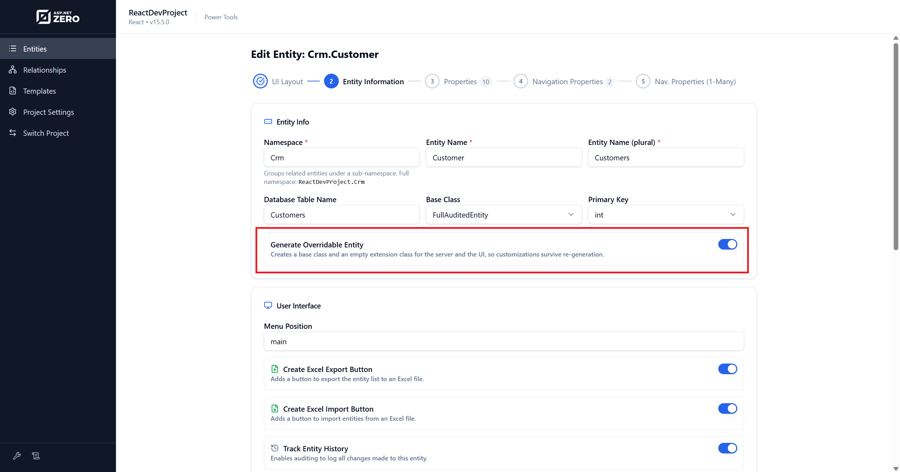

# Power Tools Custom Code - MVC

ASP.NET Zero Power Tools generates code that can be fully regenerated whenever you change an entity. The **Custom Code** feature lets you add your own code to the generated pages and classes so that your additions survive regeneration.

This page covers how Custom Code works in **ASP.NET Core MVC** projects. For other UI frameworks.

## Enabling Custom Code

Open Power Tools, select your entity, and turn on the **Generate Overridable Entity** switch in the Entity Information section.



When this switch is on, Power Tools generates additional extension files that you own. These files are created once and never overwritten, even when you regenerate the entity.

> The switch affects both the server side and the client side.

## How It Works

MVC uses two complementary mechanisms to preserve your code during regeneration:

| Mechanism | How It Works | Applies To |
|---|---|---|
| **Extension files** (SkipIfExists) | A base class is regenerated every time. A developer-owned subclass is generated once and never overwritten. | Server-side C# files and MVC Controller / ViewModel classes |
| **Preserved region slots** (`az:begin` / `az:end`) | Named regions inside regenerated files. Power Tools preserves any code you place between the markers. | Razor views (`.cshtml`) and JavaScript files (`.js`) |

> Razor views and JavaScript files cannot use the base/subclass pattern, so they rely entirely on preserved region slots.

## Server Side

When **Generate Overridable Entity** is enabled, the following server-side extension files are generated. These are shared across all UI frameworks.

| File | Base Class | Purpose |
|---|---|---|
| `AppService.Extended.cs` | `AppServiceBase` | Override application service methods |
| `AppServiceInterface.Extended.cs` | - | Extend the service interface |
| `Entity.Extended.cs` | `EntityBase` | Add custom properties or methods to the entity |
| `CreateOrEditDto.Extended.cs` | `CreateOrEditDtoBase` | Extend the input DTO |
| `EntityDto.Extended.cs` | `EntityDtoBase` | Extend the list DTO |
| `GetAllInput.Extended.cs` | `GetAllInputBase` | Add custom filter parameters |
| `GetAllForExcelInput.Extended.cs` | `GetAllForExcelInputBase` | Add custom Excel export filter parameters |
| `GetAllOutput.Extended.cs` | `GetAllOutputBase` | Extend the output DTO |
| `GetForEditOutput.Extended.cs` | `GetForEditOutputBase` | Extend the edit output DTO |
| `LookupDto.Extended.cs` | `LookupDtoBase` | Extend the lookup DTO |
| `HostController.Extended.cs` | `HostControllerBase` | Extend the API controller |

Each `.Extended.cs` file contains:

```csharp
// Write your custom code here.
// ASP.NET Zero Power Tools will not overwrite this class
// when you regenerate the related entity.
```

The base files (without `.Extended`) are fully regenerated on every run. New entity properties automatically flow into them. Your customizations in the extension files are preserved because Power Tools never touches them after the first generation.

## MVC C# - Extension Files

When you enable **Generate Overridable Entity**, the MVC Controller and ViewModel classes are split into base and extension files:

| Generated File | Description |
|---|---|
| `*Controller.cs` (base) | Abstract base controller with all generated logic. **Regenerated every time.** |
| `*Controller.Extended.cs` | Your controller subclass. **Generated once, never overwritten.** |
| `*ViewModel.cs` (base) | Abstract base view model. **Regenerated every time.** |
| `*ViewModel.Extended.cs` | Your view model subclass. **Generated once, never overwritten.** |

If the entity has a view-only page enabled, a `*ViewEntityViewModel.Extended.cs` is also generated.

### Example for a `Product` Entity

```
ProductsController.cs              ← regenerated (abstract base)
ProductsController.Extended.cs     ← yours (extends base)

ProductsViewModel.cs               ← regenerated (abstract base)
ProductsViewModel.Extended.cs      ← yours (extends base)
```

Override any method in the extension file:

```csharp
public class ProductsController : ProductsControllerBase
{
    // Write your custom code here.
    // ASP.NET Zero Power Tools will not overwrite this class
    // when you regenerate the related entity.
}
```

## MVC Razor & JavaScript - Preserved Region Slots

Razor views and JavaScript files use named `az:begin` / `az:end` markers. You can place custom markup or code between these markers and it will be preserved on regeneration.

### Index Page - Razor Slots

```html
<!-- az:begin(filters) -->
<!-- Add custom advanced filter controls here -->
<!-- az:end(filters) -->

<!-- az:begin(column-headers) -->
<!-- Add custom <th> column headers here -->
<!-- az:end(column-headers) -->
```

### Index Page Toolbar - Razor Slot

```html
<!-- az:begin(toolbar-actions) -->
<!-- Add custom toolbar buttons here -->
<!-- az:end(toolbar-actions) -->
```

### Index Page - JavaScript Slot

```javascript
// az:begin(columns)
// Add custom DataTables columnDefs entries here
// az:end(columns)
```

### Create/Edit Modal - Razor Slot

```html
<!-- az:begin(form-fields) -->
<!-- Add custom form fields here -->
<!-- az:end(form-fields) -->
```

### View Entity Modal - Razor Slot

```html
<!-- az:begin(detail-fields) -->
<!-- Add custom detail fields here -->
<!-- az:end(detail-fields) -->
```

### Slot Reference

| Slot Name | File | Comment Style | Purpose |
|---|---|---|---|
| `filters` | Index Razor (`.cshtml`) | HTML | Custom advanced filter controls |
| `column-headers` | Index Razor (`.cshtml`) | HTML | Custom table column headers |
| `toolbar-actions` | Index Razor (`.cshtml`) | HTML | Custom toolbar buttons |
| `columns` | Index JavaScript (`.js`) | JS | Custom DataTables column definitions |
| `form-fields` | Create/edit Razor (`.cshtml`) | HTML | Custom form fields |
| `detail-fields` | View entity Razor (`.cshtml`) | HTML | Custom detail display fields |

> The `column-headers` slot in the Razor file and the `columns` slot in the JavaScript file are **paired**. Adding a custom column requires entries in both files.

### Example - Adding a Custom Column

In the Razor file (`.cshtml`):

```html
<!-- az:begin(column-headers) -->
<th>Custom Score</th>
<!-- az:end(column-headers) -->
```

In the JavaScript file (`.js`):

```javascript
// az:begin(columns)
{
    data: "product.customScore",
    name: "customScore",
    render: function(data) { return data || "-"; }
},
// az:end(columns)
```

### Example - Adding a Custom Form Field

```html
<!-- az:begin(form-fields) -->
<div class="form-group">
    <label asp-for="InternalNotes" class="control-label"></label>
    <textarea asp-for="InternalNotes" class="form-control" rows="3"></textarea>
</div>
<!-- az:end(form-fields) -->
```

### Example - Adding a Custom Toolbar Button

```html
<!-- az:begin(toolbar-actions) -->
<button class="btn btn-outline-primary" onclick="exportCustomReport()">
    <i class="fa fa-file-export"></i> Custom Report
</button>
<!-- az:end(toolbar-actions) -->
```

## Preserved Region Rules

The `az:begin` / `az:end` markers follow these rules:

| Rule | Description |
|---|---|
| **Comment wrapper matches the file type** | HTML: `<!-- az:begin(name) -->`, JavaScript: `// az:begin(name)` |
| **Region names** | Letters, digits, underscores, hyphens, and dots only |
| **No nesting** | Regions cannot be placed inside other regions |
| **No duplicates** | Each region name must be unique within a file |
| **Empty regions are no-ops** | If you don't add anything between the markers, the region is ignored |

## Safety Features

Power Tools includes safety mechanisms to prevent code loss:

- **Abort on malformed markers:** If region markers are broken (unclosed, nested, duplicated, mismatched), the entire file is left untouched. No partial merge ever occurs.
- **Orphan rescue:** If a region name existed in the old file but not in the newly generated output (for example, if a template update removes a slot), the content is saved to a sidecar file (`<filename>.orphaned.txt`) and a warning is shown. Content is never silently dropped.
- **Ownership guard:** When you toggle the **Generate Overridable Entity** switch on an already-generated entity, Power Tools detects whether existing files contain developer code and refuses to overwrite them.

## Next

[How to Create & Edit Power Tools Templates](How-To-Create-Edit-Power-Tools-Templates.md)
