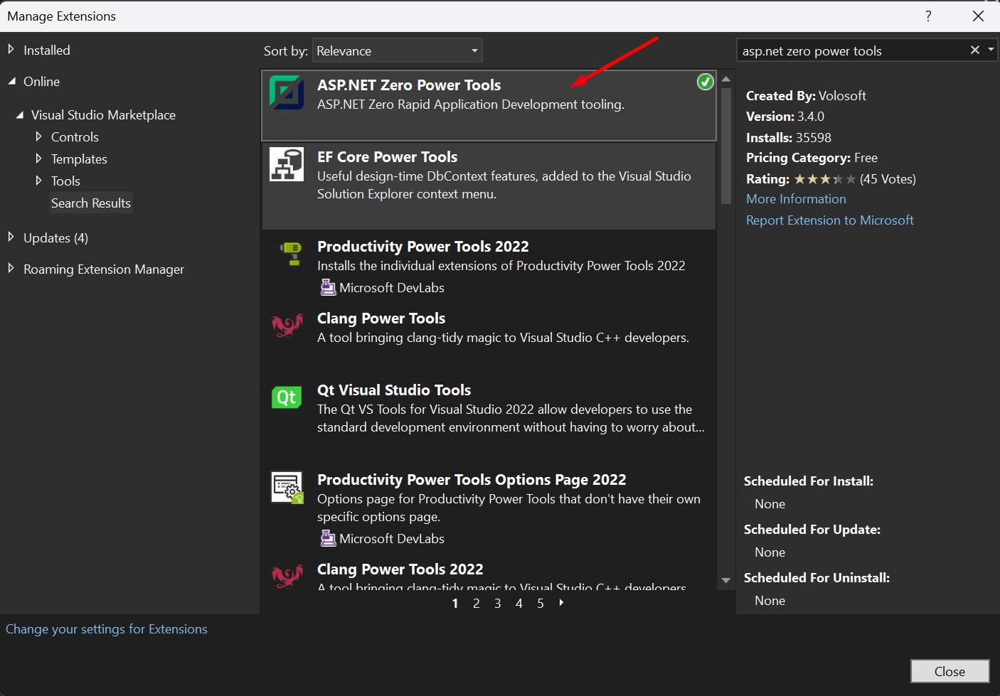

# ASP.NET ZERO Power Tools Getting Started

Did you know you can achieve Rapid Application Development (RAD) without sacrificing your ASP.Net Core habits and comforts?

## Pre Requirements

* [Visual Studio 2017 (v15.9.0+)](https://www.visualstudio.com/) (Only for Windows)
* [.NET 7 Runtime](https://dotnet.microsoft.com/en-us/download/dotnet/7.0)
* [EF Core Cli](https://docs.microsoft.com/en-us/ef/core/cli/dotnet)
* [ASP.NET Zero v5.0.0+](https://aspnetzero.com/Download)

## Installation

To harness the capabilities of ASP.NET Zero Power Tools, there are two convenient methods available. You can either install the Visual Studio extension or utilize the binaries provided within your ASP.NET Zero solution. Choose the approach that best suits your preferences and requirements.

### Windows

All you have to do is just install the ASP.NET Zero Power Tools extension on Visual Studio from [marketplace](https://marketplace.visualstudio.com/items?itemName=Volosoft.AspNetZeroPowerTools) or from Visual Studio's **Manage Extensions** menu.



### Mac/Linux

If you are a non-Windows user, you have the option to use the binaries of ASP.NET Zero Power Tools that are already included in your ASP.NET Zero solution.

The main purpose of the ASP.NET Zero Power Tools Visual Studio Extension is to create an input file automatically. However, if you prefer not to use the extension, you can create the input file manually.

To create the input file manually for ASP.NET Zero Power Tools, you can refer to the documentation provided at [ASP.NET Zero Power Tools](power-tools-creating-entity-json-file-manually.md). This documentation offers detailed instructions on how to create the input file, which is required to generate entities using the Power Tools.

Once you have created the JSON input file, you can proceed to generate the entity using the following command in the **AspNetZeroRadTool** folder within your project:

```bash
dotnet AspNetZeroRadTool.dll YourEntity.Json
```

## Notes

* If you are using the Visual Studio extension, you can find the generated JSON input file in the **AspNetZeroRadTool** folder within your project.
* Please keep in mind that JSON file is completely case sensitive.
* If you are working on ASP.NET Core & Angular template, after generating the entity via Power Tools, run your `*.Web.Host` project and then run `./angular/nswag/refresh.bat` to update `service-proxies.ts`
