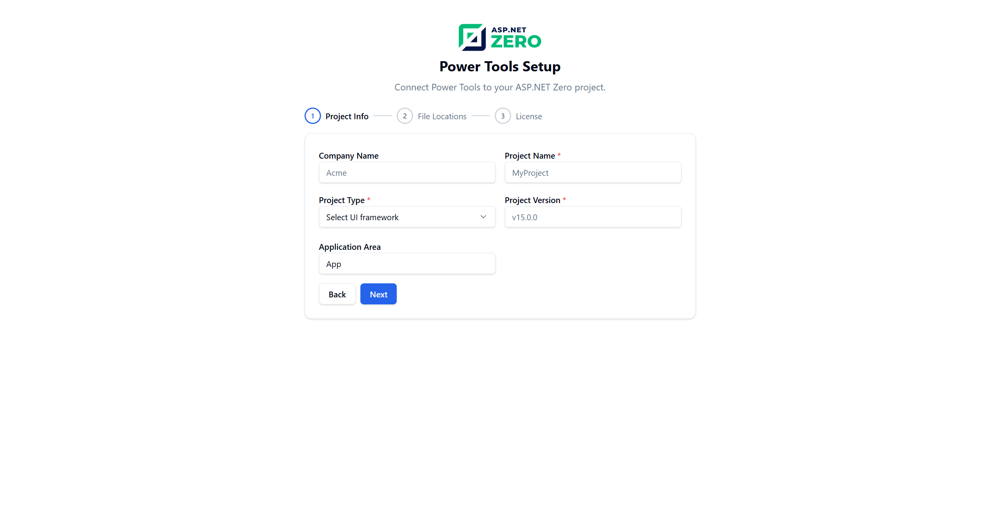
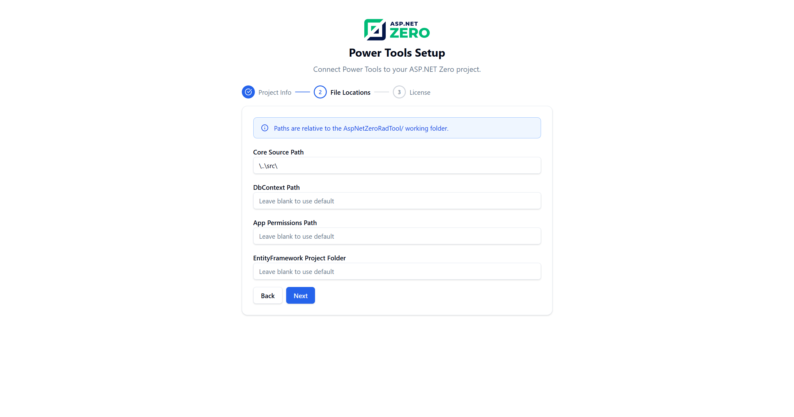
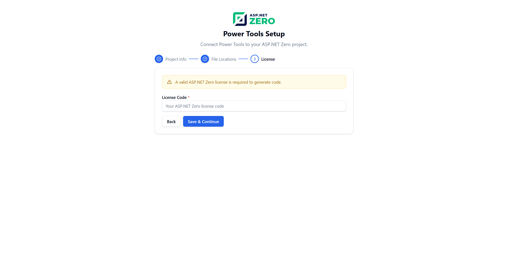

# ASP.NET Zero Power Tools Getting Started

ASP.NET Zero Power Tools is distributed as a .NET global tool. After installation, run `aspnetzero-powertools` to open the browser-based Power Tools UI and select your ASP.NET Zero project.

## Prerequisites

* [.NET 10 SDK](https://dotnet.microsoft.com/download) or later.
* [EF Core CLI](https://learn.microsoft.com/ef/core/cli/dotnet) if you want Power Tools to add migrations or update the database.
* [Node.js](https://nodejs.org/) if your generation workflow runs frontend commands such as bundle creation, service proxy refresh, or React dependency installation.
* An ASP.NET Zero project with the Power Tools NuGet source in `aspnet-core/NuGet.Config`.

> ASP.NET Zero projects include the ASP.NET Zero NuGet source automatically in `aspnet-core/NuGet.Config`. Run the install/update commands from the `aspnet-core` folder so `dotnet` can resolve the Power Tools package without manually adding a package source.

## Install Power Tools

Open a terminal in your ASP.NET Zero `aspnet-core` folder and run:

```bash
dotnet tool install -g AspNetZero.PowerTools
```

If Power Tools is already installed, update it instead:

```bash
dotnet tool update -g AspNetZero.PowerTools
```

## Launch the Web UI

From your ASP.NET Zero project folder, run:

```bash
aspnetzero-powertools
```

Power Tools starts a local web server and opens the UI in your browser. The default URL is `http://localhost:5678`.

You can also pass the project explicitly:

```bash
aspnetzero-powertools --project C:\Path\To\YourProject.sln
```

Useful launch options:

| Option | Description |
| --- | --- |
| `--project <path>` | Specifies a `.sln`, `.slnx`, or project folder to open. |
| `--port <number>` | Changes the web UI port. Default is `5678`. |
| `--no-launch` | Starts the server without opening the browser automatically. |

## First-Time Setup

When the UI opens, Power Tools detects the current project automatically when possible. If no configured project is found, the setup page asks you to select a `.sln` or `.slnx` file.

If the project already has `AspNetZeroRadTool/config.json`, Power Tools loads the existing settings for review. If it does not exist yet, the setup page creates the `AspNetZeroRadTool` working folder and guides you through:

- #### Project information such as company name, project name, project type, and version:
    

- #### File locations used by the generator:
    

- #### The ASP.NET Zero license code required for code generation:
    

After setup, Power Tools stores project-specific files under the solution's `AspNetZeroRadTool` folder and remembers the last selected project for the next launch.

## Generate Your First Entity

1. Open the **Entities** page.
2. Click **New Entity**.
3. Select the UI layout and create/edit/detail page style.
4. Enter entity information such as namespace, entity name, table name, base class, and primary key type.
5. Add properties, enum definitions, navigation properties, and master-detail child entities if needed.
6. Click **Generate** to save the entity JSON and start generation.

Power Tools streams the generation output in the browser. When generation completes, run your ASP.NET Zero application and grant yourself the generated permissions if the new page is not visible.


## Headless Mode

For automation or advanced scenarios, you can generate directly from an entity JSON file:

```bash
aspnetzero-powertools YourEntity.json --no-wait --format
```

Run headless commands from the project's `AspNetZeroRadTool` folder so `config.json`, templates, and entity JSON files can be resolved.

Common headless options:

| Option | Description |
| --- | --- |
| `--verbose` | Shows detailed console output. |
| `--format` | Runs formatting without prompting. |
| `--no-format` | Skips generated file formatting. |
| `--no-wait` | Exits without waiting for user input. |

## Notes

* Power Tools modifies existing project files and creates new files. Use source control and review the generated diff.
* Entity JSON files are case sensitive.
* If install fails because the package cannot be found, run the command from the `aspnet-core` folder so `NuGet.Config` is used.
* If install fails with `DotnetToolSettings.xml was not found in the package`, make sure the active SDK is .NET 10 or later and no `global.json` pins an older SDK.
