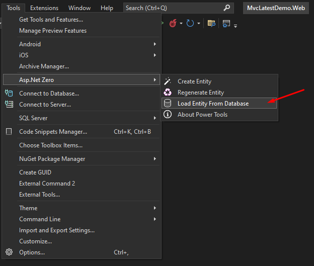
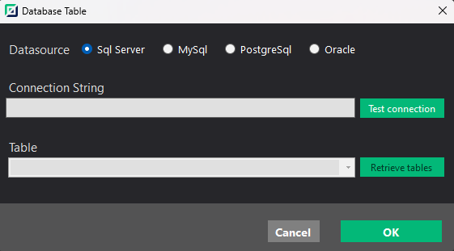

# Load Entity From Database

The ASP.NET Zero Power Tools streamline the process of loading entities from a database, enhancing efficiency and reducing manual effort. Power Tools automate entity loading from databases, generating JSON files and a wide range of code components. These tools accelerate development, ensuring a consistent and high-quality codebase across application services, UI elements, DTOs, tests, and UI tests.

## How to Load Entity From Database

It is easy to load an entity from a database using the ASP.NET Zero Power Tools. Simply follow the steps below:

1. Open the Power Tools window by navigating to `Tools > ASP.NET Zero` in Visual Studio.

2. Select the `Load Entity From Database` option from the Power Tools menu.

3. Select the database connection to use for loading the entity.

4. Select the entity to load from the database.

5. That's it! The Power Tools will generate the entity's JSON file and a wide range of code components.

## Supported Databases

* SQL Server
* PostgreSQL
* MySQL
* Oracle

## Advantages of Loading Entity From Database

Unleash remarkable efficiency and advanced capabilities in your development projects with the powerful ASP.NET Zero Power Tools.

### Effortless Entity Loading
The ASP.NET Zero Power Tools handle the intricate task of loading entities from the database seamlessly. The tools abstract away the complexities, ensuring that you can focus on higher-level application logic instead of database interaction intricacies.

### Automated Code Generation
Through the use of the Power Tools, a diverse set of code components is generated automatically. This includes the implementation of application services that manage entity operations, user interface elements for efficient data presentation, DTOs that facilitate data exchange between layers, and robust unit tests to validate functionality.

### Enhanced Consistency
By using a standardized process for entity loading, the Power Tools promote consistency across your application's codebase. This consistency leads to improved maintainability, reduced chances of errors, and a more cohesive overall structure.

### Time Savings
The automation provided by the Power Tools accelerates development. Developers can allocate their time to crafting business logic and refining user experiences instead of manually creating repetitive code components.

### Comprehensive Test Coverage
The generated unit tests and UI tests ensure that the loaded entities behave as intended across different scenarios. This results in a higher level of code reliability and confidence in the application's functionality.

### Flexibility and Customization
While the Power Tools automate many aspects, they also provide flexibility. Developers can customize the generated code to align with specific project requirements, accommodating unique business needs and architectural choices.

