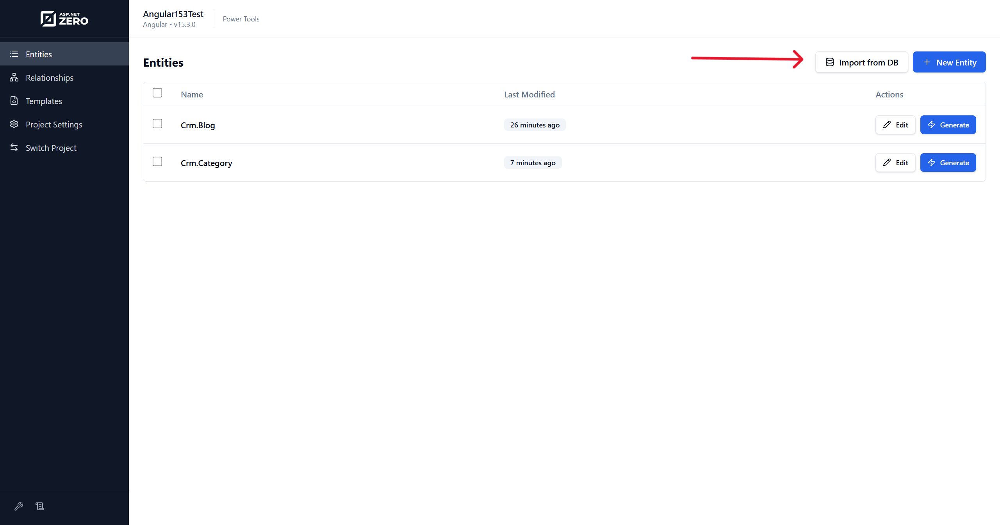
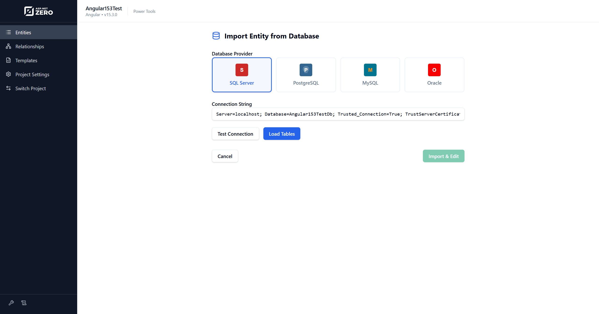

# Load Entity From Database

ASP.NET Zero Power Tools can import an entity definition from an existing database table. The import creates an entity JSON definition, opens it in the entity wizard, and lets you review or edit it before saving and generating code.

## How to Load an Entity From Database

1. Open Power Tools with `aspnetzero-powertools`.
2. Select your ASP.NET Zero project if it is not already selected.
3. Open the **Entities** page.
4. Click **Import from DB**.
5. Select the database provider.
6. Review or enter the connection string.
7. Click **Test Connection** if you want to verify the connection.
8. Click **Load Tables** and select the table you want to import.
9. Click **Import & Edit**.
10. Review the generated entity definition in the entity wizard, then save or generate it.

Power Tools tries to load the default connection string from the selected ASP.NET Zero project. If it cannot find it, enter the connection string manually.

## Supported Databases

* SQL Server
* PostgreSQL
* MySQL
* Oracle

## What Gets Imported

Power Tools reads the selected table and creates an entity JSON definition with sensible defaults:

* Entity name and plural name derived from the table name.
* Table name from the selected database table.
* Properties derived from table columns.
* Default UI, migration, Excel export/import, and host/tenant permission options.

The imported entity is not generated immediately. You can adjust namespace, names, validations, UI settings, navigation properties, and other options before generation.

## Advantages of Loading Entity From Database

### Effortless Entity Loading

Power Tools handles the repetitive work of reading database metadata and creating the initial entity definition.

### Automated Code Generation

After importing and reviewing the entity, Power Tools can generate application services, DTOs, UI files, localization entries, permissions, tests, and other related code.

### Enhanced Consistency

Using a standardized import and generation process keeps generated entities consistent across your application.

### Time Savings

Database import is useful when you already have tables and want to quickly build ASP.NET Zero pages for them.

### Flexibility and Customization

You can edit the imported entity definition before generation and customize generated templates when needed.
