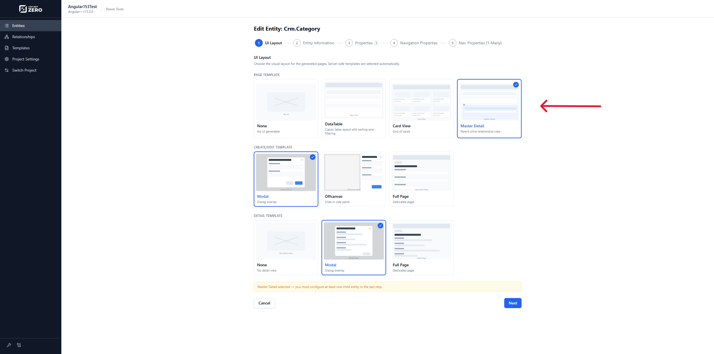
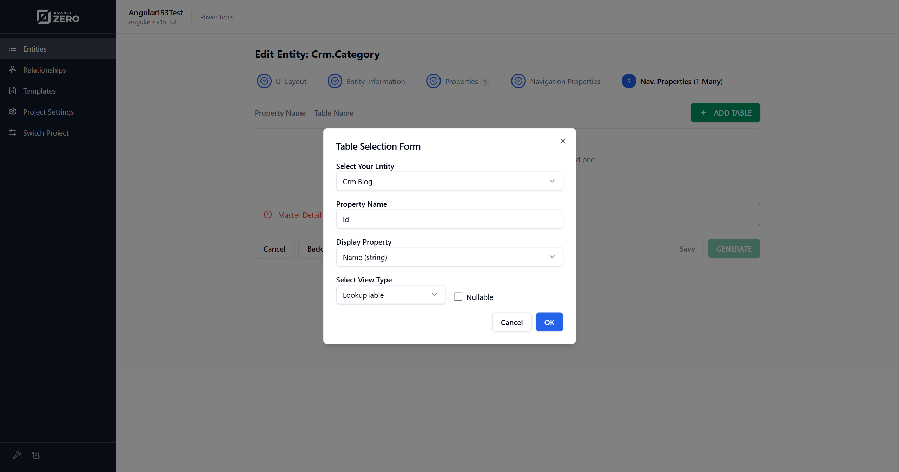
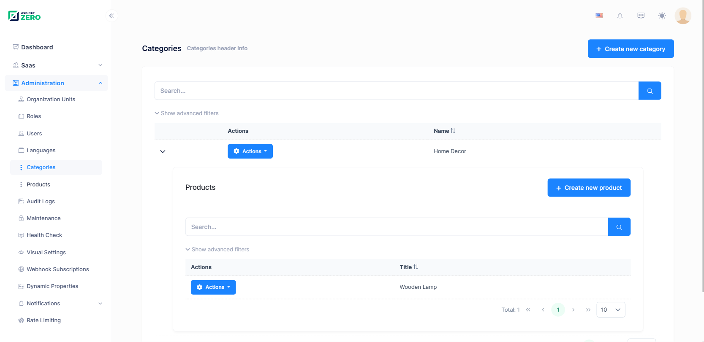
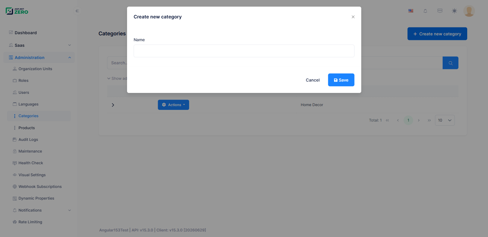
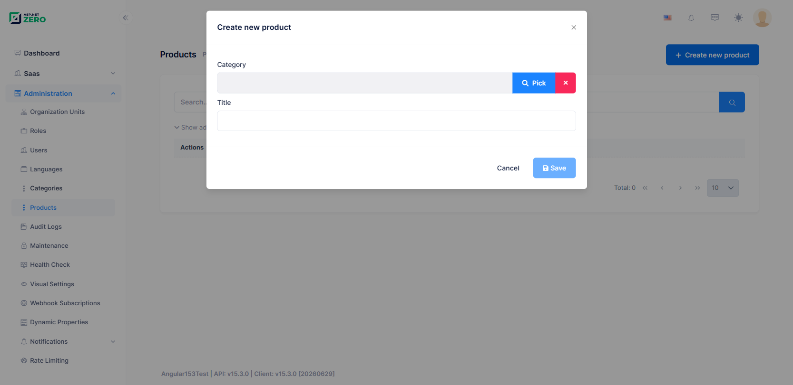

# Master Detail Tables

Master-detail tables, also known as parent-child tables, represent a one-to-many relationship between two entities. One master record can have multiple child records.

## What is a Master-Detail Table?

The master-detail relationship is a common database design pattern used to organize related data efficiently and avoid data duplication.

**Master Table:** The master table contains the main records. For example, in a bookstore database, the master table could be `Authors`.

**Detail Table:** The detail table contains records related to a master record. In the bookstore example, the detail table could be `Books`.

**Foreign Key:** The detail table contains a foreign key that references the primary key of the master table.

**One-to-Many Relationship:** One master record can be associated with multiple detail records, while each detail record belongs to one master record.

## Create a Master-Detail Page with Power Tools Web UI

Power Tools can generate master-detail pages from the web UI.

To create a master-detail page:

1. Create and save the child entity first. This entity will be used as the detail table.



2. Create the master entity.
3. In the **UI Layout** step, select the **Master Detail** page template.
4. Continue to the one-to-many navigation step.
5. Select the child entity JSON file, define the foreign key property, choose the display property, and choose the view type.




6. Click **Generate**.

Power Tools generates the required server-side and client-side files for the master page and updates the child entity relationship as needed.

## Create a Master-Detail Page Manually

For advanced or headless usage, you can edit the entity JSON file manually.

1. Create the child entity JSON file first. For more information about entity JSON files, see [Entity JSON Reference](Power-Tools-Creating-Entity-Json-File-Manually.md).
2. Create or edit the master entity JSON file.
3. Set `IsMasterDetailPage` to `true`.
4. Add `NavigationPropertyOneToManyTables` entries for child entities.

**NavigationPropertyOneToManyTables:**

| Name | Description |
| --- | --- |
| EntityJson | Child entity JSON file name. It must be located in the project's `AspNetZeroRadTool` working folder. |
| ForeignPropertyName | Property name on the child entity that stores the foreign key. |
| IsNullable | Defines whether the foreign key is nullable. |
| DisplayPropertyName | Property name from the master entity displayed on child pages. |
| ViewType | `LookupTable` or `Dropdown`. |

*Example JSON File*

```json
{
  "IsRegenerate": false,
  "MenuPosition": "main",
  "RelativeNamespace": "BaseNamespace",
  "EntityName": "BaseEntity",
  "EntityNamePlural": "BaseEntities",
  "TableName": "BaseEntities",
  "PrimaryKeyType": "int",
  "BaseClass": "Entity",
  "EntityHistory": false,
  "AutoMigration": true,
  "UpdateDatabase": true,
  "CreateUserInterface": true,
  "CreateViewOnly": true,
  "CreateExcelExport": true,
  "IsNonModalCRUDPage": false,
  "IsMasterDetailPage": true,
  "PagePermission": {
    "Host": true,
    "Tenant": true
  },
  "Properties": [
    {
      "Name": "BaseProp1",
      "Type": "string",
      "MaxLength": -1,
      "MinLength": -1,
      "Range": {
        "IsRangeSet": false,
        "MinimumValue": 0,
        "MaximumValue": 0
      },
      "Required": false,
      "Nullable": false,
      "Regex": "",+
      "UserInterface": {
        "AdvancedFilter": true,
        "List": true,
        "CreateOrUpdate": true
      }
    }
  ],
  "NavigationProperties": [
    {
      "Namespace": "Abp.Organizations",
      "ForeignEntityName": "OrganizationUnit",
      "IdType": "long",
      "IsNullable": true,
      "PropertyName": "OrganizationUnitId",
      "DisplayPropertyName": "DisplayName",
      "DuplicationNumber": 0,
      "RelationType": "single",
      "ViewType": "LookupTable"
    }
  ],
  "NavigationPropertyOneToManyTables": [
    {
      "EntityJson": "ChildNamespace1.Child.json",
      "ForeignPropertyName": "BaseEntityId",
      "IsNullable": true,
      "DisplayPropertyName": "BaseProp1",
      "ViewType": "LookupTable"
    }
  ],
  "EnumDefinitions": [],
  "DbContext": null
}
```

## Screenshots

*Authors Page*



> You can create list views for child entities too. Power Tools updates both the master entity page and child entity page.

*Authors > Create New Book*



*Books > Create New Book*



> If you manage child entities from the master entity page, Power Tools automatically handles the relationship to the master entity.
