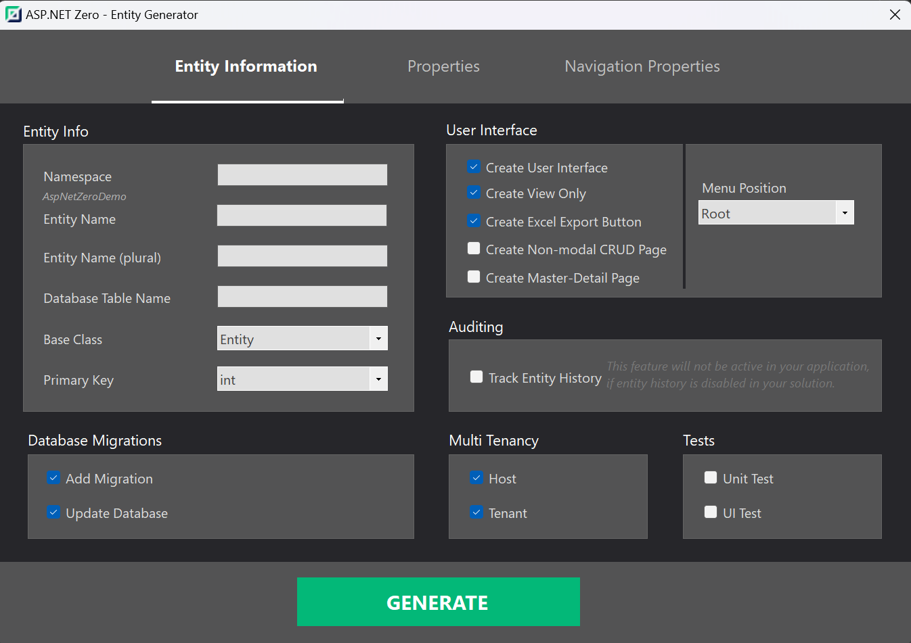

## Rapid Application Development in .Net Core with ASP.NET Zero

Welcome to the ASP.NET Zero Power Tools documentation! This documentation provides comprehensive information about using ASP.NET Zero Power Tools, a Visual Studio Extension that simplifies the process of creating CRUD (Create, Read, Update, Delete) pages in ASP.NET Core projects. 

If you are familiar with Aspnetzero Power Tools, you can begin from this [document](remastered-getting-started.md).

## What is ASP.NET Zero Power Tools?

ASP.NET Zero Power Tools is a robust extension that adheres to the SOLID principles, designed to automate the generation of essential application layers, spanning from the database to the user interface, based on a defined entity. By embracing SOLID principles, this tool ensures a clean, maintainable, and scalable architecture for your ASP.NET Core projects.

This powerful extension significantly reduces the development effort required to create CRUD pages, empowering developers to swiftly generate fully functional, production-ready CRUD pages with just a few clicks. By leveraging ASP.NET Zero Power Tools, developers can focus more on building core features and business logic, rather than dealing with repetitive and time-consuming CRUD implementation.

## How to Use ASP.NET Zero Power Tools?

The Power Tools can be used in two ways:

1. Visual Studio Extension: Windows users can conveniently use the Visual Studio Extension to streamline the CRUD page generation process.
2. Command Line (DLL): For Mac and Linux users, the extension's DLL files can be used directly with a command line, offering flexibility and efficiency.

## Development Guide

The development guide provides detailed instructions on how to use the ASP.NET Zero Power Tools effectively. It covers:

* Installation and usage of the Visual Studio Extension on Windows.
* Utilizing DLL files on Mac and Linux for code generation.
* Editing and creating new templates for code generation.
* Changing destination paths of newly generated files.
* Detailed information about the files that are created or modified by the tool.
* Troubleshooting common issues.

## Conclusion

ASP.NET Zero Power Tools is an essential tool for developers working with ASP.NET Core projects. It streamlines the process of creating CRUD pages and allows developers to focus on building the core features of their applications.

Whether you're using Visual Studio on Windows or working on Mac and Linux, the Power Tools are a valuable addition to your development toolkit, enabling you to create robust CRUD pages with ease.

Get started with the ASP.NET Zero Power Tools now and experience the productivity and convenience it offers in your ASP.NET Core projects!

## Next Steps

* [Getting Started](power-tools-getting-started.md)