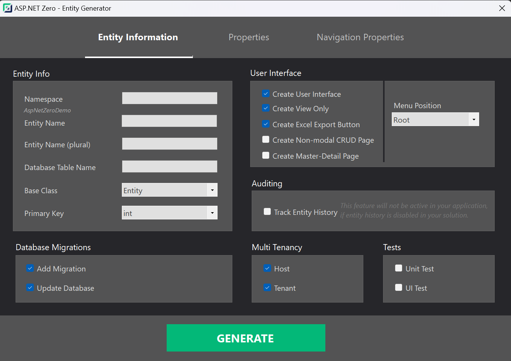

# ASP.NET Zero Power Tools Overview

Welcome to the ASP.NET Zero Power Tools documentation. Power Tools is a .NET global tool that opens a web-based user interface for generating CRUD pages and related server-side/client-side code in ASP.NET Zero projects.

If you are already familiar with Power Tools, start with [Getting Started](Power-Tools-Getting-Started.md) or [Using Power Tools Web UI](Power-Tools-Using-Web-UI.md).

## What is ASP.NET Zero Power Tools?

ASP.NET Zero Power Tools reduces the effort required to create CRUD pages. You define an entity, then Power Tools generates the related application layers from the database to the user interface.

Depending on the selected project type and entity options, Power Tools can generate entities, DTOs, application services, permissions, localization entries, migrations, Angular/MVC/React UI files, MAUI files, unit tests, UI tests, Excel import/export code, and master-detail pages.

Power Tools keeps its project-specific state in the `AspNetZeroRadTool` working folder of your ASP.NET Zero solution. This folder contains files such as `config.json`, entity JSON definitions, and customizable generation templates.

## How to Use ASP.NET Zero Power Tools

Power Tools can be used in two modes:

1. **Web UI mode:** Install the .NET global tool, run `aspnetzero-powertools`, select your ASP.NET Zero solution, and use the browser-based UI.
2. **Headless mode:** Run `aspnetzero-powertools <entity.json>` from the Power Tools working folder to generate code directly from an entity JSON file.

The web UI is the recommended approach for most scenarios. It provides project selection, setup, entity management, database import, template editing, batch generation, relationship visualization, project settings, generation workflows, and logs.

## Development Guide

The development guide covers:

* Installing and launching the .NET global tool.
* Selecting or switching ASP.NET Zero projects.
* Creating, editing, and generating entities from the web UI.
* Importing entities from existing databases.
* Creating master-detail pages.
* Editing and creating code generation templates.
* Understanding and manually editing entity JSON files for advanced/headless usage.
* Configuring file locations, license information, and generation workflows.
* Understanding generated files and troubleshooting common issues.

## Conclusion

ASP.NET Zero Power Tools helps developers build CRUD-heavy business applications faster while preserving ASP.NET Zero's layered architecture and conventions.

Use the web UI for day-to-day generation, and use headless mode when you need automation or direct JSON-based generation.

## Next Steps

* [Getting Started](Power-Tools-Getting-Started.md)
* [Using Power Tools Web UI](Power-Tools-Using-Web-UI.md)
