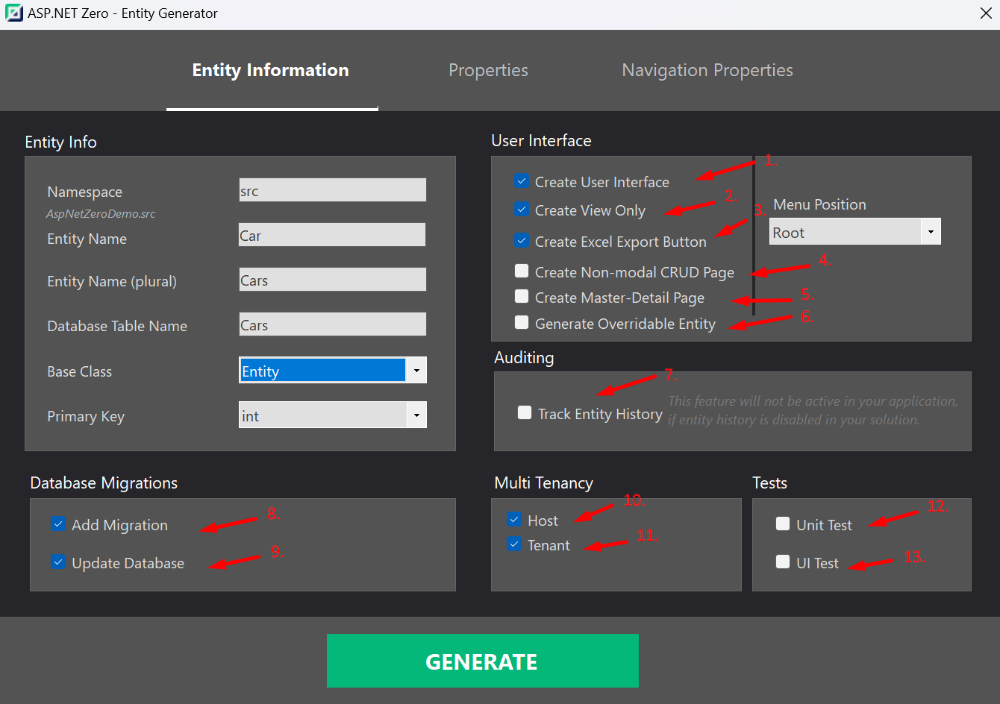
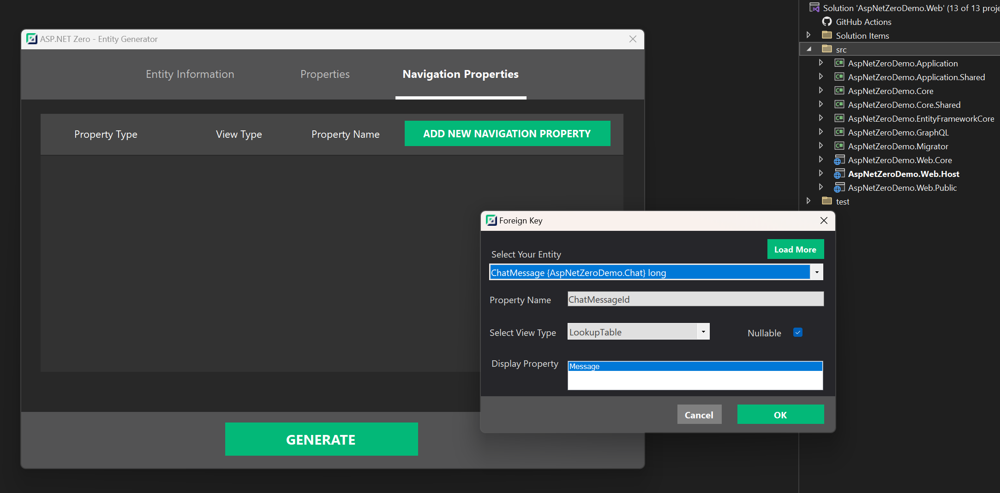
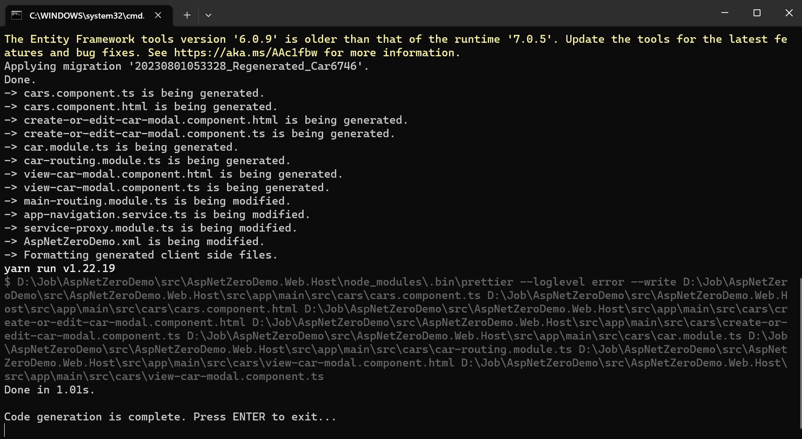

# ASP.NET ZERO Power Tools Using Visual Studio Extension

In this document, we will see how to use the ASP.NET Zero Power Tools Visual Studio Extension to create crud pages.

## Entity Information Tab

The Entity Information tab provides a platform to specify entity-specific details. These encompass the entity's name, namespace, database table name, base class, primary key type, and other relevant attributes.

1. **Create User Interface:** If you do not select this option, the Power Tools will only create the entity and its related files.

2. **Create View Only:** If you select this option, the Power Tools will create only the view pages for the entity. 

3. **Create Excel Export Button:** If you select this option, the Power Tools will create an Excel export button for the entity and you will be able to export the entity's data to an Excel file.

4. **Create Non-modal CRUD Page:** If you want to create CRUD pages without using modals, power tools will create new pages and routes for create and edit operations.

5. **Create Master Detail Page:** This option enables you to create a master detail page for the entity. Please refer to the [Master Detail Tables](power-tools-master-detail-tables.md) document for more information.

6. **Generate Overridable Entity:** This option enables you to override created entity classes with creating partial classes. 

7. **Track Entity History:** This option enables you to track the entity's history. Please refer to the [Entity History](https://aspnetboilerplate.com/Pages/Documents/Entity-History) document for more information.

8. **Add Migration:** This option adds a migration for the entity to the database. If you want to add migrations manually, you can just disable this option.

9. **Update Database:** This option updates the database after adding the migration. If you want to update the database manually, you can just disable this option.

10. **Host**: If you select this option, your entity will be available in the host side.

11. **Tenant**: If you select this option, your entity will be available in the tenant side.

12. **Unit Test:** If you select this option, the Power Tools will create unit tests based on **XUnit** & **NSubtitute**  for the entity.

13. **UI Test:** If you select this option, the Power Tools will create **Playwright** UI tests for the entity. (Min ANZ version 12.2.0)

> Note: If you select both host and tenant options, your entity will be available in both host and tenant sides. 

## Properties Tab

The Properties tab enables you to configure various settings for the selected entity. This includes defining properties such as strings, integers, booleans, enums, and more. Additionally, you have the option to add validation rules for these properties, such as setting minimum and maximum lengths, specifying whether they are required fields, or utilizing regular expressions.

Furthermore, the tab allows you to enable or disable advanced filtering, create and update options, and listing on the user interface for each of the properties.

## Navigation Properties Tab

The Navigation Properties tab enables you to define relationships between entities. This includes one-to-one, one-to-many, and many-to-many relationships. You can also specify the type of relationship, such as whether it is a required field or not. For more information on navigation properties, please refer to the [Master Detail Tables](power-tools-master-detail-tables.md) document.

## Generating CRUD Pages

After configuring the entity, you can create CRUD pages and application services by clicking the **Generate** button. The Power Tools will create the entity and its related files. 

That's it! You can now run the application and see the created pages.