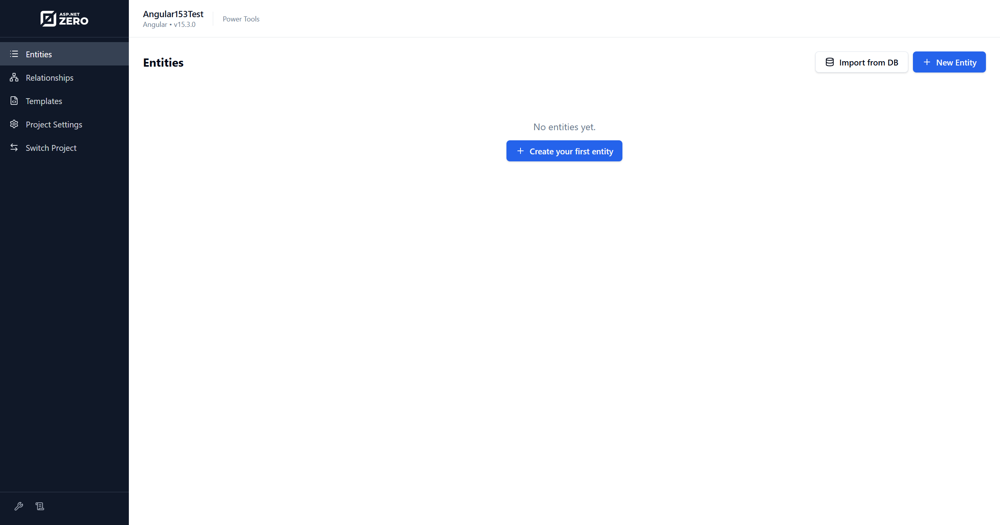
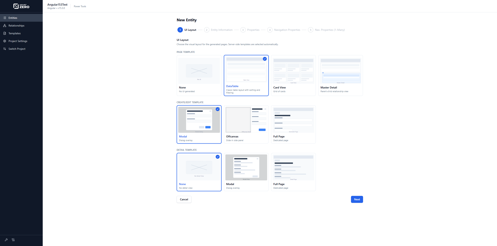
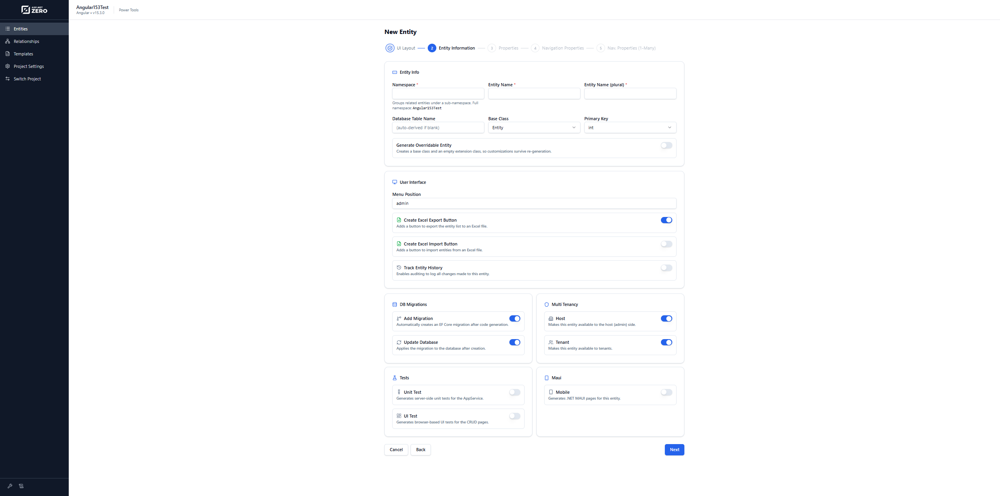
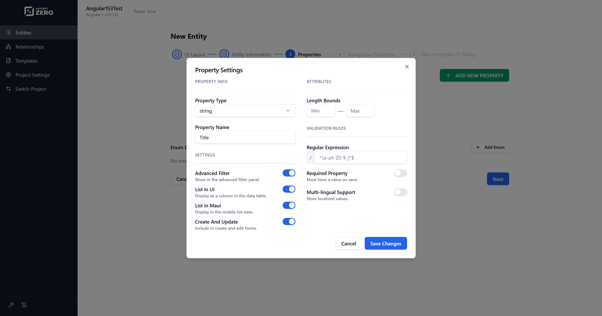
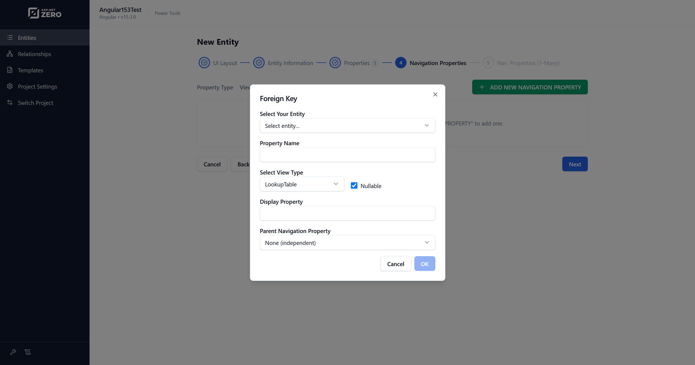
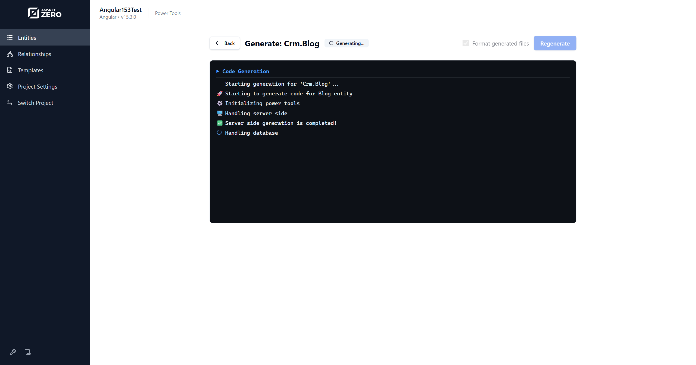
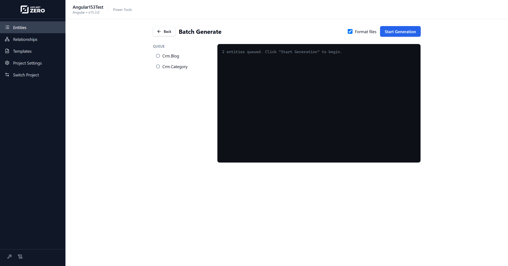
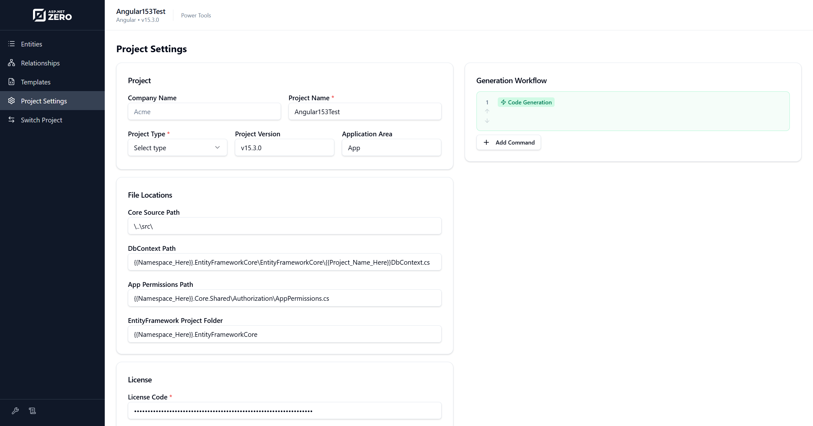

# ASP.NET Zero Power Tools Web UI

In this document, we will see how to use the ASP.NET Zero Power Tools web UI to create and generate CRUD pages.

## Open Power Tools

Install Power Tools as described in [Getting Started](Power-Tools-Getting-Started.md), then run:

```bash
aspnetzero-powertools
```

The UI opens in your browser. If Power Tools cannot detect a configured project, select your `.sln` or `.slnx` file on the click switch project menu item.

## Setup and Project Selection

On first run, Power Tools asks you to select an ASP.NET Zero solution file. It then uses the solution's `AspNetZeroRadTool` working folder.

If `config.json` already exists, Power Tools loads it and lets you review the settings. If it does not exist yet, the setup wizard asks for project information, file locations, and license code.

You can switch projects later from **Switch Project** in the sidebar.

## Entities Page

The **Entities** page lists entity JSON files in the selected project's `AspNetZeroRadTool` folder.

From this page, you can:

* Create a new entity.
* Edit an existing entity definition.
* Generate code for one entity.
* Select multiple entities and run batch generation.
* Import an entity from a database table.



## UI Layout Step

The first step of the entity wizard lets you select generated UI layouts.

Available options depend on your project version and project type. Common options include:

* Page template: None, DataTable, Card View, or Master Detail.
* Create/Edit template: Modal, Offcanvas, or Full Page.
* Detail template: None, Modal, or Full Page.

Selecting **None** for the page template generates only server-side files. Selecting **Master Detail** requires at least one child entity in the one-to-many navigation step.



## Entity Information Step

The Entity Information step defines the entity-level settings:

1. **Namespace:** Groups related entities under a sub-namespace.
2. **Entity Name:** The singular entity class name.
3. **Entity Name (plural):** Used for generated services, pages, and table names.
4. **Database Table Name:** The database table name. It can be auto-derived from the plural name.
5. **Base Class:** The entity base class, such as `Entity`, `AuditedEntity`, `CreationAuditedEntity`, or `FullAuditedEntity`.
6. **Primary Key:** The primary key type.
7. **Generate Overridable Entity:** Creates extension classes so custom code can survive re-generation.
8. **Menu Position:** The application menu path for generated UI pages.
9. **Create Excel Export Button:** Adds Excel export support.
10. **Create Excel Import Button:** Adds Excel import support.
11. **Track Entity History:** Enables entity history/audit support.
12. **Add Migration:** Creates an EF Core migration after generation.
13. **Update Database:** Applies the migration to the configured database.
14. **Host / Tenant:** Controls whether the generated page is available to the host side, tenant side, or both.
15. **Unit Test:** Generates server-side unit tests for the application service.
16. **UI Test:** Generates Playwright UI tests for the generated pages.
17. **Mobile:** Generates .NET MAUI files for the entity.

> If you select both Host and Tenant, the generated entity is available in both sides.



## Properties Step

The Properties step defines entity properties such as strings, integers, booleans, decimals, dates, GUIDs, and enums.

For each property, you can configure validation and UI behavior, including:

* Required/nullable settings.
* Minimum and maximum length for strings.
* Numeric range.
* Regular expression validation.
* Listing on the table.
* Advanced filtering.
* Create/edit form visibility.

The same step also lets you define enum types used by the entity.



## Navigation Properties Step

The Navigation Properties step defines relationships to other entities. Power Tools uses these relationships to generate foreign key fields, lookup dialogs, dropdowns, typeahead controls, and related DTO/service code.

For more information, see [Master Detail Tables](Power-Tools-Master-Detail-Tables.md).



## One-to-Many Step

The One-to-Many step is used for master-detail pages. Select child entity JSON files and define how they are connected to the master entity.

## Generating CRUD Pages

After configuring the entity, click **Generate**. Power Tools saves the entity JSON file, opens the generation log page, and streams the output.



When generation completes, run the application and check the generated page. If the page is not visible, grant the generated permission to your user or role.

## Batch Generation

On the **Entities** page, select multiple entities and click **Generate Selected**. Power Tools calculates a safe generation order based on navigation properties and master-detail relationships, then generates all selected entities.

Batch generation formats generated files once at the end and then runs configured workflow command steps.




## Project Settings

The **Project Settings** page lets you edit `config.json` from the web UI. You can update project information, file locations, license code, and generation workflow steps.

Generation workflow commands are useful for tasks such as refreshing service proxies, creating bundles, or running host projects during generation.



## Logs

The **Logs** page shows Power Tools backend logs. Use this page when generation fails or when you need details beyond the browser generation output.
