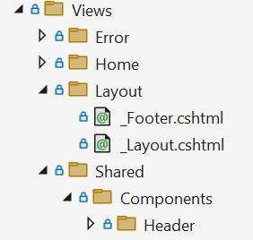

# Public Web Site

ASP.NET Zero contains a separated application that can be a starting point for your public web site or a landing page for your application. 

Before running the project, we need to install NPM packages using **yarn**. In order to do that, open a command prompt, navigate to root directory of ***.Web.Public** project and run "**yarn**" command. Yarn must be installed globally in order to do that. If you haven't installed it yet, please go to [https://yarnpkg.com](https://yarnpkg.com/) and install it.

After installing the packages, run "**npm run create-bundles**" command to generate bundles for JavaScript, CSS and LESS files. ASP.NET Zero automatically watches JavaScript and Style files and updates the bundles. 

Note that, in development time script files are not minified. When you are publishing your application you need to run "**npm run build**" command to generate bundles for production environment and then publish the application using Visual Studio (or your favorite tool).

We are ready to run the application using Visual Studio. So, just run the application using Visual Studio and it will display the main page of the Public website project.

There are two pages here: **Home Page** and **About**. Contents of these pages are just placeholders and for demo purposes. You can completely remove content and build your page upon your needs. Also, you should change the **logo** with your Company's logo.

See [metronic front-end theme](http://keenthemes.com/free-bootstrap-templates/multi-purpose-corporate-frontend-themefreebie-corporate-frontend-theme/) for all possibilities and components to build a richer web site.

Menus are defined in **FrontEndNavigationProvider** class. When you add a new menu item here, it will be automatically shown in the menu. There is a **Login** link at the top right corner. This link takes user to the **Login page** to enter to the **Angular** application. After the login, user will be redirected back to public website.

## Layout

Layout of front-end pages are located under **Views/Layout** folder:

**\_Layout** is the main layout file that includes scripts and styles. Language flags and the menu is rendered in **Header component** which is located under Shared/Components. \_PreFooter is not used but you can add
it to the \_Layout if you want.

## New Tenant Registration

When you click "**New Tenant**" link (at the top right area) you are redirected to the edition/plan selection page:

Actually, this UI is located in the main application. When you pick an edition, you are redirected to the payment or register form depending on the button you clicked. Register form is shown as below:

## Single Sign On

Public web site has a login integration to the main application. When you click to login button (at the top right area) you are redirected to the main application. If you are already logged then you automatically
login in the public web site too. If not, you can enter your username and password to login. Then you are redirected back to the public web site and your username is shown at the top right:

To make this working, public web site must know URL of Angular app. This is configured in the **appsettings.json** of the **Web.Public** project, set **AdminWebSiteRootAddress** to root URL of the main application.

This configuration is properly set for the development environment. You should change it when you publish your project.