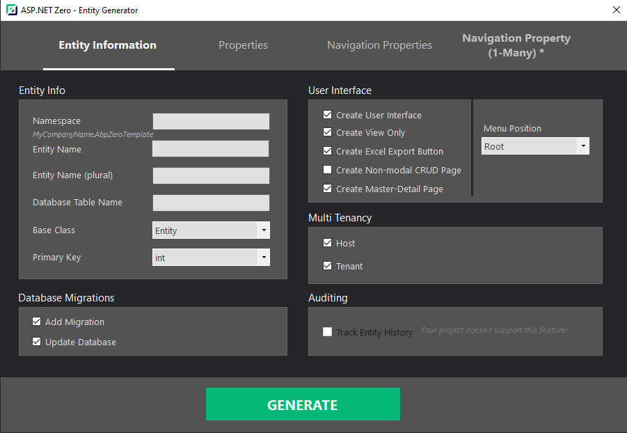
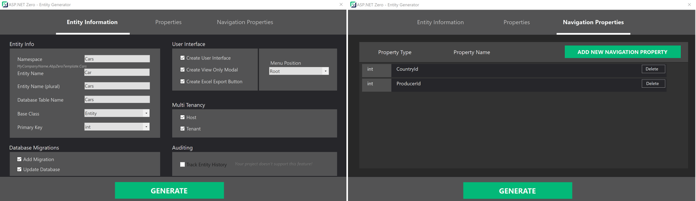
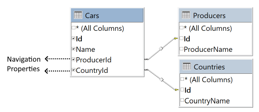

## How To Use It?

After the installation, you need to restart the Visual Studio. You can then find the extension inside the Visual Studio's **Tools** menu (Tools -> Asp.Net Zero). 

For example, clicking the "Tools -> Asp.Net Zero -> Create Entity" opens the window shown below. After carefully filling out the fields, press the **Generate** button to start the code generation process. 

A console will appear and give you information about the process during the code generation. If there is no warning or failure, run your project to see the results. If you don't see the new page on UI, grant yourself the required **permissions** in the application.

> If you are working on ASP.NET Core & Angular template, after generating the entity via Power Tools, run your ***.Web.Host** project and then run "**./angular/nswag/refresh.bat**" to update **service-proxies.ts**. Otherwise, you will see errors when building your Angular application.

> Be sure that you have saved your work before running this tool since it will add new files and modify some of the existing files. We strongly recommend using a source control system (like Git).  Otherwise, backup your project.

## Navigation Properties

A navigation property is a type of property on an entity that allows for navigation from one end of an association to the other end. Unlike other properties, navigation properties do not carry data.

Navigation properties provide a way to navigate an association between two entity types. Every object can have a navigation property for every relationship in which it participates. In ASP.NET Zero, a navigation property allows you create a button on the data table, where you can pick a record from a look up table.

Power Tools allow you to create a navigation property for only **1-to-many (1:N)** relationships.

In this scenario there are multiple records from one entity associated with a single record from another entity. This means you have a parent (or primary) entity and many related (or child) entities.

- `Car` entity (1) is associated to `Producer` entity (N). 
- `Car` entity (1) is associated to `Country` entity (N).

*Currently there's no support for many-to-1 (N:1) or many-to-many (N:N) relationships!*

A foreign keys is automatically being created for each navigation property.

The diagram below shows a conceptual model with three entity types: `Car`, `Producer` and `Country`. 
Navigation properties are `Producer` and `Country` that are defined on the `Car` entity. 

