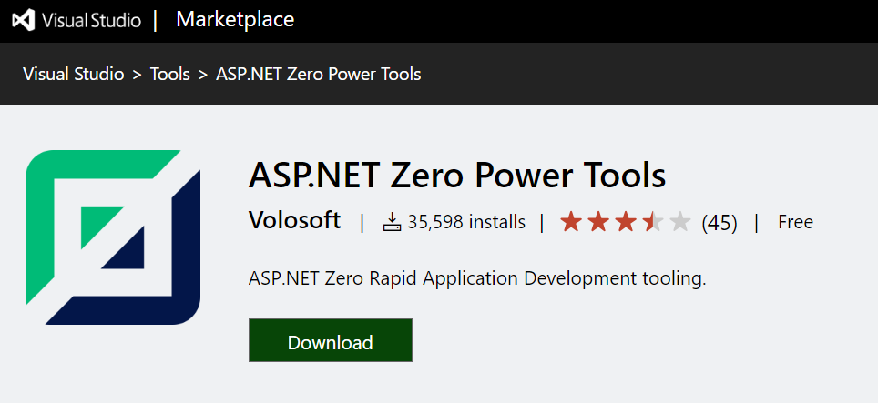
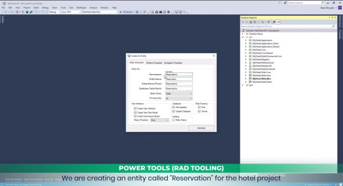
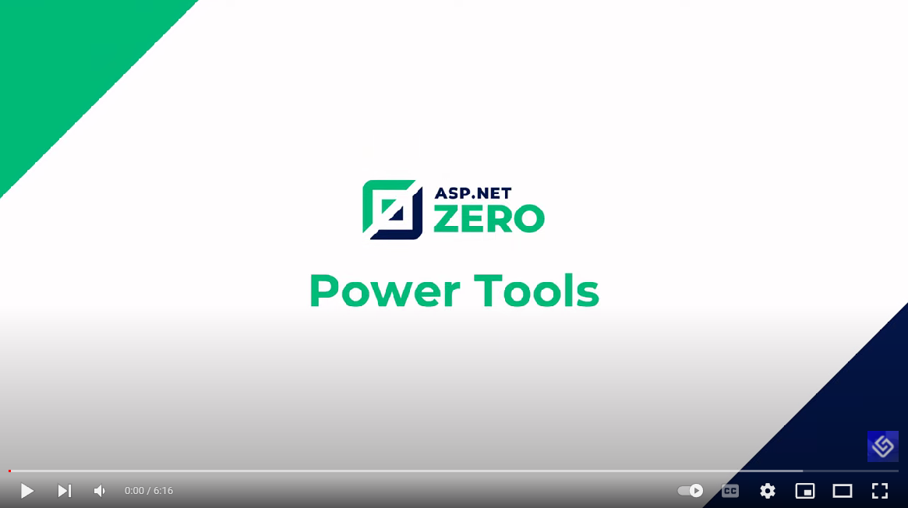

# Power Tools

[ASP.NET Zero Power Tools](https://marketplace.visualstudio.com/items?itemName=Volosoft.AspNetZeroPowerTools) is a Visual Studio Extension that can automatically create an entity and its layers from the database to the user interface. So, you can create a fully working, production ready CRUD page in seconds.

Notice that the Power Tools is only available for **ASP.NET Core** templates, not available for ASP.NET MVC 5.x templates.

## Pre Requirements

* [Visual Studio 2017 (v15.9.0+)](https://www.visualstudio.com/) (Only for Windows)
* [.NET Core 2.2 Runtime](https://dotnet.microsoft.com/download/dotnet-core/2.2).
* [EF Core Tools](https://docs.microsoft.com/en-us/ef/core/cli/dotnet)

## Download And Install

If your project version is 5.0.0+, all you have to do is just install the **ASP.NET Zero Power Tools** extension on Visual Studio from [marketplace](https://marketplace.visualstudio.com/items?itemName=Volosoft.AspNetZeroPowerTools) or from Visual Studio's Extension and Updates menu. 

> If you are a non-Windows user, you can use binaries of ASP.NET Zero Power Tools included in your ASP.NET Zero solution. See [Development Guide for Mac/Linux](Development-Guide-Rad-Tool-Mac-Linux)

## Demonstration

You can see ASP.NET Zero Power Tools in action by watching the quick introduction video [YouTube video](https://youtu.be/OsSdNkwmC7I?t=1001). This video demonstrates some of ASP.NET Zero Power Tools features starting from its installation on Visual Studio. 

For the detalied usage of ASP.NET Zero Power Tools, you can watch the detailed introduction video.

