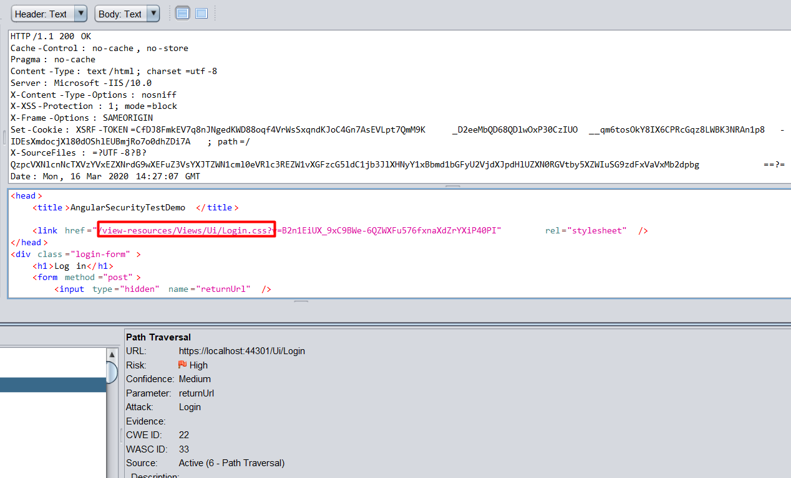

# ASP.NET ZERO Penetration Test Report

Asp.Net Zero has been scanned for vulnerabilities with the [OWASP ZAP (v2.7.0)](https://www.owasp.org/index.php/OWASP_Zed_Attack_Proxy_Project). The OWASP Zed Attack Proxy (ZAP) is one of the world's most popular security tools and is actively maintained by hundreds of international volunteers. 

The automated scanner has been reported several alerts.  Asp.Net Zero Team has fixed the positive alerts regarding the report. On the other hand most of the alerts can be stated as false-positive. The reasons for the false-positive alerts that are subject to these issues are clearly stated below.

## Summary of Alerts

### Path Traversal

##### Risk: High

**Confidence: Medium**

#### Description

The Path Traversal attack technique allows an attacker access to files, directories, and commands that potentially reside outside the web document root directory. 

#### Comment

The report has stated some CSS, JS links are open to path traversal attack. But these alerts are false-positive. You can see the reasons why they are evaluated as false-positive.

- URL: https://localhost:44301/Ui/Login
  - Method: `POST`
  - Parameter: `returnUrl`
  - Attack: `Login`
  - Evidence: `etc`

  When we inspect the below response, it returns to login page which contains `Login.css` reference in the code. 
  
  

### Recommendation

If your application has to accept input file names, file paths, or URL paths, you need to validate that the path is in the correct format and that it points to a valid location within the context of your application. To prevent a malicious user manipulating your code's file operations, avoid writing code that accepts user-supplied file or path input. 

- If you must accept file names as input, use the full name of the file by using **System.IO.Path.GetFileName**. 
- If you must accept file paths as input, use the full file path by using **System.IO.Path.GetFullPath**.

If you use **MapPath** to map a supplied virtual path to a physical path on the server, use the overload of **Request.MapPath** that accepts a **bool** parameter so that you can prevent cross-application mapping. 

### Application Error Disclosure

##### Risk: Medium

**Confidence: Low**

#### Description

This page contains an error/warning message that may disclose sensitive information like the location of the file that produced the unhandled exception. This information can be used to launch further attacks against the web application. The alert could be a false positive if the error message is found inside a documentation page.

#### Comment

- Method: `Delete`

  - Urls: 

    https://localhost:44301/api/services/app/DashboardCustomization/DeletePage, 
    https://localhost:44301/api/services/app/Role/DeleteRole, 
    https://localhost:44301/api/services/app/Tenant/DeleteTenant, 
    https://localhost:44301/api/services/app/User/DeleteUser

- Method: `Get`

  - Urls:

    https://localhost:44301/api/services/app/DashboardCustomization/GetAllWidgetDefinitions, 
    https://localhost:44301/api/services/app/DashboardCustomization/GetDashboardDefinition, 
    https://localhost:44301/api/services/app/DashboardCustomization/GetUserDashboard, 
    https://localhost:44301/api/services/app/DemoUiComponents/GetCountries, 
    https://localhost:44301/api/services/app/Payment/GetLastCompletedPayment, 
    https://localhost:44301/api/services/app/Payment/GetPaymentHistory, 
    https://localhost:44301/api/services/app/Payment/GetPaymentHistory?Sorting=Sorting&MaxResultCount=10&SkipCount=10,https://localhost:44301/api/services/app/StripePayment/GetPayment, 
    https://localhost:44301/api/services/app/StripePayment/GetPayment?StripeSessionId=StripeSessionId, 
    https://localhost:44301/api/services/app/Tenant/GetTenantForEdit, 
    https://localhost:44301/api/services/app/TenantRegistration/GetEditionsForSelect, 
    https://localhost:44301/api/services/app/Timing/GetTimezoneComboboxItems, 
    https://localhost:44301/api/services/app/Timing/GetTimezoneComboboxItems?SelectedTimezoneId=SelectedTimezoneId, 
    https://localhost:44301/api/services/app/User/GetUserPermissionsForEdit, 
    https://localhost:44301/api/services/app/WebhookEvent/Get, 
    https://localhost:44301/api/services/app/WebhookSendAttempt/GetAllSendAttempts, 
    https://localhost:44301/api/services/app/WebhookSendAttempt/GetAllSendAttemptsOfWebhookEvent, 
    https://localhost:44301/api/services/app/WebhookSubscription/GetSubscription, 
    https://localhost:44301/api/TokenAuth/LogOut

- Method `POST`

  - Urls: 
  - https://localhost:44301/api/services/app/Account/ActivateEmail, 
    https://localhost:44301/api/services/app/Account/BackToImpersonator, 
    https://localhost:44301/api/services/app/Account/Register, 
    https://localhost:44301/api/services/app/Account/ResetPassword, 
    https://localhost:44301/api/services/app/Account/ResolveTenantId, 
    https://localhost:44301/api/services/app/Account/SendEmailActivationLink, 
    https://localhost:44301/api/services/app/Account/SendPasswordResetCode, 
    https://localhost:44301/api/services/app/Account/SwitchToLinkedAccount, 
    https://localhost:44301/api/services/app/DashboardCustomization/AddNewPage, 
    https://localhost:44301/api/services/app/DashboardCustomization/AddWidget, 
    https://localhost:44301/api/services/app/DashboardCustomization/RenamePage, 
    https://localhost:44301/api/services/app/DashboardCustomization/SavePage, 
    https://localhost:44301/api/services/app/Friendship/CreateFriendshipRequestByUserName, 
    https://localhost:44301/api/services/app/HostSettings/SendTestEmail, 
    https://localhost:44301/api/services/app/Install/Setup, 
    https://localhost:44301/api/services/app/Language/CreateOrUpdateLanguage, 
    https://localhost:44301/api/services/app/Payment/CancelPayment, 
    https://localhost:44301/api/services/app/Payment/CreatePayment, 
    https://localhost:44301/api/services/app/Payment/SwitchBetweenFreeEditions, 
    https://localhost:44301/api/services/app/Payment/SwitchBetweenFreeEditions?upgradeEditionId=10, 
    https://localhost:44301/api/services/app/Payment/UpgradeSubscriptionCostsLessThenMinAmount, 
    https://localhost:44301/api/services/app/Payment/UpgradeSubscriptionCostsLessThenMinAmount?editionId=10, 
    https://localhost:44301/api/services/app/Profile/ChangePassword, 
    https://localhost:44301/api/services/app/Profile/VerifySmsCode, 
    https://localhost:44301/api/services/app/Role/CreateOrUpdateRole,
    https://localhost:44301/api/services/app/Subscription/EnableRecurringPayments,
    https://localhost:44301/api/services/app/Tenant/UnlockTenantAdmin,
    https://localhost:44301/api/services/app/TenantSettings/SendTestEmail,
    https://localhost:44301/api/services/app/UiCustomizationSettings/ChangeThemeWithDefaultValues,
    https://localhost:44301/api/services/app/User/CreateOrUpdateUser,
    https://localhost:44301/api/services/app/User/ResetUserSpecificPermissions,
    https://localhost:44301/api/services/app/User/UnlockUser,
    https://localhost:44301/api/services/app/UserLink/LinkToUser,
    https://localhost:44301/api/services/app/UserLink/UnlinkUser,
    https://localhost:44301/api/services/app/WebhookSendAttempt/Resend,
    https://localhost:44301/api/TokenAuth/Authenticate,
    https://localhost:44301/api/TokenAuth/ExternalAuthenticate,
    https://localhost:44301/api/TokenAuth/ImpersonatedAuthenticate,
    https://localhost:44301/api/TokenAuth/ImpersonatedAuthenticate?impersonationToken=impersonationToken,
    https://localhost:44301/api/TokenAuth/LinkedAccountAuthenticate,
    https://localhost:44301/api/TokenAuth/LinkedAccountAuthenticate?switchAccountToken=switchAccountToken,
    https://localhost:44301/api/TokenAuth/RefreshToken,
    https://localhost:44301/api/TokenAuth/RefreshToken?refreshToken=refreshToken,
    https://localhost:44301/api/TokenAuth/SendTwoFactorAuthCode

- Method: `PUT` 

  - Urls:

    https://localhost:44301/api/TokenAuth/SendTwoFactorAuthCode,
    https://localhost:44301/api/services/app/Language/UpdateLanguageText,
    https://localhost:44301/api/services/app/Profile/UpdateCurrentUserProfile,
    https://localhost:44301/api/services/app/Profile/UpdateProfilePicture,
    https://localhost:44301/api/services/app/Session/UpdateUserSignInToken

These requests are false-positive because the tool is checking whether the response contains **"internal error"** text. The responses contains translations which includes **"internal error"** text.

### Recommendation

If your website must return error then review the source code of the action and implement custom error pages or consider implementing a mechanism to provide a unique error reference/identifier to the client (browser) while logging the details on the server side and not exposing them to the user.

### Cross Site Scripting Weakness (Reflected in JSON Response)

##### Risk: Low

**Confidence: Low**

#### Description

A XSS attack was reflected in a JSON response, this might leave content consumers vulnerable to attack if they don't appropriately handle the data (response). 

#### Comment

There are 31 instances of this alert. AspNet Zero doesn't return any HTML response in `Web.Host` project. Thus all of the instances are raised with LOW confidence as the Content-Type is not HTML. In reflected XSS the it's important where this result is being evaluated. The responses are being evaluated by Angular. Angular has built-in protections against common web-application vulnerabilities including XSS attacks. We have used the tree library JsTree which was open to XSS. It is fixed by [this commit](https://github.com/aspnetzero/aspnet-zero-core/commit/b63b790aecdff6e9180b927351d5d6ceec735d1a).   

- URL: https://localhost:44301/api/services/app/Edition/GetTenantCount?editionId=%3Cscript%3Ealert%281%29%3B%3C%2Fscript%3E

  - Method: `GET`
  - Parameter: `editionId`
  - Attack: ``

  

  The other requests are same instances of different actions and marked as false-positive. 

### Recommendation

To block XSS attacks, you must prevent malicious code from entering the DOM. When a value is inserted into the DOM from a template, via property, attribute, style, class binding, or interpolation, you need to sanitize and escape untrusted values.

- http://projects.webappsec.org/Cross-Site-Scripting
- http://cwe.mitre.org/data/definitions/79.html

### Incomplete or No Cache-control and Pragma HTTP Header Set

##### Risk: Low

**Confidence: Medium**

#### Description

The cache-control and pragma HTTP header have not been set properly or are missing allowing the browser and proxies to cache content.

#### Comment

It is not a security problem, but we can do an enhancement which adds `Cache-Control: no-cache` header to all app service as a default. 

### Cookie No HttpOnly Flag

##### Risk: Low

**Confidence: Medium**

#### Description

A cookie has been set without the `HttpOnly` flag, which means that the cookie can be accessed by JavaScript. If a malicious script can be run on this page then the cookie will be accessible and can be transmitted to another site. If this is a session cookie then session hijacking may be possible.

#### Comment

There are 2 instances of this alert.   

- URL: https://localhost:44301/Ui

  - Method: `GET`
  - Parameter: `XSRF-TOKEN`
  - Evidence: `Set-Cookie: XSRF-TOKEN`

  Since we use `XSRF-TOKEN` in ajax requests, it is not possible to add `HttpOnly` flag.

* URL: https://localhost:44301/Ui/Login

  - Method: `GET`
  - Parameter: `XSRF-TOKEN`
  - Evidence: `Set-Cookie: XSRF-TOKEN`

  Since we use `XSRF-TOKEN` in ajax requests, it is not possible to add `HttpOnly` flag.

### Cookie Without SameSite Attribute

##### Risk: Low

**Confidence: Medium**

#### Description

A cookie has been set without the `SameSite` attribute, which means that the cookie can be sent as a result of a 'cross-site' request. The `SameSite` attribute is an effective counter measure to cross-site request forgery, cross-site script inclusion, and timing attacks.

#### Comment

* URL: https://localhost:44301/Ui
  * Method: `GET`
  * Parameter: `XSRF-TOKEN`
  * Evidence: `Set-Cookie: XSRF-TOKEN`

  Created an issue about it: https://github.com/aspnetzero/aspnet-zero-core/issues/3076

* URL: https://localhost:44301/Ui/Login

  * Method: `GET`
  * Parameter: `XSRF-TOKEN`
  * Evidence: `Set-Cookie: XSRF-TOKEN`

  Created an issue about it: https://github.com/aspnetzero/aspnet-zero-core/issues/3076

### Cookie Without Secure Flag

##### Risk: Low

**Confidence: Medium**

#### Description

A cookie has been set without the `SameSite` attribute, which means that the cookie can be sent as a result of a 'cross-site' request. The `SameSite` attribute is an effective counter measure to cross-site request forgery, cross-site script inclusion, and timing attacks.

#### Comment

* URL: https://localhost:44301/Ui

  * Method: `GET`
  * Parameter: `XSRF-TOKEN`
  * Evidence: `Set-Cookie: XSRF-TOKEN`

  Created an issue about it: https://github.com/aspnetzero/aspnet-zero-core/issues/3076

* URL: https://localhost:44301/Ui/Login

  * Method: `GET`
  * Parameter: `XSRF-TOKEN`
  * Evidence: `Set-Cookie: XSRF-TOKEN`

  Created an issue about it: https://github.com/aspnetzero/aspnet-zero-core/issues/3076

* URL: https://localhost:44301/Ui/Login

  * Method: `GET`
  * Parameter: `AspNetCore.Antiforgery`
  * Evidence: `Set-Cookie: .AspNetCore.Antiforgery`

  Created an issue about it: https://github.com/aspnetzero/aspnet-zero-core/issues/3076

### Reference

For all the other OWASP standardizations, download the OWASP sheet.

[Open Web Application Security Project (OWASP) - Application Security Verification Standard 3.0 PDF sheet ](https://www.owasp.orgimages/6/67/OWASPApplicationSecurityVerificationStandard3.0.pdf) 