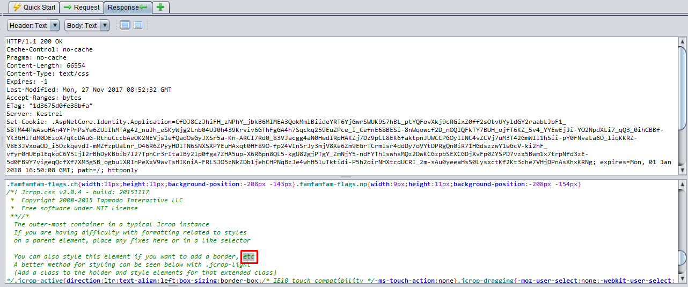

# ASP.NET ZERO Penetration Test Report

Asp.Net Zero (v5) has been scanned for vulnerabilities with the latest version of [OWASP ZAP (v2.7.0)](https://www.owasp.org/index.php/OWASP_Zed_Attack_Proxy_Project). The OWASP Zed Attack Proxy (ZAP) is one of the world's most popular security tools and is actively maintained by hundreds of international volunteers. 

The automated scanner has been reported several alerts.  Asp.Net Zero Team has fixed the positive alerts regarding the report. On the other hand most of the alerts can be stated as false-positive. The reasons for the false-positive alerts that are subject to these issues are clearly stated below.


## Summary of Alerts


### Path Traversal

##### High (Medium)

#### Description

The Path Traversal attack technique allows an attacker access to files, directories, and commands that potentially reside outside the web document root directory. 

#### Comment

The report has stated some CSS, JS links are open to path traversal attack. But these alerts are false-positive. You can see the reasons why they are evaluated as false-positive.

- URL: [http://localhost:62114/view-resources/Areas/App/Views/_Bundles/app-layout-libs.css](http://localhost:62114/view-resources/Areas/App/Views/_Bundles/app-layout-libs.css)
  - Method: `GET`
  - Parameter: `.AspNetCore.Antiforgery.DPAjufeZt_4`
  - Attack: `c:/`
  - Evidence: `etc`

  When we inspect the below response, it returns **etc** only in comments. And this is exactly not a path.  

  


- URL: [http://localhost:62114/view-resources/Areas/App/Views/_Bundles/app-layout-libs.js](http://localhost:62114/view-resources/Areas/App/Views/_Bundles/app-layout-libs.js)
  - Method: `GET`
  - Parameter: `.AspNetCore.Antiforgery.DPAjufeZt_4`
  - Attack: `c:/Windows/system.ini`
  - Evidence: `[drivers]`

  When we inspect the below response it returns **[drivers]** as array. And this is not a path as well!

  

- URL: [http://localhost:62114/Account/Login](http://localhost:62114/Account/Login)
  - Method: `POST`
  - Parameter: `Expires`
  - Attack: `/Login`

  The **Expires** header contains date/time after which the response is considered stale. Invalid dates, like the value 0, represent a date in the past and mean that the resource is already expired. The attack request sends Expires parameter as **"/Login"**, this doesn't leak any information about paths and th response returns a valid JSON 

  `{"result":null,"targetUrl":"/App","success":true,"error":null,"unAuthorizedRequest":false,"__abp":true}`

  


### Recommendation

If your application has to accept input file names, file paths, or URL paths, you need to validate that the path is in the correct format and that it points to a valid location within the context of your application. To prevent a malicious user manipulating your code's file operations, avoid writing code that accepts user-supplied file or path input. 

- If you must accept file names as input, use the full name of the file by using **System.IO.Path.GetFileName**. 
- If you must accept file paths as input, use the full file path by using **System.IO.Path.GetFullPath**.

If you use **MapPath** to map a supplied virtual path to a physical path on the server, use the overload of **Request.MapPath** that accepts a **bool** parameter so that you can prevent cross-application mapping. 


### SQL Injection

##### High (Medium)

#### Description

SQL Injection refers to an injection attack wherein an attacker can execute malicious SQL statements (also commonly referred to as a  malicious *payload*) that control a web application's database server.

#### Comment

Asp.Net Zero uses `Entity Framework`  as data access technology. And `Entity Framework` uses parameterized queries which prevents SQL injections by default. 

- URL: [http://localhost:62114/Account/Login](http://localhost:62114/Account/Login)
  - Method: `POST`
  - Parameter: `User-Agent`
  - Attack: `Mozilla/5.0 (Windows NT 10.0; WOW64) AppleWebKit/537.36 (KHTML, like Gecko) Chrome/60.0.3112.113 Safari/537.36 OR 1=1 -- `

  This request is false-positive because the tool is checking whether the response is changed or not. The **.AspNetCore.Identity.Application** cookie value is changing in every post request, that's why tool suspects of SQL Injection. But it's clearly not a SQL Injection attack. (The other instances of Login page SQL Inject attacks are not listed as they are same.)

### Recommendation

Do not trust client side input, even if there is client side validation in place.  Check all data on the server side. Always use parametrized queries  when you use directly T-SQLs or Stored Procedures. 

- https://www.owasp.org/index.php/SQL_Injection_Prevention_Cheat_Sheet


### Cross Site Scripting (Reflected)

##### High (Low)

#### Description

Cross-site Scripting (XSS) is an attack technique that involves echoing attacker-supplied code into a user's browser instance. 

#### Comment

There are several attacks that are marked as suspicious. When it's inspected these attack instances, it can be seen that the response is JSON and reflected value is handled as string in alert dialogs. The scripts are not being evaluated by JavaScript. Therefore these instances are false-positive. 

- URL: [http://localhost:62114/api/services/app/User/GetUsers?filter=&permission=&role=&maxResultCount=10&skipCount=%3Cscript%3Ealert%281%29%3B%3C%2Fscript%3E](http://localhost:62114/api/services/app/User/GetUsers?filter=&permission=&role=&maxResultCount=10&skipCount=%3Cscript%3Ealert%281%29%3B%3C%2Fscript%3E)

  - Method: `GET`
  - Parameter: `skipCount`
  - Attack: `<script>alert(1);</script>`
  - Evidence: `<script>alert(1);</script>`


### Recommendation

When you return a HTML content page, be sure that you encode the response. Before putting untrusted data inside an HTML element ensure it is HTML encoded. 

- Never put untrusted data into your HTML input, unless you follow the rest of the steps below. Untrusted data is any data that may be controlled by an attacker, HTML form inputs, query strings, HTTP headers, even data sourced from a database as an attacker may be able to breach your database even if they cannot breach your application.
- Before putting untrusted data inside an HTML element ensure it is HTML encoded. HTML encoding takes characters such as < and changes them into a safe form like `&lt;`
- Before putting untrusted data into an HTML attribute ensure it is HTML attribute encoded. HTML attribute encoding is a superset of HTML encoding and encodes additional characters such as " and '.
- Before putting untrusted data into JavaScript place the data in an HTML element whose contents you retrieve at runtime. If this is not possible then ensure the data is JavaScript encoded. JavaScript encoding takes dangerous characters for JavaScript and replaces them with their hex, for example < would be encoded as `\u003C`.
- Before putting untrusted data into a URL query string ensure it is URL encoded.
  - http://projects.webappsec.org/Cross-Site-Scripting
  - http://cwe.mitre.org/data/definitions/79.html


### X-Frame-Options Header Not Set

##### Medium (Medium)

#### Description

The `X-Frame-Options` HTPP header can be used to indicate whether or not a browser should be allowed to render a page in a `<frame>`, `<iframe>` or `<object>` . Sites can use this to avoid clickjacking attacks, by ensuring that their content is not embedded into other sites.

#### Comment

ASP.NET Zero uses [ASP.NET Boilerplate](https://aspnetboilerplate.com/) framework. After version **3.4.X**, the framework adds `X-Frame-Options` header to all responses with the value `SAMEORIGIN`. If you want to remove the header you can do it via `UseAbp()` options in `Configure ` method of `Startup` class.

```c#
public class Startup
{
	public void Configure(IApplicationBuilder app, IHostingEnvironment env, ILoggerFactory loggerFactory)
	{
		app.UseAbp(options =>
		{
			options.AddSecurityHeaders = false;
		});
	}
}
```

#### Reference

http://blogs.msdn.com/b/ieinternals/archive/2010/03/30/combating-clickjacking-with-x-frame-options.aspx


### X-Content-Type-Options Header Missing

##### Low (Medium)

#### Description

The `X-Content-Type-Options` HTTP header is a marker used by the server to indicate that the [MIME types](https://developer.mozilla.org/en-US/docs/Web/HTTP/Basics_of_HTTP/MIME_types) advertised in the [`Content-Type`](https://developer.mozilla.org/en-US/docs/Web/HTTP/Headers/Content-Type) headers should not be changed and be followed. This allows to opt-out of [MIME type sniffing](https://developer.mozilla.org/en-US/docs/Web/HTTP/Basics_of_HTTP/MIME_types#MIME_sniffing), or, in other words, it is a way to say that the webmasters knew what they were doing.  

#### Comment

ASP.NET Boilerplate framework **v3.4.X** adds the `X-Content-Type-Options` header to all responses with the value `nosniff`. If you want to remove the header you can do it via `UseAbp()` options in `Configure ` method of `Startup` class.


### Format String Error

##### Medium (Medium)

#### Description

A Format String error occurs when the submitted data of an input string is evaluated as a command by the application.

#### Comment

The instances of this attack is false-positive. Because this attack vector is applicable for C programming language. In ANSI C, conversion functions, like **printf, fprintf**, converts a primitive variable into a human-readable string representation. For C# this alert can be safely ignored.

#### Reference

https://www.owasp.org/index.php/Format_string_attack


### Application Error Disclosure

##### Medium (Medium)

#### Description

If a page contains an error/warning message that may disclose sensitive information, this can be used to launch further attacks against the web application. 

- URL: [http://localhost:62114/Account/Login](http://localhost:62114/Account/Login)
  - Method: `POST`
  - Evidence: `HTTP/1.1 500 Internal Server Error`

  This is false-positive alert. As seen in the below screenshot, Asp.Net Zero returns a HTPP 500 Internal Server Error without any sensitive information. While the error detail is not being sent to the client, it is logged on the server.

  

Asp.Net Zero never returns error details, if only developer sends it deliberatively.  When the project runs on development, exceptions are being sent to client. But publishing application in release mode prevents exception details to be sent. While `MVC` project shows a custom error page, `Host` project sends a JSON with message "*An internal error occurred during your request!*"


### Cookie No HttpOnly Flag

##### Low (Medium)

#### Description

A cookie has been set without the `HttpOnly` flag, which means that the cookie can be accessed by JavaScript. If a malicious script can be run on this page then the cookie will be accessible and can be transmitted to another site. If this is a session cookie then session hijacking may be possible.

#### Comment

Asp.Net Zero uses `HttpOnly` flag wherever it needs. In some cases the tool reports false-positive alerts. See the following instances to understand why they are false-positive.

- URL: [http://localhost:62114/Account/SwitchToLinkedAccountSignIn?tokenId=86d58f40-1db2-4fc9-9ee7-56cf70cb7bd6](http://localhost:62114/Account/SwitchToLinkedAccountSignIn?tokenId=86d58f40-1db2-4fc9-9ee7-56cf70cb7bd6)
  - Method: `GET`
  - Parameter: `idsrv.session`
  - Evidence: `Set-Cookie: idsrv.session`

  In the above request, `idsrv.session`  cookie is being set by [Microsoft Identity Server](https://github.com/IdentityServer/IdentityServer4). By design this is not `HttpOnly` . It is required by the OIDC session management spec for SPA clients. For the related spec see https://openid.net/specs/openid-connect-session-1_0.html#ChangeNotification .

- URL: [http://localhost:62114/App/Dashboard](http://localhost:62114/App/Dashboard)
  - Method: `GET`
  - Parameter: `XSRF-TOKEN`
  - Evidence: `Set-Cookie: XSRF-TOKEN`

  Setting `XSRF-TOKEN` as `HttpOnly` is pointless because in Angular UI client must access this cookie. 

- URL: [http://localhost:62114/Account/SwitchToLinkedAccount](http://localhost:62114/Account/SwitchToLinkedAccount)- 
  - Method: `POST`
  - Parameter: `Identity.TwoFactorUserId`
  - Evidence: `Set-Cookie: Identity.TwoFactorUserId`

This is a false-positive too because set cookie is removing `Identity.TwoFactorUserId` with an empty value.

  

- URL: [http://localhost:62114/Account/SwitchToLinkedAccount](http://localhost:62114/Account/SwitchToLinkedAccount)
  - Method: `POST`
  - Parameter: `Identity.External`
  - Evidence: `Set-Cookie: Identity.External`

  This is also false-positive because it removes the cookie with an empty value.

  

- URL: [http://localhost:62114/Account/Logout](http://localhost:62114/Account/Logout)
  - Method: `GET`
  - Parameter: `.AspNetCore.Identity.Application`
  - Evidence: `Set-Cookie: .AspNetCore.Identity.Application`

  It's false-positive as well because same as above instances it's removing cookie with an empty value.

- URL: [http://localhost:62114/AbpLocalization/ChangeCulture?cultureName=en&returnUrl=/App/Dashboard](http://localhost:62114/AbpLocalization/ChangeCulture?cultureName=en&returnUrl=/App/Dashboard)

  - Method: `GET`
  - Parameter: `.AspNetCore.Culture`
  - Evidence: `Set-Cookie: .AspNetCore.Culture`

  As of **v3.4.X** of ASP.NET Boilerplate framework this cookie is being set as `HttpOnly`.

### Web Browser XSS Protection Not Enabled

##### Low (Medium)

#### Description

Web Browser XSS Protection is not enabled, or is disabled by the configuration of the 'X-XSS-Protection' HTTP response header on the web server.

#### Comment

Asp.Net Boilerplate framework **v3.4.X** adds the `X-XSS-Protection` header to all responses with the value `1; mode=block`.  If you want to remove the header you can do it via `UseAbp()` options in `Configure ` method of `Startup` class.


### Private IP Disclosure

##### Low (Medium)

#### Description

A private IP (such as 10.x.x.x, 172.x.x.x, 192.168.x.x) or an Amazon EC2 private hostname (for example, ip-10-0-56-78) has been found in the HTTP response body. This information might be helpful for further attacks targeting internal systems.

- URL: [http://localhost:62114/App/Users/LoginAttemptsModal](http://localhost:62114/App/Users/LoginAttemptsModal)
  - Method: `POST`
  - Evidence: `192.168.1.46`

  Asp.Net Zero has a feature that shows login attempts to the authenticated user. This is a modal dialog which can be reached by clicking profile picture at the top-right of the page. In the login attempt dialog it's shown last 10 logins with IP addresses.  This private information can be seen if only the user is logged-in. And users can only see their own records!

  


### Reference

For all the other OWASP standardizations, download the OWASP sheet.

[Open Web Application Security Project (OWASP) - Application Security Verification Standard 3.0 PDF sheet ](https://www.owasp.orgimages/6/67/OWASPApplicationSecurityVerificationStandard3.0.pdf) 
