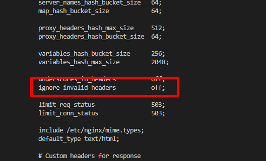
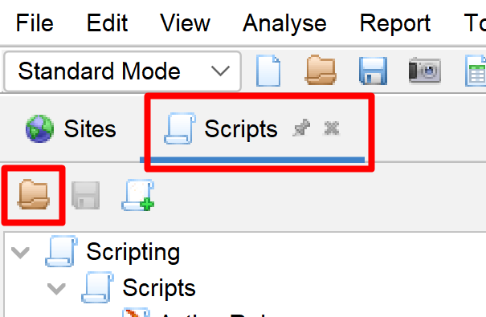
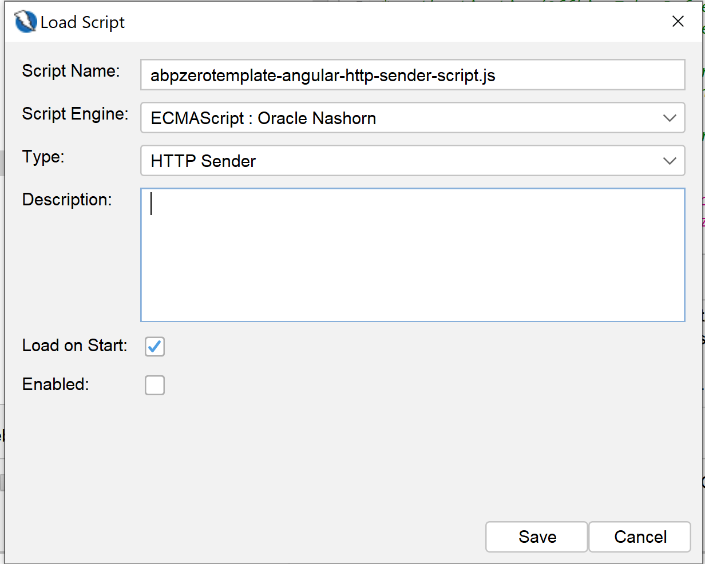
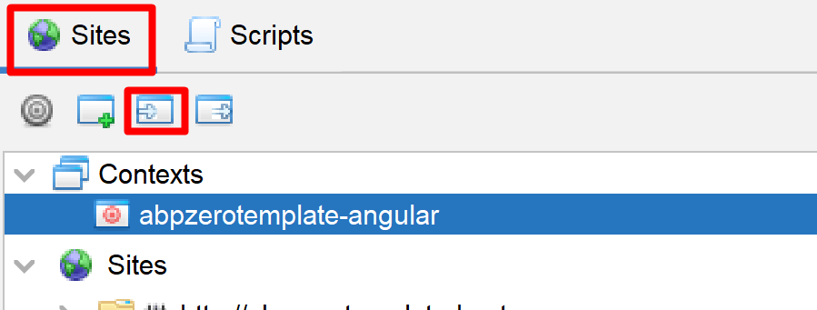

# Security Test with OWASP ZAP

Security is an important aspect for software applications. ASP.NET Zero includes ready to use files for testing the security of its web application using [OWASP ZAP](https://www.zaproxy.org/) Tool.

To test the web application, you need to install following tools;

* [Docker](https://www.docker.com/)
* [Helm](https://helm.sh/)
* [NGINX ingress](https://kubernetes.github.io/ingress-nginx/deploy/) for k8s
* [Owasp ZAP Tool](https://www.zaproxy.org/)

After installing the Docker, be sure that you enabled the Kubernetes on Docker by following [https://docs.docker.com/desktop/kubernetes/](https://docs.docker.com/desktop/kubernetes/). 

## Deploying App to Kubernetes

The security test will be runned on an instance of the app which works in Kubernetes. To run our application on Kubernetes, ASP.NET Zero includes Helm charts out of the box. To run our web application on Kubernetes, we must create 3 Docker images. 

To do that, go to folder which contains *.Web.sln file and execute the command below (Don't forget to replace MyCompanyName.AbpZeroTemplate with your project name);

```bash
docker build -t abpzerotemplate-host -f src\MyCompanyName.AbpZeroTemplate.Web.Host\Dockerfile .
```

This command will create a Docker image for the Host API application. Our application also needs to connect to a database. We will be using the *.Migrator project to create and seed our app's database. So, we need to create a docker image for our Migrator app as well. To do that, run the command below in the same directory (Don't forget to replace MyCompanyName.AbpZeroTemplate with your project name);

```bash
docker build -t abpzerotemplate-migrator -f src\MyCompanyName.AbpZeroTemplate.Migrator\Dockerfile .
```

We will not run a security test on the client side Angular application, we will only run security test on API application but our Helm chart includes the Angular app as well. Because of that, we need to create an image for the Angular app as well. To do that, first publish your Angular app using the command below;

````
npm run publish-k8s
````

When the publish is completed, run the following command in the ```angular``` folder of your project;

````
docker build -t abpzerotemplate-angular -f Dockerfile . 
````

Now, we have all Docker images we need to run our application.

Open a command prompt and go to "aspnet-core\etc\k8s\helm-chart" under your project directory and execute the Helm command below;

```
helm upgrade --install anz abpzerotemplate-angular
```

This command will create 4 pods on Kubernetes, 1 for SQL Server, 1 for Host API application, 1 for Angular application and 1 for the migrator app. The default Helm chart uses SQL Server but you can change it if your app uses a different database provider.

To access your app from your local computer, go to your Host file and add the entry below. You can use a different URL if you wish but don't forget to use that URL in the following steps.

```bash
127.0.0.1 abpzerotemplate-host-www
127.0.0.1 abpzerotemplate-angular-www
```

If you are not using Windows OS, you need to do the same for your OS.

Now, if you go to a browser and type [https://abpzerotemplate-host-www/swagger](https://abpzerotemplate-host-www/swagger), you can visit the Host API application. You can visit the Angular app on  [https://abpzerotemplate-angular-www](https://abpzerotemplate-angular-www).

### About Nginx Ingress Controller

By default, nginx doesn't allow "." character in request headers. We need to change ```ignore_invalid_headers``` setting for nginx. To do that, follow the steps below:

- Run ```kubectl get pods -A``` command and find the ingress-nginx pod name. It should have a name similar to ```ingress-nginx-controller-756f546d89-52r5t```.

- Then run the command below to enter to this pod:

  ```bash
  kubectl exec -it ingress-nginx-controller-756f546d89-52r5t -n ingress-nginx sh
  ```

- In this pod, run ```vi nginx.conf```. This will print content of nginx.conf and will allow you to edit its content.

- Go to the line which contains **ignore_invalid_headers** setting by using arrow keys. Click ```i``` key to enter to edit mode and change **on** value to **off**. Now, the setting should be like this:




* press ```:w``` to save the changes and then press ```:q!``` to exit from edit mode.
* Finally run ```nginx -s reload``` to restart the Nginx to load this change.

After all, Nginx ingress controller will allow AspNet Zero app tp use "." in request headers.


## Preparing ZAP for Testing

Open the OWASP ZAP application and load the script from "aspnet-core\etc\owasp\abpzerotemplate-angular\abpzerotemplate-angular-http-sender-script.js" by clicking the scripts area and then load icon as shown below;



When the script load window appears, select the properties as shown below;



This script will be used to automatically add "authorization" header to each request. The script itself contains "ACCESS_TOKEN_HERE" placeholder for the token value. So, you need to go to [https://abpzerotemplate-host-www/swagger/](https://abpzerotemplate-host-www/swagger/) endpoint and get a token from "TokenAuth/Authenticate" endpoint and replace this placeholder.

Don't forget to enable the HTTP Sender script after importing it. Otherwise, OWASP ZAP can't make authorized requests to your API endpoints.




## Include OpenAPI Definitions

OWASP ZAP can import OpenAPI definition from an OpenAPI json file. To do that, select "Import > Import an OpenAPI definition from a URL" and enter "https://abpzerotemplate-host-www/swagger/v1/swagger.json" as Definition and "https://abpzerotemplate-host-www" as the URL.

## Testing the App

Finally, we can start testing the app. To do that, right click on the your site and Click Attack > Active Scan and select the context we imported before and click "Start Scan" button.

### Report

The test process might take a long time depending on the API endpoint count. When the test finishes, you can go to Report menu on ZAP Tool and generate a report as you wish.

