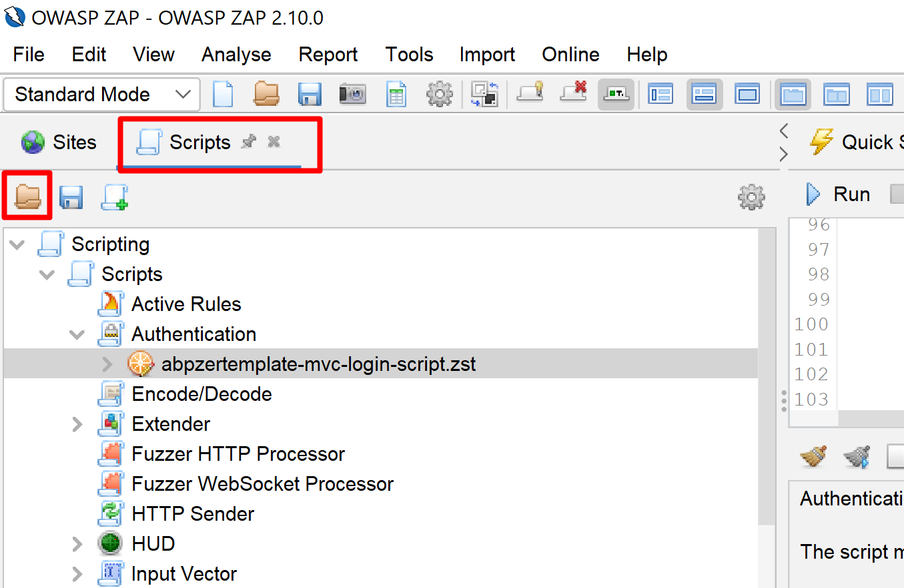
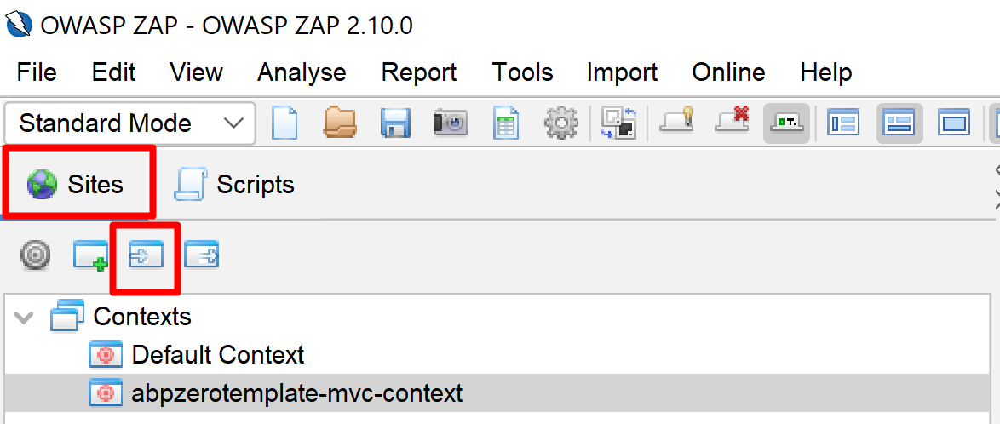
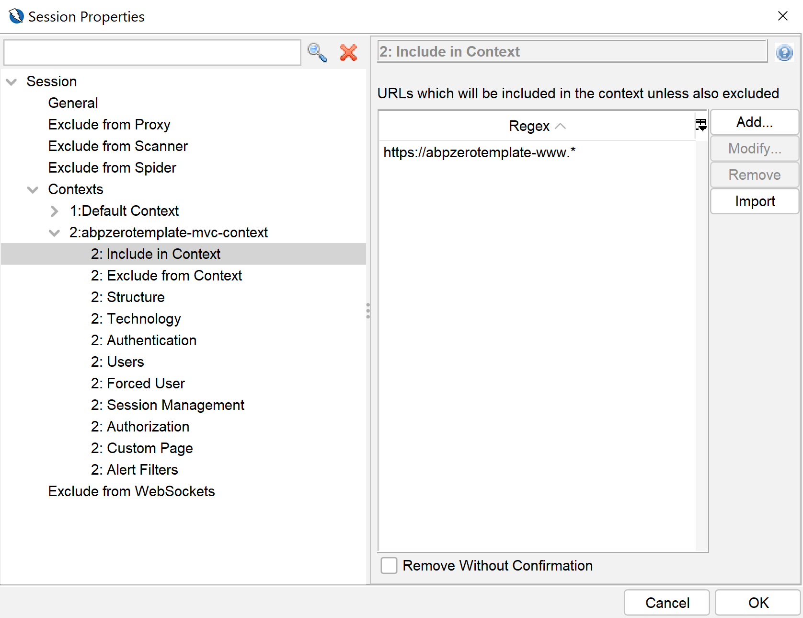
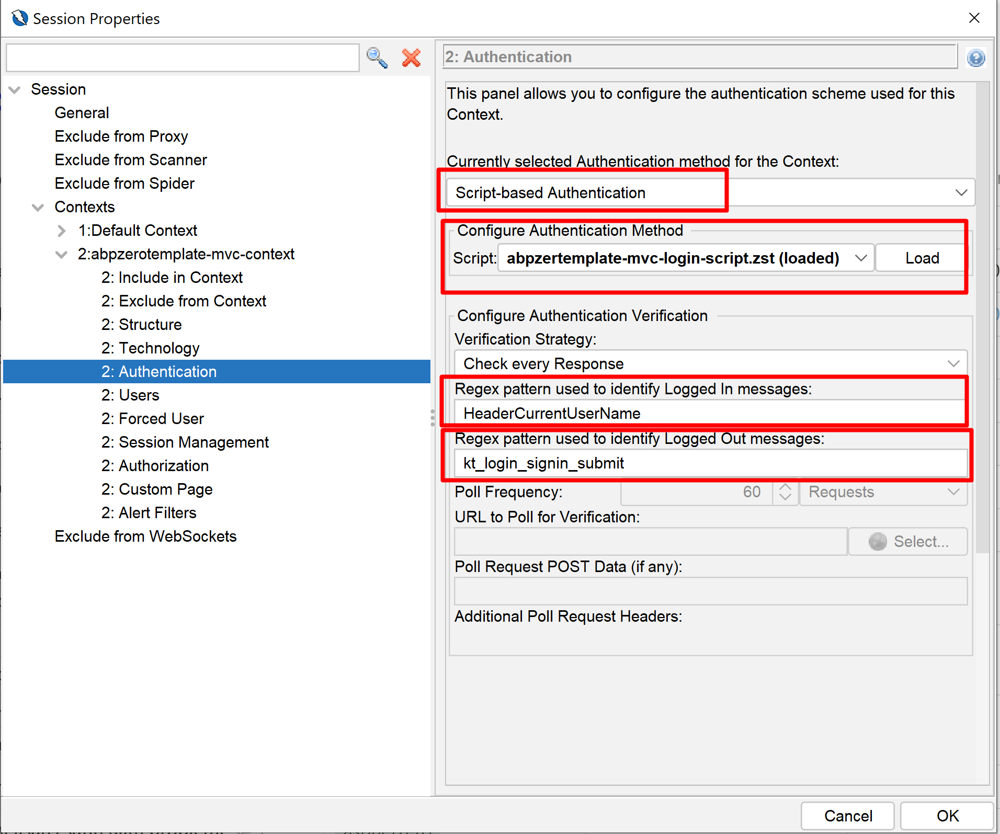
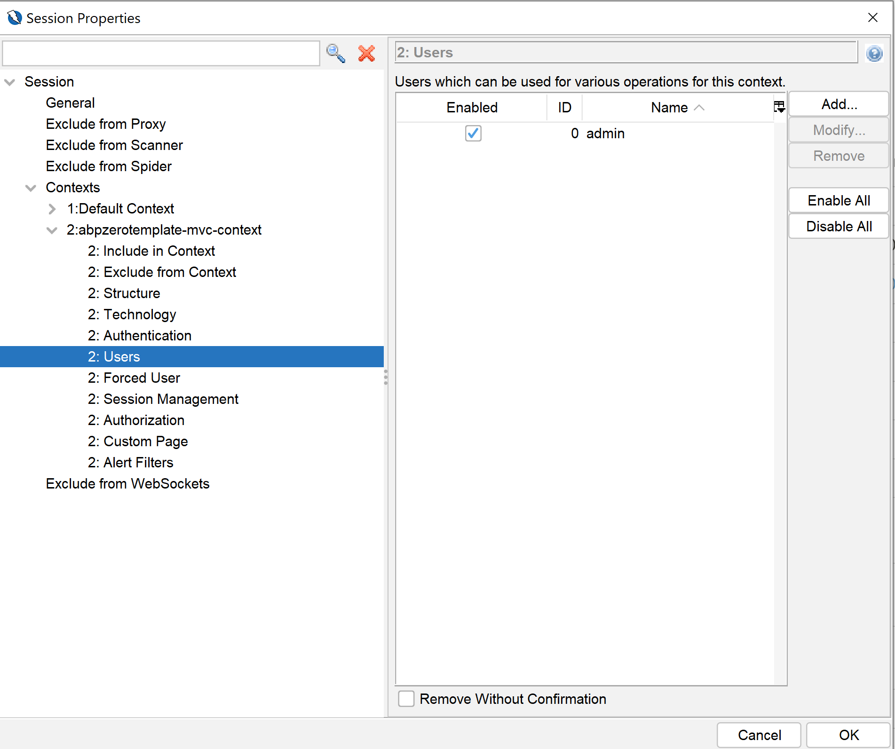
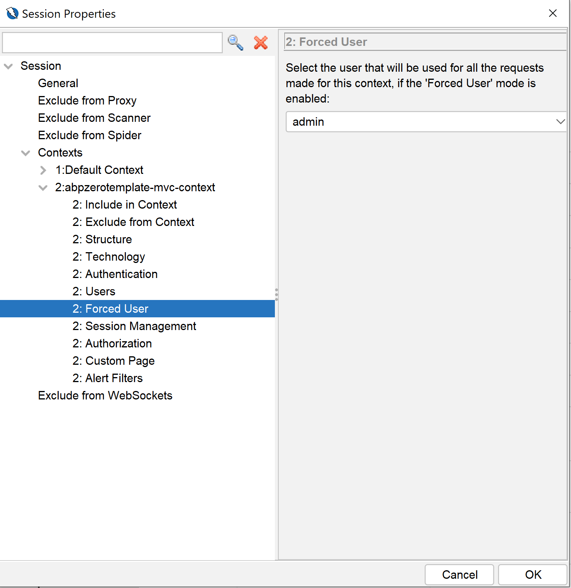
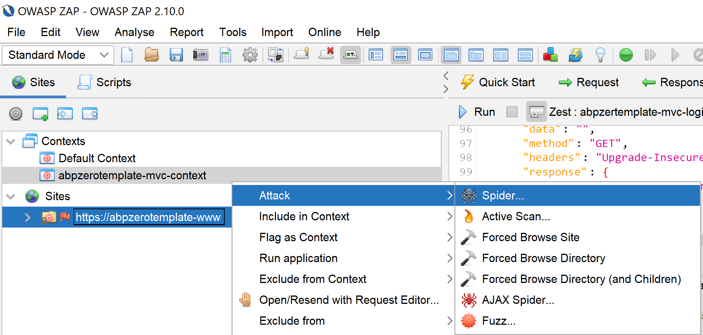

# Security Test with OWASP ZAP

Security is an important aspect for software applications. ASP.NET Zero includes ready to use files for testing the security of its web application using [OWASP ZAP](https://www.zaproxy.org/) Tool.

To test the web application, you need to install following tools;

* [Docker](https://www.docker.com/)
* [Helm](https://helm.sh/)
* [NGINX ingress](https://kubernetes.github.io/ingress-nginx/deploy/) for k8s
* [Owasp ZAP Tool](https://www.zaproxy.org/)

After installing the Docker, be sure that you enabled the Kubernetes on Docker by following [https://docs.docker.com/desktop/kubernetes/](https://docs.docker.com/desktop/kubernetes/). 

## Deploying App to Kubernetes

The security test will be runned on an instance of the app which works in Kubernetes. To run our application on Kubernetes, ASP.NET Zero includes Helm charts out of the box. To run our web application on Kubernetes, we must create a Docker image first. To do that, go to folder which contains *.Web.sln file and execute the command below (Don't forget to replace MyCompanyName.AbpZeroTemplate with your project name);

```bash
docker build -t abpzerotemplate-mvc -f src\MyCompanyName.AbpZeroTemplate.Web.Mvc\Dockerfile .
```

This command will create a Docker image for the web application. Our application also needs to connect to a database. We will be using the *.Migrator project to create and seed our app's database. So, we need to create a docker image for our Migrator app as well. To do that, run the command below in the same directory (Don't forget to replace MyCompanyName.AbpZeroTemplate with your project name);

```bash
docker build -t abpzerotemplate-migrator -f src\MyCompanyName.AbpZeroTemplate.Migrator\Dockerfile .
```

Now, we have both Docker images we need to run our application.

Open a command prompt and go to "aspnet-core\etc\k8s\helm-chart" under your project directory and execute the Helm command below;

```
helm upgrade --install anz abpzerotemplate-mvc
```

This command will create 3 pods on Kubernetes, 1 for SQL Server, 1 for web application and 1 for the migrator app. The default Helm chart uses SQL Server but you can change it if your app uses a different database provider.

To access your app from your local computer, go to your Host file and add the entry below. You can use a different URL if you wish but don't forget to use that URL in the following steps.

```bash
127.0.0.1 abpzerotemplate-www
```

If you are not using Windows OS, you need to do the same for your OS.

Now, if you go to a browser and type [https://abpzerotemplate-www](https://abpzerotemplate-www), you can visit your published application.

## Preparing ZAP for Testing

Open the OWASP ZAP application and load the script from "aspnet-core\etc\owasp\abpzerotemplate-mvc\abpzertemplate-mvc-login-script.zst" by clicking the scripts area and then load icon as shown below;



This script will be used to automatically login to the application as the Host user. After that, go to Sites section and load test context from "aspnet-core\etc\owasp\abpzerotemplate-mvc\abpzerotemplate-mvc.context" as shown below;



Sometimes, OWASP Tool doesn't load the context correctly, so check its important items as shown below;

### Include Context

This section must contain the website URL which will be scanned;



### Authentication

ZAP Tool will be use the Zest script we loaded above for login operation. So, it must be loaded correctly as shown below. If it is not set correctly, please load this script and set the fields marked in red as shown below;



### Users

ZAP Tool requires a user to be defined for executing the login operation. So, a user must be defined as shown below;



### Forced User

Finally, set the forced user as shown below;




## Testing the App

### Spider

To add your app to ZAP's Sites list, click on the Firefox icon on ZAP Tool and visit the [https://abpzerotemplate-www](https://abpzerotemplate-www) on opened Firefox app. Then, right click on the your site and Click Attack > Spider as shown below;



Select the context we imported before and user we created/imported. This operation will find scan URLs in our application for testing with an authenticated user.

### Test

Finally, we can start testing the app. To do that, right click on the your site and Click Attack > Active Scan and select the context we imported before and user we created/imported on the opened dialog and click "Start Scan" button.

### Report

The test process might take a long time depending on the page count. When the test finishes, you can go to Report menu on ZAP Tool and generate a report as you wish.

