# Setting Up an Azure Pipeline for ASP.NET ZERO Core MVC 

In this tutorial, we will see how to create an Azure CI/CD pipeline for a fresh copy of ASP.NET Zero MVC Core project, hosted on GitHub. At the end of the tutorial we’ll be ready to deploy our web project to Azure App Service by just clicking a button. First of all create a demo project from aspnetzero.com and add the project to your private GitHub. For this sample, we will create a project named as `MyPortalDemo` (MVC Core project).

## What's Azure Pipelines?

Azure Pipelines let us to create different jobs which automates CI/CD processes. There are plenty of predefined tasks by Microsoft and by third party vendors. It helps you to continuously build, test and deploy to any platform and cloud. See https://azure.microsoft.com/en-us/services/devops/pipelines/


## Prerequisites


Before the deployment process through your project's pipeline, Azure App Service and Azure SQL Database must be ready. If they are not ready yet, you need to create them by following the instructions below:

[Create a new Azure SQL Database](https://learn.microsoft.com/en-us/azure/azure-sql/database/single-database-create-quickstart?view=azuresql&tabs=azure-portal)

## Creating an Azure Web App Service

To create a new Azure Web App Service, visit the  [Azure Portal](https://portal.azure.com/) and follow the instructions. 

After signing in to your Azure account, you can directly create a **Web App** by clicking the **Create Resource** button.


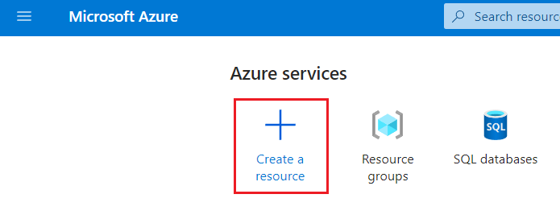


Entering **Web App** in the search bar, click the **Create** button as indicated below.

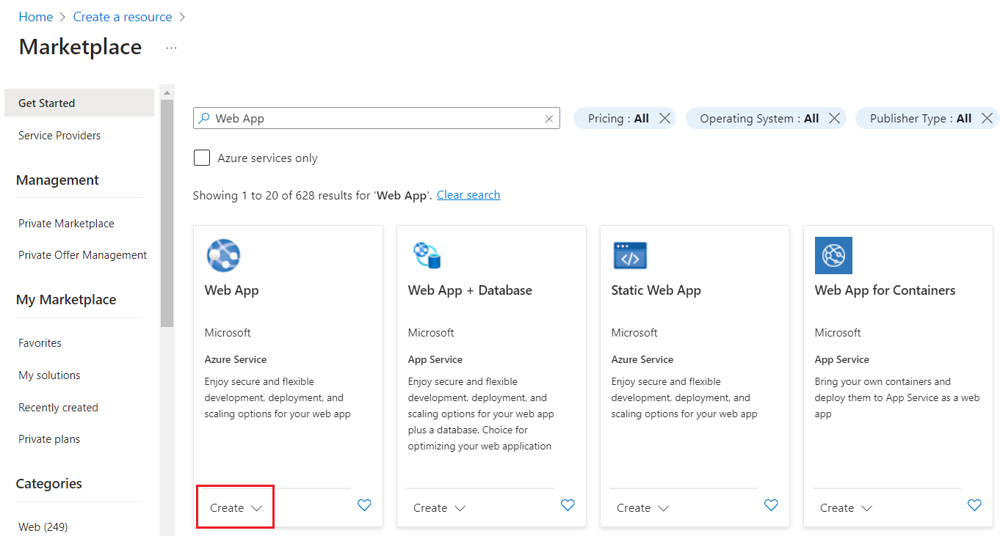

After filling in the required fields, click on the **Review + Create** button.

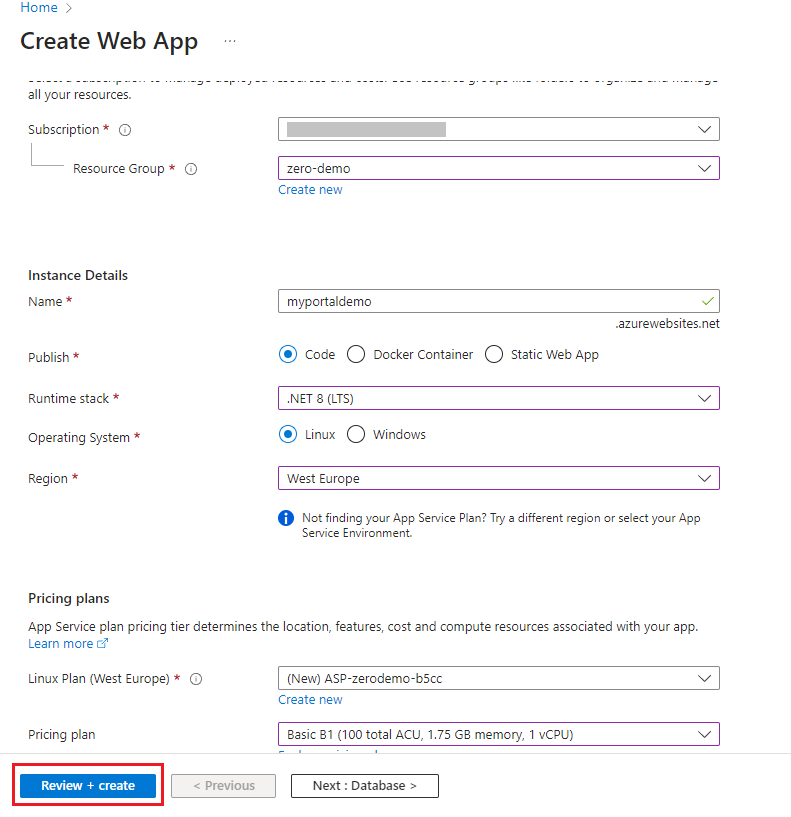

After creating the **Web App service**, you can find the information related to the service below.

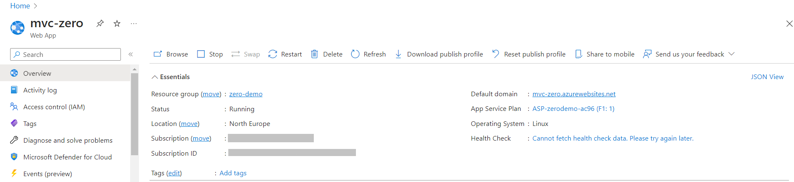


## Configuring ASP.NET Zero Project Settings


It is necessary to replace the `"ConnectionString"` values in your project with the **SQL Server** information created in the **Azure portal**. The `"ConnectionString"` is located in the `appsettings.json` file. You can change it as follows. 

If there is a `"ConnectionStrings"` information in `appsettings.Production.json` while in the release environment, this information is used.

```json
"ConnectionStrings": {
    "Default": "Server=tcp:yourserver.database.windows.net,1433;Initial Catalog=yourdatabase;Persist Security Info=False;User ID=yourusername;Password=yourpassword;MultipleActiveResultSets=False;Encrypt=True;TrustServerCertificate=False;Connection Timeout=30;"
}

```

## Start Your New Azure Pipeline

Go to https://azure.microsoft.com/en-us/services/devops/pipelines/ and click the "Start free with Pipelines" button. You need to authenticate and grant permission for "Get started with Azure DevOps".


### Create a project

After you authenticate, you will see the new project screen. Enter your project name `MyPortalDemo`.


### Select Your Pipeline Menu 

After creating the project, select Pipelines from the menu on the left side. Once you've done that, click on the New Pipeline button.

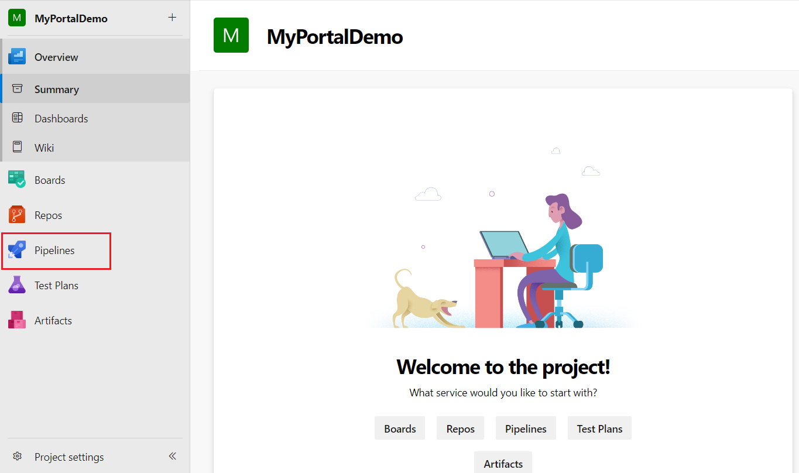

### Choose your source-code hosting service

Choose **Github** to create a pipeline with YAML.


After that it will ask authorization to Azure Pipelines. After successful authorization, you will be redirected to your repository list. Select your repository for  `MyPortalDemo`. If you have not committed your project to GitHub, you can do it now.


Then you will be able to see the list of your repositories on GitHub. Choose your repository.

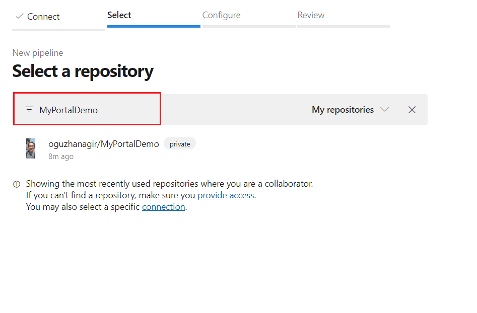

Grant permission to your repositories with OAuth.


### Choose your template

The next step is choosing a template... We will choose the **ASP.NET Core** template. After clicking on **Show more** look for the `ASP.NET Core` option and then click.

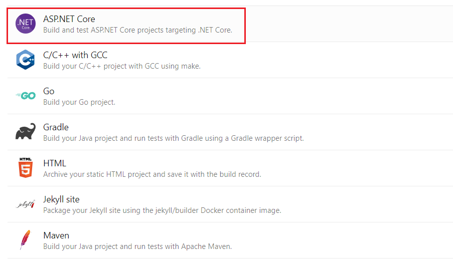


### Configure your pipeline steps

After the template is being created, you will see the below auto-generated pipeline steps.

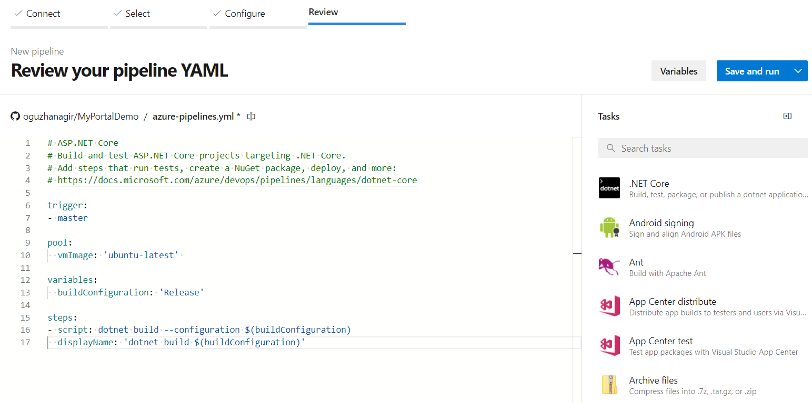

You can edit the default ***.yaml** file as specified below.

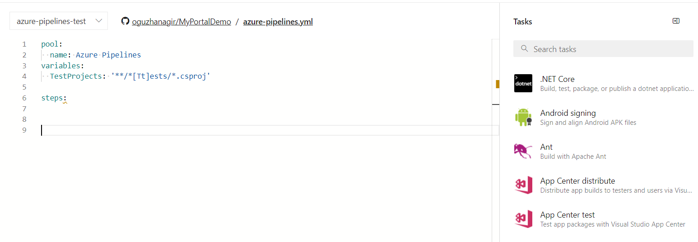

After specifying, you can add the indicated section under `steps:`.


Other important setting is the **Project(s) to build and restore**. The default setting is `**/*.csproj` but this will break build process because Xamarin projects don't build with `dotnet build` command but need to be built with `msbuild`. So we need to build only the `*.Web.Mvc` project. For that, change it to `**/MyPortalDemo.Web.Mvc.csproj` as seen below.

Configure the **Restore** task as specified.

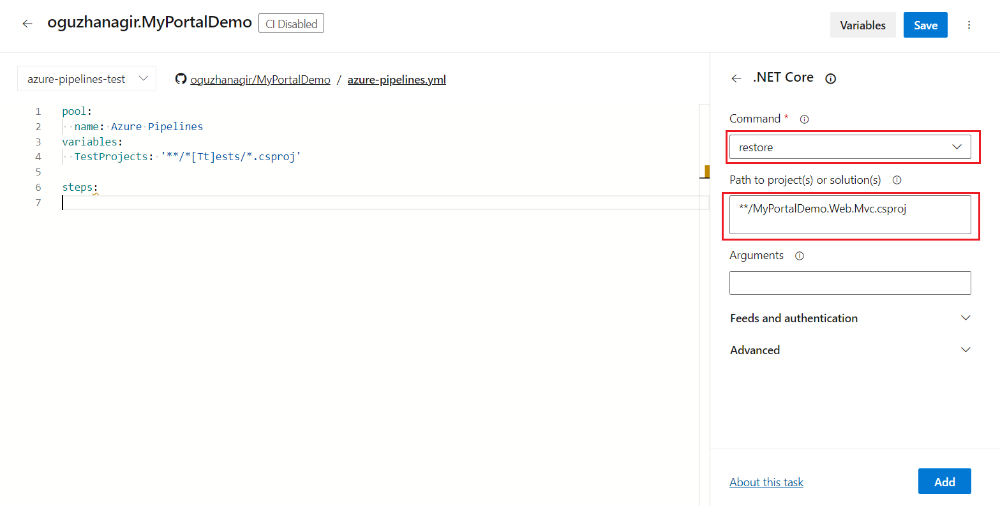

Configure the **Build** task as specified and add it as well.Additionally, here the `--configuration $(BuildConfiguration)` **argument** should be specified.

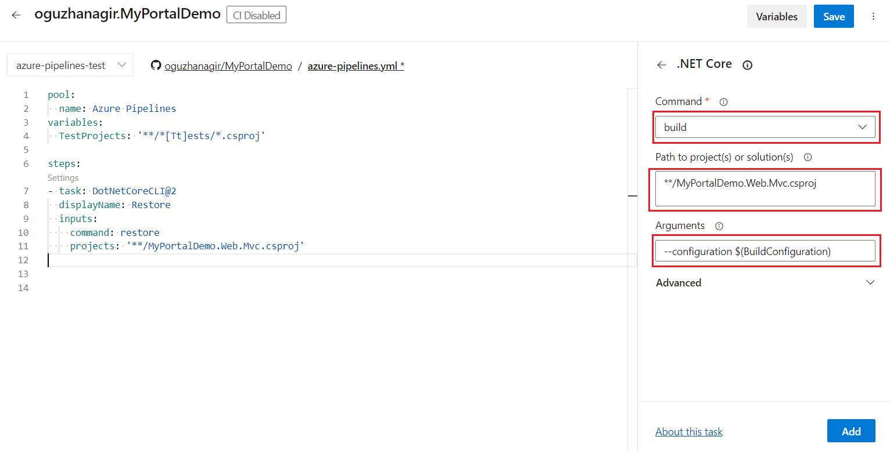

Add the path of the **Test** project by specifying it as `**/[Tt]ests/.csproj`.

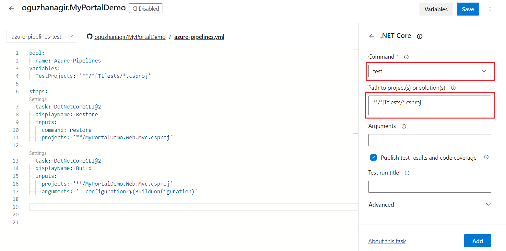

Add the path of the **Publish** project.

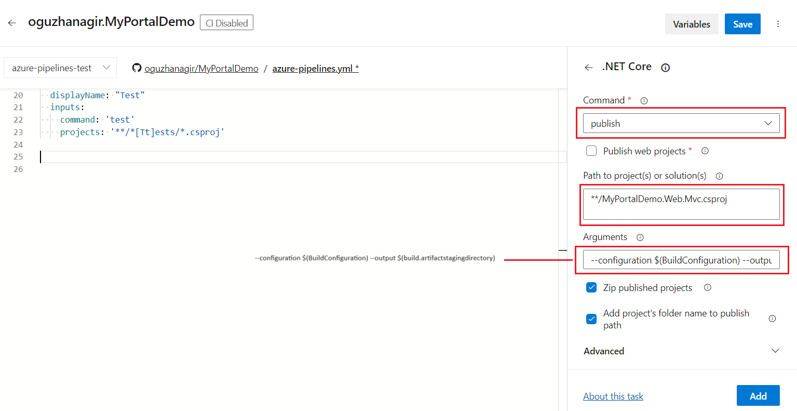

Add the path of the **Publish Artifact** project

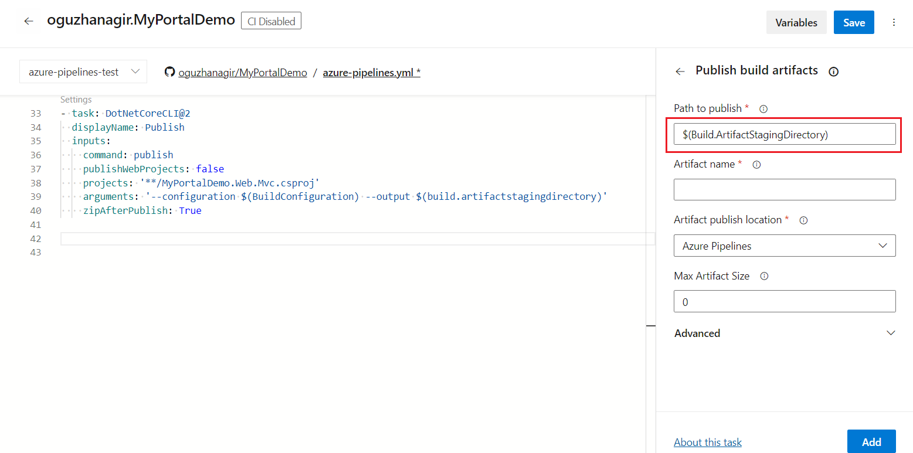

### Additional pipeline steps for the MVC project

There are 3 additional steps we must add for ASP.NET Zero Core MVC project.

First, visit the marketplace to install the Yarn extension for your Azure DevOps organization. You can find it at https://marketplace.visualstudio.com/azuredevops.


Click on the **Get it free** button to install the necessary extension for your organization.

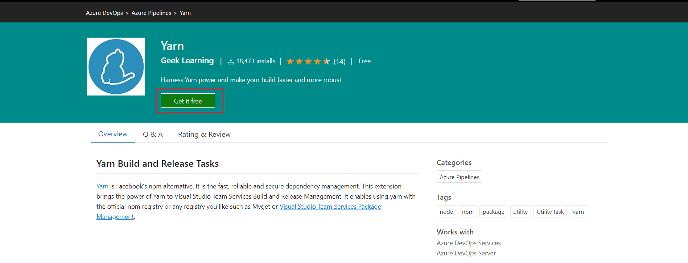

1. #### **Execute Yarn Task**

   For the MVC project, we have to run `yarn`  command in the `src/MyPortalDemo.Web.Mvc` folder. To do this click the `Show asisstant` icon on top of the task list.

   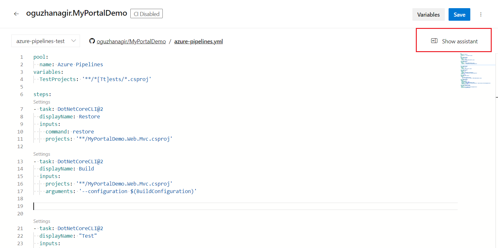

   Write **yarn** into the search textbox and click on the **Yarn task** to install this new Yarn task.

   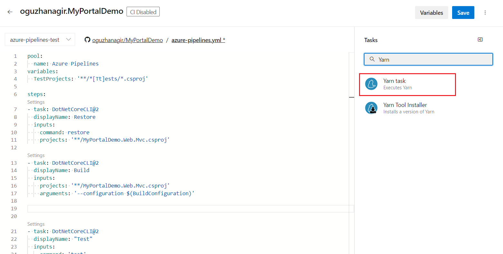


   After adding it, the new Yarn task is placed at the end. Move it after the **Build** step. Then, enter `src/MyPortalDemo.Web.Mvc` in the Project Directory. This step is completed.

   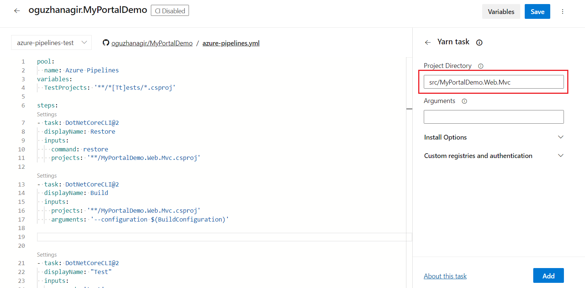

   

   Save the changes by clicking **Save** button on the toolbar.

   

   

   

2. #### **NPM Run Build Task**

   To add NPM Run Build task, write `command line` to the search textbox. Click the **Add** button of **Command Line** item.

   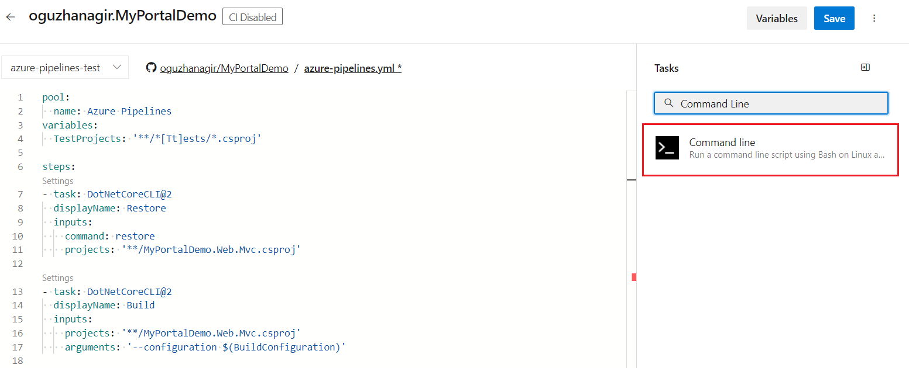

   

   It will append it after right after the **Yarn** task. If it comes to the end, you need to move it after **Yarn** task.


   ```bash
   cd src/MyPortalDemo.Web.Mvc
   npm run build
   ```


   

   

   Save the changes by clicking the **Save** button on the toolbar.

   

3. ### **Run Migrator**

   To run the ***Migrator** project here, a **CMD line** is required. Let's create it as specified below.

   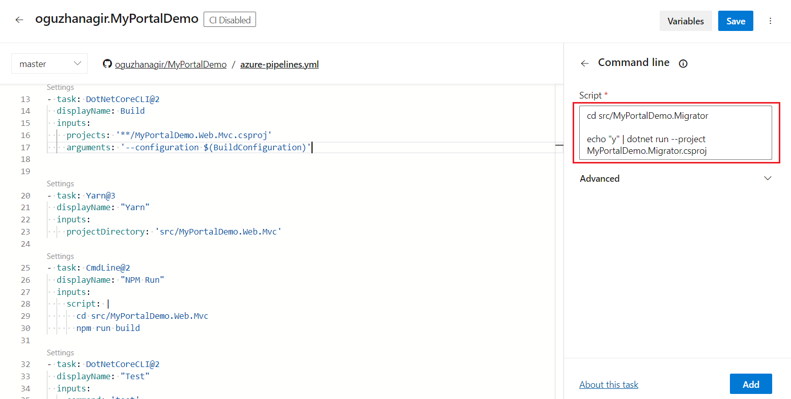

   ```bash
   cd src/MyPortalDemo.Migrator
   echo "y" | dotnet run --project MyPortalDemo.Migrator.csproj 
   ```

   The part indicated as `"y"` implies acceptance on all tenants in the host database.


After clicking the **Save** button on the toolbar, press the **Run** button. The pipeline will start for the first time.

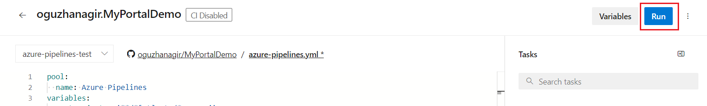


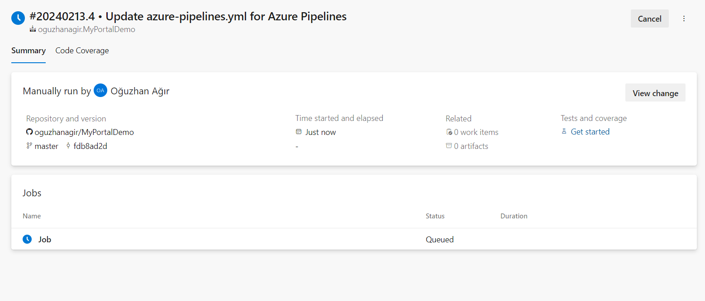


So far, we have created a pipeline to get our project from GitHub, build, yarn, NPM run build, test and publish.  The next step is copying the publish output to Azure App Service. 

**Before starting this step, we assume that you have already created a web app on Azure App Services and set up your database**.


### Create release pipeline

Select Azure App Service deployment template.

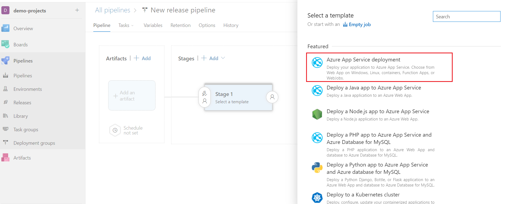

#### Add an artifact

Click **Add an artifact** button and choose the related project as source.

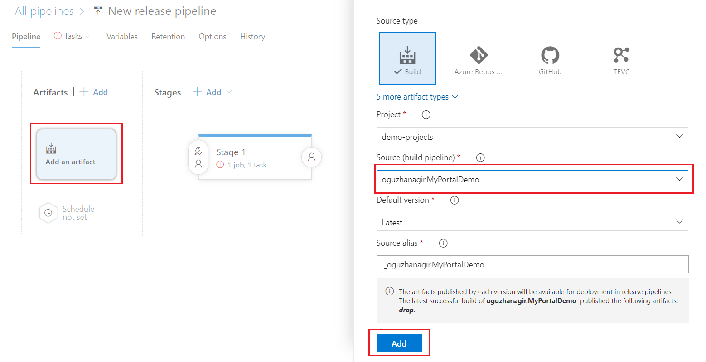

Then click the default stage to edit.


On the new release pipeline, you will see **Deploy Azure App Service** options. Select your Azure subscription and then authorize it. Set `Web App on Linux` as your app type. Then pick your app service name from the list. Finally click **Save** button.


#### Choose Web.Mvc package for releasing

One important setting is the **package or folder** setting. We will release `*.Web.Mvc`. To set that package click the `...` button on the **Package or folder** row.


Choose  `*.Web.Mvc` and then click **Save** button on the top toolbar.


Click the save button after the changes.


#### Release for the first time

Now we are done! Click the **Create release** button on the top toolbar and click **Create** on the new opened dialog. This will copy our last publish output to the selected Azure App Service.


After clicking on the `Create Release` button, select the stage and click on the `Create` button.

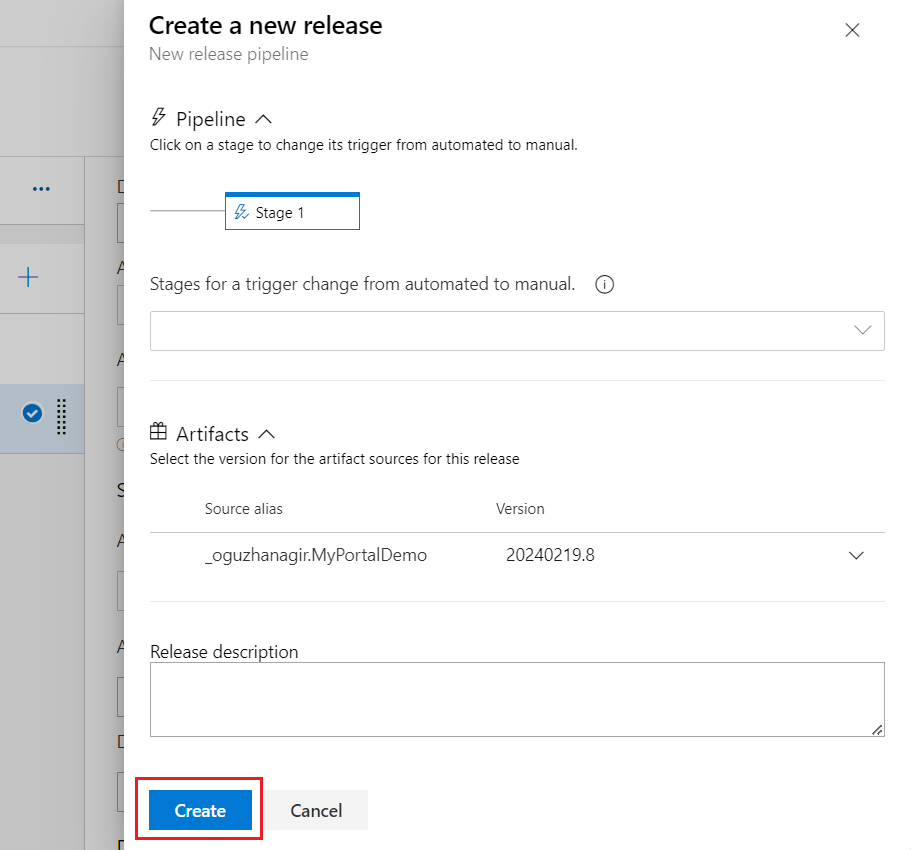


When you see the green tick for your release, it means it's successfully completed.


