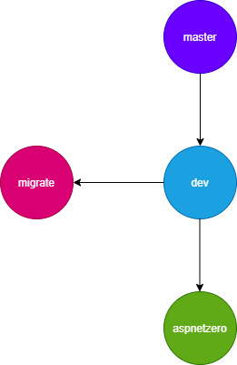

# Version Updating

AspNet Zero is designed to be a startup template. Updatability of AspNet Zero is not automatic and straightforward. But, it is possible to upgrade an AspNet Zero solution with the latest version using source control.

### New Projects

If you haven't created your project or if you haven't started development on your project, it is easier to create an upgradable repository structure.

- First, create your project from aspnetzero.com with the name you want or use your unchanged project.
- Add it to source control (like GitHub). According to AspNet Zero license rules, your repository must be private.
- Push it to the 'master' branch.
- Create a branch named **dev** from master branch. This branch will be used for your daily development.
- Create another branch from dev branch named **aspnetzero**. This branch will be used for updating your solution with the latest version of AspNet Zero.
- When a new version of AspNet Zero is released, re-create your project from scratch with the same name.
- Switch to **aspnetzero** branch in your source control and copy new AspNet Zero version into this branch. 
- Switch to dev branch and merge branch **aspnetzero** into **dev**. There will be conflicts, resolve them manually.

That's all. Your dev branch will have a new ASP.NET ZERO version. You can merge changes from dev branch to master branch before releasing your app or publishing your app to production. 

The important thing here is, you must not make any changes in **aspnetzero** branch other than overwriting it with the latest version of AspNet Zero.

### Existing Projects

If you have already created your project and make some development on your project, it is also possible to update your solution with the latest version of AspNet Zero but it requires a bit more work to do.

* First, create a new repository 
* Create an empty project from AspNet Zero website using your existing project name but select the version when you started development for your project. If you don't remember the initial AspNet Zero version you have started your project, you can check [*.Core/**AppVersionHelper.cs**].
* Add downloaded source code to your new repository and push to master branch.
* Create a branch named **dev** from master branch.
* Create two branches named **aspnetzero** and **migrate** from dev branch.
* Copy your existing project's source code to **migrate** branch.
* Switch to **dev** branch and update it from **migrate** branch. In this step, you will face conflicts. You have to resolve those conflicts manually.
* After merging changes from **migrate** branch to **dev** branch, you will have a structure as explained in "New Projects" section above. You can read "New Projects" section to update your solution for the next releases of AspNet Zero.

You can delete **migrate** branch after merging it to **dev** branch because you will not need it anymore. 

Note: Both approaches explained above doesn't delete the files which are renamed or deleted in the original AspNet Zero repository. You can use a tool similar to [WinMerge](https://winmerge.org/) to find not used (deletet or renamed) files and delete them from your main branch if you want.

